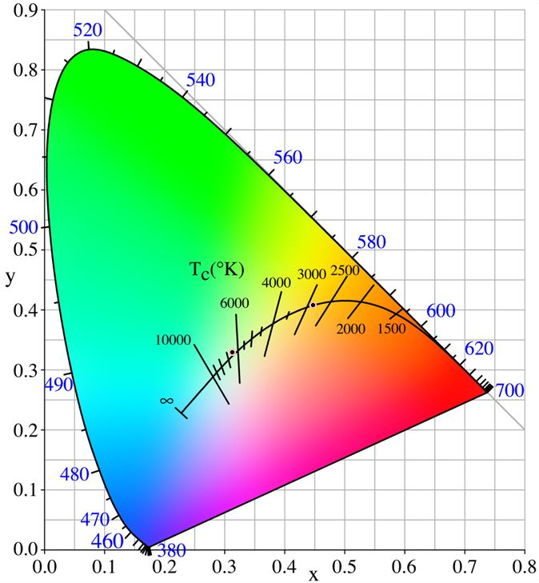
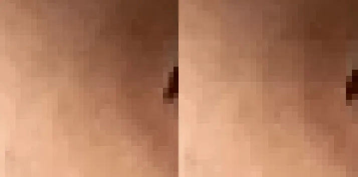
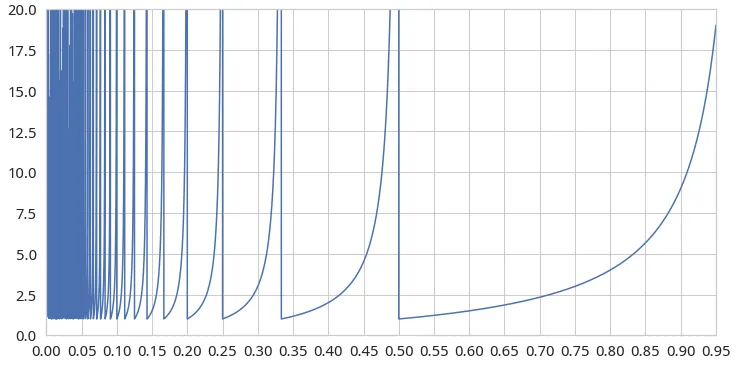
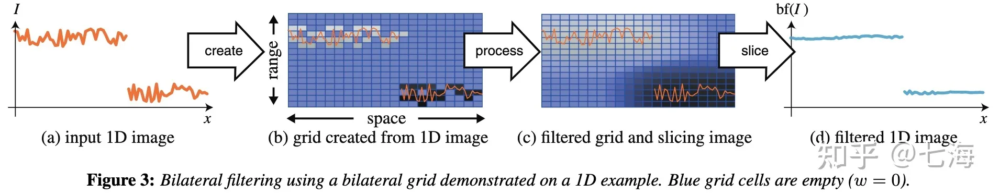
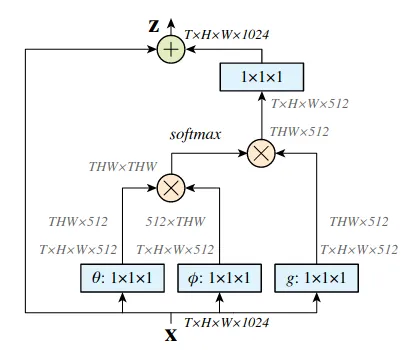
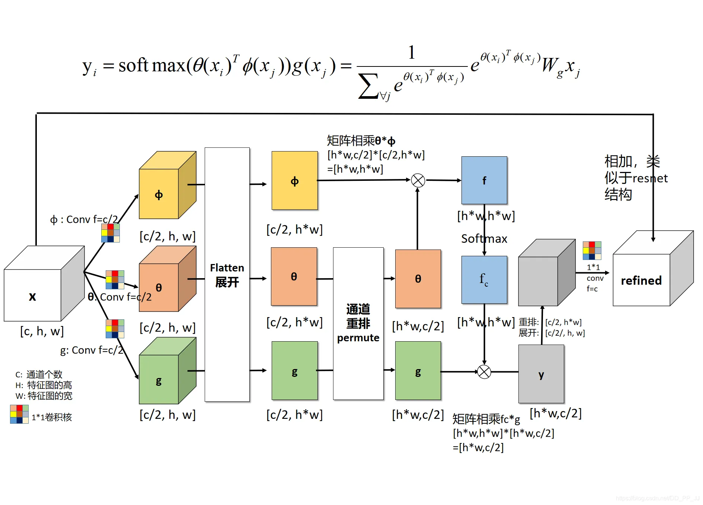
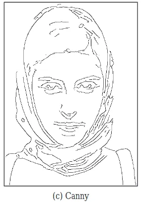
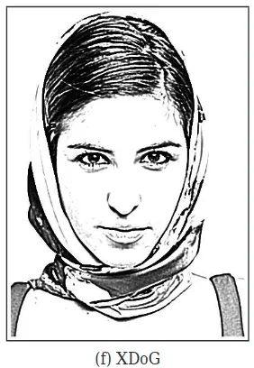

## 色彩
人眼可见光的波长范围在 400nm-700nm 左右，光的不同波长展现出不同颜色是因为人眼的三种感受不同波长的视锥细胞导致的，也就是三原色。

人们通过混合三原色来模拟各种颜色，也就是颜色匹配实验。后来通过总结转换建立了CIE 1931 XYZ 色彩空间，表示了人类能看到的所有颜色。这里的 XYZ 是线性转换后的虚拟光，因为三原色光没法模拟所有的原始波长光，需要在原始波长光的一方加入一些三原色的光才能匹配（类似于天平需要把一些砝码加到左边），也就是需要负值光。负值光没法用，于是只能通过线性变换将三原色转成虚拟的三种光 X、Y、Z。

为了更易于使用，人们对 CIE XYZ 进行二维投影再变换，得出 CIE xyY 色度图。其中 x 和 y 作为颜色分量，Y 表示明度。对于一种给定的颜色，如果增加它的明度，每一种基色的光通量也要按比例增加，这样才能匹配这种颜色。



其中外层的弧线是最大饱和度颜色，中间的弧线是黑体辐射对应的颜色。现在的显示系统会选取其中三个点作为三原色，围成一个三角形色域，代表该显示系统能表达的色彩范围，也就是 sRGB 之类的标准。

目前 PC 上最常用的是 sRGB，它的范围要比 Adobe RGB 和 Display P3 要小。如果是别的设备上处理的图片，可能会附带 ICC 配置文件来帮助色域转换，如果没有 ICC 配置文件或者库没有相关的转换处理会导致图片在电脑上看颜色很奇怪（比如最常用的图像处理库 opencv 就不支持 ICC 配置文件转换）。

## 基本图像处理
- 直方图均衡化：增强对比度方法，算出直方图（代表频率，值为 0.0-1.0）后累加成累积分布函数，然后乘 255，在让原图像素根据累积分布函数取值就行（近似均匀分布）
- 维纳滤波：常用的降噪方法，指满足最小二乘的线性滤波器

### 锐化
一般是原图叠加上边缘图（也可以在大于一定阈值时才叠加），边缘图可以通过各种算子算出，用原图减去高斯模糊图也算一种。
- Sobel：对 x 或 y 一阶偏导
- Roberts：对角线一阶偏导
- Laplacian：拉普拉斯算子，二阶偏导，`a - 3 * cv2.Laplacian(a, cv2.CV_32F)`（中间 -4 周围 1 的核）
- Unshape Mask（USM）：对原图像经过模糊得到 Unshape Mask，然后反转缩放处理后叠加到原图上得到锐化后的图像。和用原图减去模糊图像一样

### 特征
- Harris 角点：在任意两个相互垂直方向上都变化较大的点，旋转不变，比较快
- SIFT：高斯差分金字塔，找极值点，设置主方向，生成 128 维描述子，很准
    - 还有一种 Dense SIFT 的实现，但这种直接计算特征的方法没有尺度、旋转不变的特性，实际上和 HOG 效果几乎完全一样
- HOG：局部区域统计梯度方向的直方图，块内归一化，串联形成描述子，一般。但因为结构化，所以很常用
- LBP：领域像素值比较，统计直方图，比较底层，用于提取纹理，快
- Haar：滑窗计算局部像素差值和

DPM：目标检测方法。将目标分成多个部件，每个部件一个模型，以及一个根模型。所有模型滑动窗口检测，得到响应图叠加得最终响应。

## 插值
最近邻（Nearest）插值：最快速的插值方法，将输出网格打在输入图像上，然后直接取值

整数倍插值时相当于等间隔采样，非整数倍插值时由于浮点取整会在等间隔位置产生整数值跳变，导致不好的 artifacts 产生（放大插值时为部分像素图形长宽比变形，缩小插值时为等间隔抽值导致方块现象出现） [[2023-03-06-Week#^09011e]]

非整数倍缩小导致的方格状 pattern：


artifacts 的大小 S 由缩放倍数 r 决定：

$$S=floor(\frac{1}{\frac{1}{r}-floor(\frac{1}{r})})$$

r-S 关系图如下：



## 卷积
卷积输出尺寸 O，输入尺寸 I，卷积核大小 K，padding 值 P，步长 S，dilation 值 D：
$$\frac{I-(K+(K-1)(D-1))+2P}{S}=O$$
假设希望输出尺寸 O 和输入尺寸 I 成整数倍（S 倍），那么就能求得 padding 数为：
$$P=\frac{D(K-1)+1}{2}$$

padding 是以图为中心 pad 一圈，所以偶数 K 的情况需要特殊处理

## 滤波
滤波是指采用滤波器对输入信号进行处理的操作。广义上几乎涵盖了所有对信号进行单次运算处理的算法，但一般来讲我们主要指的是采用卷积处理的过程，如果没有指明用途则表示对输入信号进行平滑处理。

经典的滤波算法：高斯滤波、均值滤波、中值滤波。基本思路就是用 kernel 来对当前像素及其周边像素进行运算，得出一个值替代当前像素，遍历全图完成滤波。

边缘保持是模糊算法的重点关注的部分，高斯模糊会导致图像内容内收，边缘被削缓。可以采用三种缓解方法：
1. 通过 DoG 提取出软边缘，然后与原图做 mask 融合。缺点是需要调参，而且会让图像内部模糊减弱。
2. 设定图像内容 mask，对 mask 同步进行模糊，然后模糊图像除以 (blur_mask-mask+1) 来恢复边缘。这种方法既可以完全恢复边缘又可以保持内部模糊强度，而且不需要调参。缺点是 mask 需要进行设定，相当于手动指定边缘。
3. 以双边滤波为首的边缘保持滤波，这些方法或是效率不够高，或是会对模糊程度造成影响。


### 各向异性扩散（anisotropic diffusion）
保持边缘滤波的一种方法，会产生 artifacts


### 双边滤波（Bilateral filter）
高斯滤波本身可以看作是位置越近越保留，双边滤波则在其基础上加上像素之间的相似度，这样的话如果像素之间离得近且相似度高会保留，离得远且相似低高被舍弃，从而在降噪同时保持边缘？缺点是会产生一些伪影，但有 guided filter 等改进方式可以解决。

其实就是同等考虑像素域和空间域。具体而言，采用两种 filter，一种是一维的 range kernel，另一种是二维的 spatial kernel，可以都用高斯核形式，确定核直径 d，对点 I(x, y) 周边 dxd 大小的 patch 做如下操作：
1. 对 patch `Ω` 内像素 `I(i,j)` 和中心点 `I(x,y)` 像素做灰度绝对差值
2. 对差值图每一点做 range kernel 灰度变换 `fr`（可以用查找表实现）
3. 得出的结果图再乘上 spatial kernel `gs`
4. 然后与 patch 点乘求加权平均，得出替换值 `Io(x,y)``

数学式如下：
$$I_o(x, y)=\frac{\sum_{(i,j)\in \Omega}I(i,j)\cdot W_{x,y}(i,j)}{\sum_{(i,j)\in \Omega}W_{x,y}(i,j)}$$
其中核 `Wxy` 为根据像素点 `I(x,y)` 生成的双边滤波核：
$$W_{x,y}(i,j)=fr(||I(i,j)-I(x,y)||)\cdot gs(i,j)$$
这里展开坐标的二维写法，个人感觉详细一点会更直观易懂。

双边滤波带来的启示是「像素强度可以作为其所属的局部模式的简单表征和空间滤波组合起来」，用核来定义模式边界，让边缘像素点与边缘像素点平均，平坦像素点和平坦像素点平均，从而达到期望效果。

一般的算法实现涉及两个参数： `σr` 和 `σs`，分别指两个 kernel 的标准差，一般会使用 `σs` 定义 patch `Ω` 的大小，可能会约定使用 `2σs` 到 `3σs` 作为 `Ω` 的半径生成高斯核。这里 `σs` 就代表了滤波器的空间关联性，越大输出的空间局部越模糊。`σr` 代表了像素强度域的关联性，越大输出的边缘越容易被模糊

参考资料：  
1. https://en.wikipedia.org/wiki/Bilateral_filter
2. https://www.geeksforgeeks.org/python-bilateral-filtering/

### Bilateral Grid
双边滤波存在耗时非常慢的缺点，故而有了 Bilateral Grid。



前文双边滤波采用的 range kernel 需要对像素点周边 patch 逐个进行差值和滤波计算，即使能用查找表加速，算法整体的效率也很低。这时候出现了一种思想：视灰度值为一个额外维度，和图像二维坐标一同构成三维空间，将该空间网格化，并且把各个点累加到其对应的三维网格中（__这类操作又称为 Splatting__），这样灰度和周边差值大的边缘就会在空间上隔离开来，这时对网格内做三维空间滤波就能达到类似 range kernel 的效果。最终沿着原数据找滤波后的值或者三线性采样出值就能完成滤波（__这类操作又称为 Slicing__） 。上图为一维图像的情况，构成二维空间进行操作，比较直观。

该方法的思想就是将数据展成高维将目标区分，然后处理后再映射回低维。这里面我们需要的是「不影响边缘的灰度信号的平滑」，而做法是「将空间滤波从沿空间坐标系变成沿灰度-空间坐标系，摆脱了边缘附近的沾黏」。好处是分辨率可以缩小，运算也较为简单，容易并行化，效率高。

寻常算法和双边算法都可以在低分辨率上运作，它们直觉上的异同在于：寻常算法相当于双边算法像素强度 bins 为 1 的情况，而且输出不经过引导图 slicing 插值而是直接空间上采样，所以会出现锯齿，如果是邻近插值上采样则效果有一块一块的感觉，如果是双线性上采样则效果呈现模糊的锯齿，总之“颗粒感”是无法消除的，因为低分辨率下每一个被处理的像素之间差异都容易很大，而普通的上采样算法很难去除掉这种差异；而双边算法因为使用了引导图做 slicing，会同时根据周边相近的像素强度进行插值，所以能够消去锯齿。


Bilateral 类的方法除了使用原图像素强度来升维外，还能采用 Guided Image 来升维，比如经过特殊处理的原图，以及彩色图像下使用原图转换的灰度图

一些尝试 [[2022-08-15-Week#^482770]] [[2022-08-22-Week]] [[BilateralLearning改进模型上采样-202208231747]]

参考资料：  
1. https://zhuanlan.zhihu.com/p/37404280
2. https://zhuanlan.zhihu.com/p/365874538
3. https://groups.csail.mit.edu/graphics/bilagrid/bilagrid_web.pdf

### Bilateral Guide Upsample
结合了 joint bilateral upsampling [Kopfet al.2007] 和 guided filter [He and Sun 2015] 两种方法。能让算子在 8 倍下采样分辨率下工作，通过学习仿射系数来应用到全分辨率图像上，利用了大部分算子「输入像素的附近局部颜色相似，输出像素的附近局部颜色也会相似」的先验。这种方法要求算子尺度不变，所以降噪去模糊不太适用（像迪士尼特效那种有特征的更不适用了）。论文阅读见：[[BilateralGuidedUpsampling-202208111042]]

其深度学习实现版见：[[HDRNet-202208151109]]

### Non-Local
考虑 patch 之间相似性来替代点之间的灰度绝对差值，以此做双边滤波就能得到 non-local 的思想

传统图像处理的 Non-Local Mean：
- __Insight__：图像中的局部细节在图像的其他地方也冗余存在，而这些相同的局部细节叠加在一起求均值可以抑制噪声
- __Implement__：遍历每个点，求以该点中心的局部窗口（称为模板窗口）和图像中以另一个像素点为中心的局部窗口的距离，得到一个相似度（用 h 因子控制大小）用来加权另一个像素值，遍历完图像所有局部窗口加权结果得到该像素点值
- __Advantage__：对高斯噪声效果好，清晰且保留细节
- __Shortcoming__：双重遍历，速度慢  
- __Enhancement__：实际应用上一般会采用快速的实现方法，也就是只遍历点中心周围的一块区域（称为搜索窗口）

深度学习根据这个也搞了个 Non-Local block，某种程度上和 NLP 里的 self-attention 都是一个思想：  
- __Insight__：卷积比较 local，特别是在前期，无法很好融合时间和空间上的 global 信息
- __Implement__： 
- __Advantage__：用于视频效果不错，只加一层效果就挺好了
- __Shortcoming__：最好插入在网络浅层，但是这样计算量又会很大（3090 下 1x16x144x80 要 70ms）

参考
1. https://www.cnblogs.com/byteHuang/p/6926354.html
2. https://blog.csdn.net/piaoxuezhong/article/details/78345929
3. https://zhuanlan.zhihu.com/p/85776086
3. https://www.zhihu.com/question/68473183?sort=created

## 边缘提取
在图像处理领域里，边缘一般指的是特征，需要符合一些条件，比如 binary 图，边缘不交叉等。常见的边缘检测器 Canny 检测结果如：



这种边缘主要是为了后续传统图像处理算法所需，携带的信息量较小，容易受到噪声和超参数的影响，不好进行主观视觉理解

这里主要介绍更好看、更富含信息量、更利于深度学习处理的一些边缘提取算法。只是这里得到的边缘图就不是传统意义上的边缘特征了，而是一种软阈值的轮廓图像：



### DoG
DoG（Difference-of-Gaussians）从信号处理的角度看相当于带通滤波器，滤除低频内容和高频噪声，保留中频边缘，是一种很棒的处理算法

其中高斯模糊可以表示为卷积，根据 σ 可以生成一个归一化的 kernel 用于导入到 CNN 中

$$G_σ(x)=\frac{1}{2πσ^2}exp(−\frac{‖x‖^2}{2σ^2})$$

```python
def gaussian_kernel(sigma, ksize=None):
    # cv2.GaussianBlur 的实现，逻辑或 1 为取奇数。实际 3 sigma 应该也可以
    ksize = max(1, int(6*sigma + 1)) | 1 if ksize is None else ksize

    # 生成卷积核，也可以更高效的分开卷
    weight = np.matmul(cv2.getGaussianKernel(ksize, sigma), 
                       cv2.getGaussianKernel(ksize, sigma).T)
    return weight
```

DoG 则写成：

$$ D_{σ,k,τ}(x)=G_σ(x)−τ·G_{kσ}(x) $$

其中 k 可以取 1.6，τ 为 1.0。这里在原版的基础上增加了 τ 用于控制抑制边缘的强度，当 τ=1.0 时为原版 DoG，其均值趋向于 0。而当 τ 不为 1.0 时，为了保持均值亮度，需要增加软阈值化参数，简单来讲就是：

$$T_{ε,φ}(u) =\begin{cases}
\begin{aligned}
1 & \phantom{10,} u≥ε \\
1+tanh(φ·(u−ε)) & \phantom{10,} otherwise 
\end{aligned}
\end{cases}$$

其中 φ 控制。如果采取上述形式对原图进行边缘增强就可以得到期望的软阈值轮廓图像，该方法也就是 XDoG：

$$ T_{ε,φ}(D_{σ,k,τ}∗I)$$

仔细看这个式子的形式，就是一个卷积和激活函数。不过该软阈值化方法也存在一些问题，实际使用 DoG 可能更高效好用 [[2023-08-14-Week]] 

DoG 在 kernel size 固定时可以转化为单个卷积，很方便高效实现（但是很可惜秩无法保证是 1，可能不如行列滤波）：
```python
def DoG(img, sigma, k, ksize):
    kern = gaussian_kernel(sigma, ksize) - gaussian_kernel(k*sigma, ksize)
    dog_img = cv2.filter2D(np.float32(img), -1, kern)
    return dog_img
```


参考
1. https://notebook.community/darshanbagul/ComputerVision/EdgeDetection-ZeroCrossings/EdgeDetectionByZeroCrossings
2. https://users.cs.northwestern.edu/~sco590/winnemoeller-cag2012.pdf


## 跟踪稳定

### 点跟踪
使用 OpenCV 稀疏光流计算来稳定估算点
```python
cur_detected_pts = some_algorithm(new_image)
cur_estimate_pts, _, _ = cv2.calcOpticalFlowPyrLK(old_image, new_image, prev_points, None)  # prev_points 需要是 FP32 格式
dist_change = np.norm(cur_detected_pts - prev_detected_pts)
alpha = np.exp(-dist_change^2/nomalized_eye_distance)
cur_pts = (1-alpha)*cur_detected_pts +alpha * cur_estimate_pts
```

还有通过 ROI 的内容来完成跟踪的 [[KCF]]

### 概率稳定
如果要将图像推理模型推广至视频帧流式推理模型，需要考虑输出稳定性，一种简便的方法是采用 EMA （Exponential Moving Average）滤波，也就是对输出概率进行滑动加权，取最大概率做为输出。（以下皆来自 chatGPT）
```python
import torch

# Define the smoothing factor (between 0 and 1)
smoothing_factor = 0.9

# Initialize the previous predictions with zeros
prev_preds = torch.zeros(num_classes)

# Capture video frames and perform inference
while True:
    # Capture the next frame and preprocess it
    frame = capture_frame()
    frame_tensor = preprocess_frame(frame)
    
    # Perform inference and get the predicted class probabilities
    probs = model(frame_tensor)
    
    # Apply the EMA filter to the predicted class probabilities
    smoothed_probs = smoothing_factor * probs + (1 - smoothing_factor) * prev_preds
    
    # Get the predicted class label from the smoothed probabilities
    pred_label = torch.argmax(smoothed_probs)
    
    # Update the previous predictions with the current smoothed probabilities
    prev_preds = smoothed_probs
    
    # Display the current frame with the predicted label
    display_frame(frame, pred_label)
```

如果是视频推理不考虑 3 维卷积的话有两种方法，这是着重利用空间信息提升精度，提升稳定性的话还是要考虑 temporal smoothing 也就是类似 EMA 的方法：
```python
class MaxPoolCNN(nn.Module):
    def __init__(self, cnn):
        super(MaxPoolCNN, self).__init__()
        self.cnn = cnn

    def forward(self, x):
        batch_size, seq_len, channels, height, width = x.size()
        x = x.view(batch_size * seq_len, channels, height, width)
        x = self.cnn(x)
        x = nn.functional.max_pool2d(x, kernel_size=x.size()[2:])
        x = x.view(batch_size, seq_len, -1)
        return x

class RNNCNN(nn.Module):
    def __init__(self, cnn, hidden_size, num_layers):
        super(RNNCNN, self).__init__()
        self.cnn = cnn
        self.rnn = nn.LSTM(input_size=cnn.output_shape[-1], hidden_size=hidden_size,
                           num_layers=num_layers, batch_first=True)

    def forward(self, x):
        batch_size, seq_len, channels, height, width = x.size()
        x = x.view(batch_size * seq_len, channels, height, width)
        x = self.cnn(x)
        x = x.view(batch_size, seq_len, -1)
        _, (h_n, c_n) = self.rnn(x)
        return h_n[-1]
```

还有就是用 RNN 接在 CNN 模型后来加强时间稳定：
```python
import torch
import torch.nn as nn

# Define the RNN architecture
class TemporalRNN(nn.Module):
    def __init__(self, input_size, hidden_size, output_size):
        super(TemporalRNN, self).__init__()
        self.rnn = nn.RNN(input_size, hidden_size, batch_first=True)
        self.fc = nn.Linear(hidden_size, output_size)
        
    def forward(self, x):
        # Apply the RNN to the input sequence
        out, _ = self.rnn(x)
        
        # Apply a fully connected layer to the final output of the RNN
        out = self.fc(out[:, -1, :])
        
        return out

# Initialize the model and the RNN
model = MyModel()
rnn = TemporalRNN(input_size=model.output_size, hidden_size=64, output_size=num_classes)

# Initialize the previous hidden state with zeros
prev_hidden = torch.zeros(1, 1, 64)

# Capture video frames and perform inference
while True:
    # Capture the next frame and preprocess it
    frame = capture_frame()
    frame_tensor = preprocess_frame(frame)
    
    # Perform inference and get the intermediate features
    features = model.get_features(frame_tensor)
    
    # Apply the RNN to the intermediate features
    rnn_input = features.view(1, 1, -1)
    rnn_output, prev_hidden = rnn(rnn_input, prev_hidden)
    
    # Get the predicted class label from the RNN output
    pred_label = torch.argmax(rnn_output)
    
    # Display the current frame with the predicted label
    display_frame(frame, pred_label)
```

## 插帧

https://github.com/sniklaus/softmax-splatting

## 仿射变换
常用的几何变换，能处理旋转、平移、缩放、翻转和剪切之类的，使用 2x3 的数组可以表示仿射矩阵，仿射矩阵还能用来逆变换以及变换点坐标
```python
out_width = np.int64(out_width)
out_height = np.int64(out_height)

out_width_half = out_width / 2
out_height_half = out_height / 2

# 左上角点坐标
left = center_x - out_width_half * scale
top = center_y - out_height_half * scale

# 旋转、缩放和平移
warp_mat = cv2.getRotationMatrix2D((center_x, center_y), angle, scale)
warp_mat[0, 2] -= left
warp_mat[1, 2] -= top

# 裁剪
crop_img = cv2.warpAffine(img, wrap_mat, (out_width, out_height))
```


## 图像差异
求出图像差异，像是分割一样的情况。一般情况下差分图+二值化就能解决，但对于光照条件不怎么好的情况，需要在形态学变换上多做功夫

灰度图像的形态学变换：
- 腐蚀：遍历图像，往其中图像点 I(x,y) 放结构元，取结构元内的最小值替换 I(x,y)
- 膨胀：同上，取最大值替换。可以看到是兼容二值图像处理的
- 开操作：顺着理解就是先腐蚀，于是可以限制峰值毛刺（亮噪点）
- 闭操作：同理可以限制谷值毛刺（暗噪点）
- White Top-hat：图像 - 图像开操作
- Black Top-hat：图像闭操作 - 图像，也有叫 Bottom-hat 的
- 测地膨胀：模板图像 G（I ≤ G），对 I 膨胀，取膨胀后的结果和 G 中的最小值。也就是有个预期图像 G 做兜底，去掉不需要的膨胀部分
- 测地腐蚀：同上，腐蚀后取最大值，有 G 做封顶
- 形态学重建：不断测地膨胀或腐蚀直至稳定，以及先腐蚀后膨胀重建或相反。用处是比如去掉复杂背景，只保留恒定灰度背景上的文字

非均匀光照条件下用大的结构元做开操作可以一定程度滤掉非均匀光照影响（如果目标物小于结构元且光照变化大于结构元的话）


## 图像分割
传统方法：GrabCut

采用 Bilateral Guided Filter 也能够从低分辨率分割掩码提升至高分辨率，因为加入了原图作为 Guide Image，而原图含有边缘等高分辨率信息，根据这些信息可以生成合适的滤波权重从而指导掩码提升分辨率，放大后的高分辨率掩码能够拥有原图的样式，对于 matting 类方法很有用

## 单像素成像
算是某种计算成像，和鬼成像（Ghost imaging）是一种原理。

传统成像属于间隔排开多个传感器来同时获取光强和空间分布，能很快曝光出一整张图片。

单像素成像则是只用一个传感器来得到入射光的强度总和，其空间分布是利用光的主动调制（空间光调制器）或被动调制（光的强度随时间和空间自然涨落）来获取。就像是信号处理里的变换一样，把单像素相机得到的光强度视作系数，光的调制信息当做基，进行多次拍摄后做加权求和就能还原出图像来。

该方法搭配压缩感知可以更好的还原图像。其中的一个问题大概是光要如何调制，也就是选取怎样的基来恢复图像，或许用深度学习做预训练或用强化学习做优化是好的方法。

参考：
1. https://www.zhihu.com/question/21562998
2. https://zhuanlan.zhihu.com/p/161090398


## 主动测距
- 结构光：打出特殊图案的红外光，观察回来的图案的畸变来获得深度信息，需要特殊镜头
- ToF：打红外光，观察来回时间来测距


