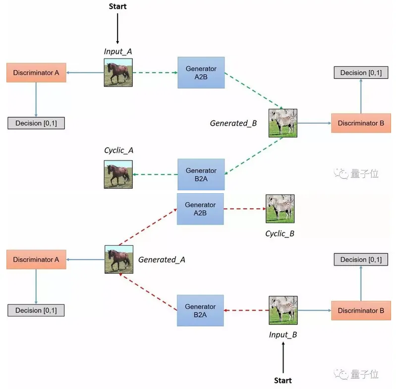

原文 Unpaired Image-to-Image Translationusing Cycle-Consistent Adversarial Networks https://arxiv.org/pdf/1703.10593v6.pdf

### Main Contribution
通过双向生成以及 _cycle consistency loss_ 来添加约束，以达到 Unpaired image-to-image translation

### Introduce
假设转换的两个域间存在某种关系（如同一 scene 的不同 renderings），去寻学习这种关系。  
  
单纯学习一个 X->Y 映射会导致两个问题，一是生成的 Y^ 很可能不是所希望的有特定关系意义的 (x, y) 对，因为映射的路径和结果有非常多，这样做只能保证 y^ 属于类似的 Y 域，输入的 x 和 y^ 很可能没多大联系。二是很难优化单独学习的对抗目标，容易导致 mode collapse。  
  
所以提出变换应 _cycle consistent_，即对于某种映射 G，我们希望和它的反映射 F 能达到 F(G(x)) ≈ x，G(F(y)) ≈ y。这是一种有长远历史的 trick，比如 visual tracking 的 forward-backward consistency 和翻译领域的 "back translation and reconciliation" 等等。  

与寻常的使用训练深度特征融合的 neural style transfer 相比，该方法通过捕获高层语义结构来学习两组图像集的映射。

### Implementation

- 网络架构，G 采用 Residual + transpose conv，D 采用 PatchGANs 生成的最后结果是一张图（每个像素值代表该 patch 是真或假）
- 训练方法，loss 采用均方差（L2）
- 训练策略，使用了 _《Learning from simulated andunsupervised images through adversarial training》_ 的方法来减少模型抖动，更新判别器时使用历史生成的图片（保存在大小为 50 的缓冲区里，这样似乎不是 (x,y) pair，具体暂且不明？）
- 可选的 loss：_identity mapping loss_，即类似 ||G(y) - y||，可以让 G 在映射时保持 Y 域的色调，在 painting->photos 里有用

### Result
- loss function：若 cycle consistency loss 只做单向，发现经常训练不稳定以及导致 mode collapse，特别当 labels->photos 去除 F(G(x)) ≈ x 的 loss 表现会很差（_可能是 labels->photos 比 photos->labels 要难，需要更多约束？？？_）
- Image reconstruction quality：质量经常很接近原始输入，发现即使是由复杂域到简单域的映射，其重建质量也能很好。

### Limitations and Discussion
1. 对于颜色和纹理的变换经常能得到好结果，而对于有几何变化的情况则很少能得到好结果。  
2. 数据集的分布特性会导致在没见过的情境下生成错误的结果。  
3. 和监督学习的情况还是有无法消去的差距，添加一点监督信息会利于搭建更强的转换器。

