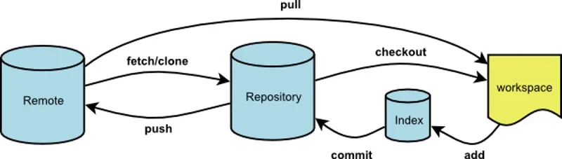

常用的版本控制软件，与 SVN 那种集中式的软件不同，Git 的分布式更适合多开发者共同合作，但每个开发者都需要维护好自己的本地仓库，并保持和远程仓库的同步，会稍微有点麻烦。

## Git Graph



- 工作区（workspace）：平常硬盘上保存的文件所处区（Untracked files 不算在内）  
- 暂存区（Index）：`git add` 后将工作区文件压为 index 信息（也就是 stage changes 了），保存这个 index 信息的就是暂存区  
- 本地仓库（Repository）：`git commit` 后文件所处区，相当于在本地提交了暂存区代码及备注的相关信息
- 远程仓库（Remote）：`git push` 后文件所处区，将本地仓库的提交上传到远程服务器（比如 GitLab 或 GitHub 服务器）

## 配置选项
```shell
git config --global core.autocrlf input      # 在 commit 时将 CRLF 转为 LF
git config --global core.filemode false      # 防止文件权限被纳入 git
git config --global --add merge.ff false     # 关闭 fast-forward

git config --global user.name "xxx"          # 配置用户名
git config --global user.email "xxx@xx.com"  # 配置邮箱

git config --global http.sslverify false     # 若出现 CAfile: none CRLfile: none
git config --global https.sslverify false

git config --global core.editor "vim"        # 默认使用 vim
```

## SSH
不用每次都输入账号密码：`git config credential.helper store`  

国内快速通道：`https://hub.gitmirror.com/`

personal key：2021-08-13 后不支持密码验证了，似乎只能到 Github 上生成 key，用  key 来登录，参考 https://bobbyhadz.com/blog/support-for-password-authentication-was-removed-on-august

## .gitignore
用于忽略指定文件或目录，可用正则表达式匹配。__注意，默认会影响所有子目录。__  
```sh
## 影响根目录和全部子目录
# 忽略所有名为 __pycache__ 的目录
__pycache__/
# 忽略所有以 `~` 结尾的文件和目录
*~

## 影响根目录
# 忽略根目录下的 .pyc 后缀文件
/*.pyc
```
对于已在仓库内的文件无法通过 `.gitignore` 来忽略（比如依赖本地的配置文件或符号链接），而应该用：
```sh
git update-index --assume-unchanged <PATH>
git update-index --no-assume-unchanged <PATH>

git ls-files -v		                    # 列出所有的文件，assume unchanged 的话有 "h"
git ls-files -v | grep '^[[:lower:]]'   # 列出 assume unchanged 文件

```

## CLI
官方命令行工具，可以有很多方便的操作
```Shell
brew install gh       # 安装 CLI

gh auth login         # 登录
```


## Git 常用命令
### git add
```Shell
git submodule add <url> lama   # 添加其他仓库(lama)作为子模块
```

### git clone
```sh
git clone -b dev xxx   # 只克隆 dev 分支
git clone --bare xxx   # 克隆一个裸库，用于迁移
git clone --depth n xxx   # 浅克隆，只含最近 n 次更新，可以缩小 git 文件大小
```

### git commit
```sh
git commit --amend     # 修改最近一次 commit 信息 
```

### git checkout
```sh
git checkout xxx       # 切换到 xxx 分支
git checkout -- a.txt  # 撤销本地对 a.txt 的修改
git checkout .         # 撤销本地的所有修改，使用本地仓库恢复文件
git checkout id        # 切换到某个 commit（可从此另开分支）
git checkout -b xxx origin/xxx   # 新建 xxx 分支，并设置为跟踪远程 xxx 分支
```

### git branch
```sh
git branch              # 打印所有分支
git branch -a           # 打印远程跟踪分支和本地分支
git branch -d xxx       # 删除本地分支
git branch -m xxx       # 重命名本地分支
git branch xxx          # 创建 xxx 分支
git branch -vv          # 查看分支最新提交以及正在跟踪的远程分支

git branch -u origin/xx # 设置远程仓库上游分支为 xx
git branch --set-upstream-to=origin/dev dev  # 设置 dev 分支上游为 origin/dev
```

### git fetch
```sh
# 将远程仓库与本地代码同步

## 方法一
git fetch origin master   # 将远程 origin 的 master 分支下载到本地仓库
git log -p master origin/master      # 比较本地的仓库和远程参考的区别
git log --stat master origin/master  # 比较本地的仓库和远程参考的区别（简略版）
git merge origin/master       # 把远程下载下来的代码合并到本地仓库
                              # 的当前分支，远程的和本地的合并

## 方法二
git fetch origin master:temp  # 新建本地分支 temp 保存远程 master 分支
git diff temp                 # 比较当前本地分支和本地 temp 分支的不同
git merge temp                # 本地合并分支
git branch -d temp            # 删除本地 temp 分支


# 删掉远程仓库里已经删除掉，无法访问的分支
git fetch --prune
git remote prune origin
```

### git merge
```sh
# 若未 commit 则不要 merge

git merge --no-ff develop   # 将 develop 分支合并到 master 分支
                            # --no-ff 表示不用 fast-foward merge，保留
                            # develop 分支的 commit 信息，文件指针不改变
                            # 如果不慎忘了就用 git reset --merge ORIG_HEAD 恢复到合并前
                            
git merge --abort           # 在冲突时放弃 merge，回到 merge 前的状态

git merge --allow-unrelated-histories	# 如果想鸠占鹊巢，在 merge 时需要加上这个

git merge -X theirs dev     # 合并 dev 到当前分支，有冲突的部分全部采用 dev 分支
                            # 适用于改了二进制资源的情况
```
注意，merge 会将忽略 `.gitattributes` 文件中的内容

### git cherry-pick
```Shell
git cherry-pick id     # 将其他分支的某个 commit 合并进来
```

注意，merge 会将忽略 `.gitattributes` 文件中的内容

### git pull
```python
# rebase 避免多余 merge commit
git pull --rebase origin xxx   # 将远程仓库 xxx 分支合并到当前分支
```

就是 git fetch & git merge FETCH_HEAD，但是似乎不忽略 `.gitattribute`


### git push
```sh
git push origin --delete xxx            # 删除远程 xxx 分支
cd 裸库.git && git push --mirror xxx    # 镜像推送库，用于库迁移
```

### git rebase
```sh
git rebase             # 消掉 pull 远程仓库时产生的 merge log
git rebase -i HEAD~4   # 交互式合并近 4 个 commit，修改 pick 为 edit 来切换对应
                       # 历史分支，此时可以通过 git commit --ammend 来修改历史


# 将 pick 改为 edit 后可修改已 push 的 commit 信息
git rebase -i HEAD~4   # 展示出近 4 次 commit
                       #   edit 需要修改的 commit
                       #   squash 需要合并的 commit

git commit --amend     # 修改 commit 信息
git rebase --continue  # 完成 rebase 操作
# git push --force       # push 到远程仓库，需要分支 unprotected
```

### git reset
```sh
git reset HEAD [-- files]   # 撤销 git add 暂存区文件，相当于 git add 反操作
git reset --soft id         # 将本地仓库回退到 id 版本，id 之后提交的修改放到暂存区，
                            # 相当于撤销 commit

git reset --hard id         # 将工作区、暂存区、本地仓库全部回退到 id 版本
git reset --hard HEAD       # 撤销修改（包括 merge），回退到最新提交

git reset --mixed           # fatal: git-write-tree: error building 
                            #        trees Cannot save the current index

git reset --merge ORIG_HEAD  # 取消 merge？

# reset 后通过 git push -f 可以修改远程仓库的 commit
# 但需要先取消掉远程仓库的分支 protect
```

### git revert
```sh
git revert id           # 撤销 commit id 的修改
                        # 与 git reset 不同，保留 commit 信息
```

### git remote
```sh
git remote              # 打印远程仓库名（一般origin）
git remote -v           # 打印仓库名和对应地址（分开 fetch 和 push）

git remote add origin (ssl/https address)  # 初始化仓库时用到，添加远程仓库 

# pull 公用仓库，push 私人仓库时使用
git remote set-url origin (ssl/https address)  # 设置远程仓库地址
git remote set-url --push origin (ssl/https address)  # 设置push的远程仓库地址
```

### git submodule
```sh
git submodule add <url> <path>     # 添加子模块
```

### git stash
```sh
git stash save "xxx"       # 会将当前未提交的修改（暂存区和工作区）保存起来到本地栈中，
                           # 并添加该栈的版本信息 "xxx"，不会保存 untracked 的文件，
						   # 添加 `-u` 才可以保存 untracked
						   # 添加 `-a` 保存所有（包括 ignored）

git stash pop              # pop 出栈顶
git stash apply stash@{#}  # 恢复栈 stash@{#}

git stash list		       # 打印所有的栈，栈名格式为：stash@{#}

git stash show stash@{#}   # 打印栈修改的部分
git stash apply stash@{#}  # 恢复栈 stash@{#}
git stash drop stash@{#}   # 丢弃栈 stash@{#}

git stash branch xxx       # 使用新分支恢复，避免工作区多次修改导致的冲突
```

## 问题
- `git add .` 无响应：
- 出现一大堆文件 `old mode 100755 new mode 100644`，无法 unstage 也无法切分支：跨了 linux 和 windows 系统导致，文件权限被改了，可以指明 git 忽视这种改变 `git config core.filemode false`
- `git status` 显示了没有改动的文件。`git diff` 也查看不到任何改动：
    - 可能是用某些软件查看过文件后导致的 bug，`git stash save "xxx"` 然后 `git stash pop`  可以刷新工作区恢复正常
    - 也可能就是文件文件权限改变的问题，`git config core.filemode false` 来解决
- `detected dubious ownership in repository`：似乎是新版本 Git 会检查文件的所有者，如果不是当前用户就会报错，直接 `chroot -R 用户名 工程文件夹` 就能解决
- 文档结尾多了一堆 `^M`，`autocrlf` 的问题，`git config --global core.autocrlf input` 设置全局让 git 自己处理换行符的差异，如果没用说明工程里已经设置了不用 `autocrlf`，到 `.git/config` 里设置就行，或者去掉 `--global` 再来一次就行
- `error: RPC failed; curl 92 HTTP/2 stream 0 was not closed cleanly: CANCEL (err 8) error: 7280 bytes of body are still expected`
    - `git config --global http.postBuffer 524288000`
- Github Release 页的 assets 转圈加载不出来：原因不明，直接访问 `https://github.com/仓库/releases/expanded_assets/版本号` 也行

## 工程实践

### 分支管理
- master(main)
- dev
- feature

### 配置文件
- `.gitignore`
- `.gitattributes`

### 约定式提交
```
格式：  
<类型>[可选的作用域]: <描述>

[可选的正文]

[可选的脚注]


类型：  
feat:     增加新功能  
fix:      修复bug  
ehance:   旧有功能加强（新增）

docs:     只改动了文档相关的内容  
style:    不影响代码含义的改动，例如去掉空格、改变缩进、增删分号  
build:    构造工具的或者外部依赖的改动  
refactor: 代码重构时使用  
revert:   代码回滚时使用  

test:     添加测试或者修改现有测试  
perf:     提高性能的改动  
ci:       与CI（持续集成服务）有关的改动  
chore:    不修改src或者test的其余修改


例：
feat(config): 允许 config 对象直接从其他 config 继承

BREAKING CHANGE: 在 config 对象中增加 `extends` 字段，用于从其他继承 config

close issue #23
```

