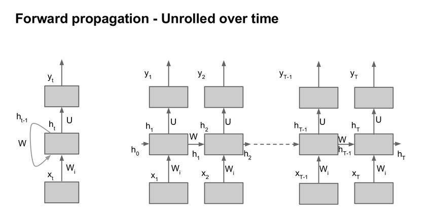

动态计算图框架，根据运行时定义计算，可以在迭代中修改计算图，最终对标量输出节点使用 `.backward()` 实现自动求导并将梯度累积保存在 `.grad` 里。比如，想要知道模型分类不够理想的地方表现在输入图像的哪些区域上，可以这样做：
```python
# 一般张量要设置了梯度需求才会在后续 backward 中保存梯度
x = x.requires_grad_(True)

# 分类的模型和损失函数，在计算期间产生的张量如 y 和 loss 
# 都会保存一个 grad_fn，指向用于计算当前层反向传播的 Function 对象
y = model.forward(x)
loss = target_loss(y)

# 执行 backward() 会沿着 grad_fn 逐步往前计算梯度
# 注意，如果没有设置 retain_grad() 的话会在 backward() 
# 之后清空计算图的前向缓存，也就是这次涉及的相关节点都不能再进行反向传播了
loss.backward()

# 对梯度后处理，转换成 opencv 图像用来观察 loss 的产生原因对应到输入的区域
saliency_map = torch.sum(torch.abs(x.grad), axis=1, keepdims=True)
saliency_map = saliency_map.detach().cpu().numpy()
saliency_map = cvglue.scale_min_max(saliency_map, 0, 255, percentile=99)
saliency_map = np.uint8(saliency_map[0].transpose((1,2,0)))
```

相比于别的框架，PyTorch 好在和 Python 理念一致，都是以简单、便捷为首要目标，不需要斟酌计算图的构建细节，也没有一个功能对应一千种 API 的繁琐，最大的缺点是性能以及部署生态没那么完善。

## 机制
### CUDA 内存申请
CUDA 初始化时会创建 CUDA context 占用几百兆左右的显存，该占用量随版本和设备变化。

由于向 CUDA 申请显存会很耗时间，所以 PyTorch 一次会申请一块较大的显存，也就是 reserved memory。

> 在 Pytorch 中，CUDA 内存以内存块的形式存在，在你创建一条 4 Bytes 的 Tensor 时，默认情况下，Pytorch 会向 CUDA 申请 2 MB 的内存块，然后再为我们分配 512 Bytes 的显存来储存我们申请的 Tensor。剩余的 1.5 MB 以 reserved memory（以前叫 cache memory）的形式保持占用。假设这时候，你想再申请一条 Tensor，Pytorch 首先会去看之前申请的内存块够不够放。如果我们申请的 Tensor 小于 1.5MB，那就直接放在刚刚申请的内存块中。如果大于 1.5MB，Pytorch 则再向 CUDA 申请新的内存块。假设 CUDA 也没有足够内存的时候，Pytorch 会尝试切分释放掉这些内存块中闲置的部分，再重新向 CUDA 申请。如果还不够，那就会报我们模型训练中常见的 out of memory 错误了。

1. https://www.zhihu.com/question/571024067/answer/2796051468

## 模块
模块可以嵌套，但需要设为其属性，也就是以 `self.xxxx` 或 `setattr(self, name, xxx)` 的形式设置

### Parameter
模块的参数定义，如果不设置 `requires_grad=False` 的话意味着这个参数将纳入模型训练更新中

如果有参数需要保存但不需要优化，可以使用 `self.register_buffer()` 的方法注册到缓冲区中，该方法的缓冲参数不会在 `model.parameters()` 中返回，所以不会被优化器优化

### BatchNorm
BN 层的运作依赖模块的工作模式 `train()` 和 `eval()`，以及初始化时的 `affine` 和 `track_running_stats` 参数
- `affine=True`：建立相关的仿射变换参数（也就是 weights 和 bias 参数），用于对输出范围做重新映射，一般用默认值不用管
- `track_running_stats=True`：建立累计 `train()` 时前向经过的 batch 的统计量的缓冲区，会有个 `momentum=0.1` 来确定累计更新的动量（该缓冲区的参数 `running_mean`、`running_var` 等只在 `eval()` 时会用作 batch 归一化，`train()` 时还是会用当前 batch 的统计量来归一化）。当 `track_running_stats=False` 时，只会用当前的 batch 统计量来做归一化

具体计算式如下：
$$O=\frac{I-mean}{\sqrt{var+eps}}\cdot weight+bias$$

### Sequential
可以用来初始化一串模块，会顺序执行
```python
nn.Sequential(*[Conv(), BN(), ReLU()])
```

### ModuleList
初始化一堆模块。和 Sequential 不同的地方在于其不实现 forward，也就是不规定按顺序执行。和 list 的不同之处在于其元素自动归为 Module 的一部分会一起初始化

### RNN
多层 Elman RNN 的实现，也就是一般的 RNN

$$ht​=tanh(x_t​W_{ih}^T​+b_{ih}​+h_{t−1}​W_{hh}^T​+b_{hh}​)$$

```python
torch.nn.RNN(input_size, hidden_size, num_layers=1, batch_first=False)
```



- 注意 `batch_first` 默认为 `False`，也就是说 batch size 在第二位，比如输入是 `[Length,Batch,H_in​]` ，输出是 `[Length,Batch,H_out]`，中间状态为 `[Layer,Batch,H_out]`
- LSTM 接口也类似，但多了一个中间记忆状态 `c`，参数还有门控的输入、遗忘、输出

## 结构
### Tensor
类似 numpy 的数组，torch.view() 类似 numpy.reshape()，转换：  
```python
a = torch.ones(5)
b = a.numpy()   # a 和 b 共用一块内存
a = np.ones(5)
b = torch.from_numpy(a)  # 不要用 torch.Tensor(a)，速度会非常慢
```  
Tensor 包含：
- `.requires_grad`：`True` 则跟踪所有基于它的操作，可以通过 `.backward()` 来计算梯度，梯度结果保存到 `.grad` 中，默认为 `False`。注意传播后计算得到的梯度是通过累加的方式保存到 `.grad` 中的，所以参数更新前需要通过 `optimizer.zero_grad()` 清空梯度
- `.detach()`：从计算图中分离出来，也就是会切断反传路径，而 `.requires_grad` 不会切断（global loss 依然会计算传递回去）
- `.backward(optional)`：单数据标量不需要参数，否则要指定传过来的梯度 Tensor 作为参数。
  - `retain_graph=False`：默认计算图只反传一次就释放，所以如果计算图有多次利用，则需要将它设为 `True`
- `.grad_fn`：指向计算该 Tensor 的函数
- `.to(device)`：送到指定设备（CPU/GPU）上运算，运算需在同一设备，如果不急着使用数据，可以同时对 `pin_memory` 数据设置 `non_blocking=True` 来异步传输数据，更多见 [[#^69d2e9|dataloader]]
- `.data`：不安全，似乎是隔开反传用的，现用 `.detach()` 替代，返回内存与 Tensor 共享，和直接操操作 Tensor 似乎没什么区别

方法记录：（函数加下划线表示 in-place 操作）
- __排序__：`a.sort(axis)`，沿 axis 维度做排序，输出 `a.sort(axis)[0]`、`a.sort(axis)[1]` 分别代表排序后的 Tensor 和排序对应 index
- __最大值__：`a.max(axis, keepdim)`，类似 `a.sort`，keepdim 为 bool 值，置为 True 则保留维度，即 `(96, 10) max(1, True) -> (96, 1)`
- __矩阵运算__：`a.shape = (1,24), b.shape = (10,1), (a+b).shape = (10,24)`，意思是 Tensor 中垂直向量加法会扩展为矩阵，加一行加一列这样。
    - 多维矩阵乘法 `torch.bmm(a, b)`，a 为 `(b, n, m)`，b 为 `(b, m, p)`，输出 `(b, n, p)`，这里 b 是批次，n 不清楚，似乎随意？
- __reshape__：`a.view(-1, 2)` / `a.reshape(-1, 2)`，都是改变形状，`Tensor.reshape()` 会在内存不连续时调用 `Tensor.contiguous()` 以返回一份 copy 再调用 `Tensor.view()`
- __扩增__：
  - `a.expand(3, -1)`，将 a `(n, )` 复制扩展成 `(3, n)`
  - `torch.repeat_interleave(a, 2, dim=0)`，沿 0 维重复元素 2 次，如 `[0,1,2] => [0,0,1,1,2,2]`，在 CUDA 上扩增多个维度没有 `torch.nn.functional.interpolate(a, scale_factor=2, mode='nearest')` 快
- __堆叠/展开__： ^e3b3d9
    - `torch.nn.Unfold(kernel_size, dilation=1, padding=0, stride=1)`：相当于卷积的前置操作。Tensor 也有类似算子，不过只能是一维的。返回 `[N, C x ks^2, -1]` 的 Tensor，如果 ks 和 stride 相同则相当于图像切片展开，可以转换为这样 `[N, C, ks_h, ks_w, patch_h, patch_w]`
- __填充__：
    - `F.pad(x, [1,2,3,4])`：padding 算子，第二个参数类似 copyMakeBorder，也就是对应 `[left, right, top, bottom, first_c, last_c]`，可以缺省
- __仿射__：通过 `F.affine_grid(theta, size)` 和 `F.grid_sample(img, grid)` 来实现仿射变换，但和通常的实现方法的有所不同
	- PyTorch 会在处理前将输入输出坐标系缩放到 [-1, 1]，零点为图像中心点。由于输出范围固定为 [-1, 1]，所以输出的大小 `size` 代表的是输出网格的分辨率而非 OpenCV 的从输出空间中截取的区域大小 `dsize`
	- 假设 $I(x, y)$ 和 $O(u, v)$ 分别为 输入空间 和 输出归一化空间
		- OpenCV 的 warp_affine 方法为：$I(x,y)$->$O(x,y)$，仿射矩阵为 `M`，处理过程就是输入一个 $I(x_0,y_0)$ 变换得到对应的 $O(x_0,y_0)$
		- PyTorch 会先用 `F.affine_grid()` 输入 `size` 大小的输出空间网格 $O(x,y)$，输出一张含有输入归一化坐标 $I(u,v)$ 的输出网格 `grid` $O(x,y)$，表示输出网格的像素对应于输入归一化空间的哪个坐标，也就是 $O(x,y)$->$I(u,v)$_（由于归一化在内部自动完成，所以实际的处理矩阵 `theta` 为 $O(u,v)$->$I(u,v)$ 的变换矩阵，也就是将 `M` 变换到输出归一化空间且后再取逆）_。最后在经过 `F.grid_sample()` 从输入归一化空间中采样出像素映射到输出网格中。处理过程为：输入一个 $O(x_0,y_0)$，内部归一化得到 $O(u_0,v_0)$，变换得到 $I(u_0,y_0)$，采样得到 $I(x_0,y_0)$ 值
	- 详细推导参照 https://www.zhihu.com/question/294673086
```python
def affine2theta(warp_mat, in_size, out_size):
    W1 = in_size[3]
    H1 = in_size[2]
    W2 = out_size[3]
    H2 = out_size[2]
    warp_wh_2 = np.array([2/W2, 0, -1, 0, 2/H2, -1, 0, 0, 1]).reshape(3,3)
    warp_wh_1 = np.array([W1/2, 0, W1/2, 0, H1/2, H1/2, 0, 0, 1]).reshape(3,3)
    warp_mat_r = np.insert(warp_mat, [2], [0,0,1], axis=0)
    aff_theta = torch.from_numpy(np.linalg.inv(warp_wh_2 @ warp_mat_r @ warp_wh_1))[:2].unsqueeze(0).type(torch.float32)
    return aff_theta 

# src (1xCxHxW)  out_size (4)
W1 = src.size()[3]
H1 = src.size()[2]
W2 = out_size[3]
H2 = out_size[2]
# keep resolution when shinking
if W1 > W2 and H1 > H2:
    out_size = src.size()
# aff_theta (1x2x3)
aff_theta = affine2theta(M, src.size(), out_size)
# grid (1xHxWx2)
grid = torch.nn.functional.affine_grid(aff_theta.cuda(), out_size)
dst = torch.nn.functional.grid_sample(src.cuda(), grid)
dst = dst[:,:,:H2,:W2]
```

在使用 CUDA 时，需要对各个参数和缓冲区转成 CUDA 张量 `net.to(device)` 和 `inputs, labels = inputs.to(device), labels.to(device)`，其中 `device = torch.device("cuda:0" if torch.cuda.is_available() else "cpu")`。另外，使用 `.cuda()` 也可以达到同样的效果而且速度会快些

### Variable
类似 Tensor，已 deprecated  
- `.requires_grad`：同 Tensor
- `.volatile`：和 `requires_grad` 相反，表示是否不参与求导，为 `True` 时它及依赖节点不求导，优先级比 `requires_grad` 高

### nn
用于模块化神经网络的接口。  
`nn.functional`：没有学习参数的一些神经网络函数，如 ReLU、Pool 等。   

网络定义：
```python
import torch
import torch.nn as nn
import torch.nn.functional as F

class Net(nn.Module):
    def __init__(self):
        # nn.Module子类的函数必须在构造函数中执行父类的构造函数
        super(Net, self).__init__()
        
        # 卷积层 '1'表示输入图片为单通道, '6'表示输出通道数，'3'表示卷积核为3*3
        self.conv1 = nn.Conv2d(1, 6, 3) 
        #线性层，输入1350个特征，输出10个特征
        self.fc1   = nn.Linear(1350, 10)  #这里的1350是如何计算的呢？这就要看后面的forward函数
    #正向传播 
    def forward(self, x): 
        print(x.size()) # 结果：[1, 1, 32, 32]
        # 卷积 -> 激活 -> 池化 
        x = self.conv1(x) #根据卷积的尺寸计算公式，计算结果是30，具体计算公式后面第二章第四节 卷积神经网络 有详细介绍。
        x = F.relu(x)
        print(x.size()) # 结果：[1, 6, 30, 30]
        x = F.max_pool2d(x, (2, 2)) #我们使用池化层，计算结果是15
        x = F.relu(x)
        print(x.size()) # 结果：[1, 6, 15, 15]
        # reshape，‘-1’表示自适应
        #这里做的就是压扁的操作 就是把后面的[1, 6, 15, 15]压扁，变为 [1, 1350]
        x = x.view(x.size()[0], -1) 
        print(x.size()) # 这里就是fc1层的的输入1350 
        x = self.fc1(x)        
        return x

net = Net()
print(net)
```

列出名字和参数：
```python
for name,parameters in net.named_parameters():
    print(name,':',parameters.size())
```

### utils
`torch.utils.data.dataloader`： ^69d2e9
  - `pin_memory=False`：是否使用锁页内存（锁页就是锁定内存页，不让其用于磁盘交换，比如 GPU 显存就无法交换到磁盘，但 CPU 用虚拟内存会可能和磁盘交换）。该标志会将数据加载到锁页内存，从而接下来不需要 CPU 参与就能传输数据到 GPU（GPU 的 DMA 直接从锁页内存拿数据），坏处是可能会出现问题，看系统是否卡住或者 swap 有没爆来决定开不开，而且非锁页内存数据传到锁页内存也需要时间。配合 `Tensor.cuda(non_blocking=True)` 可以实现异步传输，更多见：
	  - https://discuss.pytorch.org/t/should-we-set-non-blocking-to-true/38234/3 
	  - https://discuss.pytorch.org/t/guidelines-for-assigning-num-workers-to-dataloader/813/15?u=lamply 
	  - [[操作系统内存管理-202201171131]]
	  - _（不过实际在远程机上尝试发现速度完全没有加快，这可能是因为瓶颈并不在这方面上，而且使用锁页内存也会导致各种其他系统问题导致延迟）_
	  - _似乎是要配合 non_blocking 进行  CPU->GPU 才会有加速，二者缺一不可，毕竟非 pin_memory 的话传数据还是要占用 CPU I/O，相当于 blocking 了_
  - `num_worker`：dataloader 创建的工作进程数，并使用 `batch_sampler` 指定 batch 和 worker，然后各个 worker 将各自 batch 加载进 RAM，最后 dataloader 从 RAM 中寻找需要的 batch。设置越大，batch 预备得越多，内存和 CPU 消耗也大，设置为 0 则不会自动加载到 RAM，一般设置为 CPU 核心数，但如果核心很多对共享内存要求会很高（_而且速度还不一定会更快，尝试过 [64 bs, 32 worker]，[32 bs, 32 worker]，[32 bs, 16 worker]，[16 bs, 16 worker]，[8 bs, 8 worker] ，[8 bs, 4worker]，batchsize 非瓶颈（但和 worker 匹配会更快），10 核服务器 cpu，worker 为 16 或 8 时最快_）  
    更多请参考 https://www.cnblogs.com/hesse-summer/p/11343870.html_

如果想要更快的训练速度，需要明确瓶颈所在，CPU、GPU、I/O，大的 batch size 一般会被 I/O 限制，复杂的 augmentation 以及编解码会被 CPU 限制。
- 对于 I/O，如果不是十分频繁读写而且很大的批次（128 以上），一般不会成为瓶颈，使用 `lmdb` / `tfrecord` 会有帮助，此外还有一些非阻塞 I/O 如 `tf.io.gfile.GFile(img_path, 'wb')` 可以改善
- 对于 CPU，迁移预处理操作到 GPU 上（`DALI`），或事先做好部分预处理，加上 `PyTurboJPEG` 等加速编解码，以及给 `Dataloader` 加上 fast_collate 和套层 prefetcher
- 更多见：https://discuss.pytorch.org/t/how-to-prefetch-data-when-processing-with-gpu/548/18


### loss函数
定义在 torch.nn 或 torch.nn.functional 里。需要注意这里的 loss 函数和 Tensorflow 的 loss 函数很有可能默认参数、输入顺序和实现细节是不同的，总之__如果要跨框架复现，在使用之前一定要对数值进行检查！__  
- `torch.nn.CrossEntropyLoss(weight=class_weights, ignore_index=0)`：交叉熵，用于分割的 loss
  - `weight` 为 shape=(C, ) float32 数组，用于平衡类别 loss，如果 GPU 训练则还需要先 `.cuda()` 送入 GPU
  - `ignore_index` 为忽略的类别，值可以在 C 外，好像是不会传相应类别的梯度回去
  - 输入为 NxCxHxW 的原始网络输出（未经 softmax）和 NxHxW 的 __long__ 型标签（值域为 [0, C-1]）
- `torch.nn.BCELoss`：二值交叉熵，需要事先做 `sigmoid`，除非用 `BCEWithLogitsLoss`
  - `BCEWithLogitsLoss` 和 `CrossEntropyLoss` 区别在于前者可以软标签（0.0-1.0），后者是硬标签（整型 0-C-1），更多见 https://discuss.pytorch.org/t/loss-function-crossentropyloss-vs-bcewithlogitsloss/16089/4

### torchvision
__torchvision.datasets__：拥有很多数据集  
__torchvision.models__：拥有很多预训练模型  
__torchvision.transforms__：用于预处理的函数，用于 datasets 时的 transform 参数传入

### cuda
`torch.cuda.synchronize()`：用于同步设备，因为 python 一般不会等待 GPU 等外部设备计算完毕（除非 `Tensor.cpu()` 这种传回来的操作 pytorch 会自动 synchronize），加上这个显式同步可以用于的话就会停下来直到设备上的计算完成。计时的时候会用到，如：
```
torch.cuda.synchronize()   # 等待之前的设备上计算完成
start = timer()

y = model.forward(x)

torch.cuda.synchronize()   # 等待模型在设备上的计算完成
end = timer()
```
`torch.backends.cudnn.benchmark`：设置 True 使 cudnn 寻找当前尺寸网络的最佳运行算法，详见参靠资料

参考资料：  
https://pytorch.org/docs/1.7.1/notes/cuda.html#cuda-semantics  
https://zhuanlan.zhihu.com/p/73711222
## 方法
### 数组操作
- 扩维：`.unsqueeze(axis)`

### 参数设置
需要反传的参数需要用 `nn.Parameter(data=x)` 来加到 `nn.Module` 的变量里，如：
```python
class SmoothOneHot(nn.Module):
    def __init__(self, classes, target=None, smooth_val=None):
        super().__init__()
        if target is None:
            target = torch.tensor(1.5)
        self.target = nn.Parameter(data=target)

        if smooth_val is None:
            smooth_val = torch.ones(1)
        self.smooth_val = nn.Parameter(data=smooth_val)
        
    def forward(self, target_center):
        res = torch.exp(-(target_center - self.target)**2 / (2 * self.smooth_val**2))
        smooth_one_hot = res / res.sum(dim=-1, keepdim=True)
        return smooth_one_hot
```

注意待参数 `self.target` 和 `self.smooth_val` 需要保持 PyTorch Tensor 操作，不能通过 `float()` 之类的转换成 Python 变量，不然会切断反传路径无法更新

### 随机种子
```python
def init_seeds(seed=0):
    torch.manual_seed(seed)
    torch.cuda.manual_seed(seed)
    torch.cuda.manual_seed_all(seed)
    if seed == 0:
        torch.backends.cudnn.deterministic = True
        torch.backends.cudnn.benchmark = False
```
### 数据加载
pytorch提供 __Dataset__ 类来构建数据集，并通过 __Dataloader__ 来读取。  
Dataset 结构如下：
```python
from torch.utils.data import Dataset
import pandas as pd
# 定义一个数据集
class BulldozerDataset(Dataset):
    """ 数据集演示 """
    def __init__(self, csv_file):
        """实现初始化方法，在初始化的时候将数据读载入"""
        self.df=pd.read_csv(csv_file)
    def __len__(self):
        '''
        返回df的长度，决定数据集的大小，若返回小于 len(self.df) 的值则会截断数据集
        '''
        return len(self.df)
    def __getitem__(self, idx):
        '''
        根据 idx 返回一行数据
        '''
        return self.df.iloc[idx].SalePrice
		# 也可以返回字典，dataloader 会自动将里面的元素 batch 起来
		# return {'label': A_tensor, 'inst': inst_tensor, 'image': B_tensor, 'feat': feat_tensor, 'path': A_path}
        
ds_demo= BulldozerDataset('median_benchmark.csv')
# 实现了 __len__ 方法所以可以直接使用len获取数据总数
len(ds_demo)
# 用索引可以直接访问对应的数据, 对应 __getitem__ 方法
ds_demo[0]
```

DataLoader 会加载 batch 的数据，如果 `dataset.__getitem__(idx)` 返回的是 `512x512` 大小数据，则会 batch 成 `nx512x512`，如果是 `3x512x512` 则 batch 成 `nx3x512x512`

DataLoader 的常用方法：
```python
# 返回迭代器
dl = torch.utils.data.DataLoader(ds_demo, batch_size=10, shuffle=True, num_workers=0)

# 通过迭代枚举来获得数据
for i, data in enumerate(dl):
	# 通过给 enumerate 设置 start=n 可以指定下标 i 的起始位置，但数据 dl 依然从头开始遍历
    print(i, data)
```  

安装第三方库 tfrecord 可以读 TFRecord：
```python
from tfrecord.torch.dataset import TFRecordDataset
index_path = None
description = {"depth": "int", "image_raw": "byte"}
# 返回 Dataset
dataset = TFRecordDataset(tfrecord_path, index_path, description) 
# 用 dataloader 封装
dataloader = torch.utils.data.DataLoader(dataset, batch_size=1, shuffle=False, num_workers=1)
# 用 PIL decode 图像文件，转换为 Tensor
for i, data in enumerate(dataloader):
    x = Image.open(io.BytesIO(data['image_raw'].numpy()))
    y = transforms.Compose([transforms.ToTensor()])(x)
```
分布式下的表现见下文[[#多卡 分布式训练]]  

更多见：https://ptorch.com/news/215.html

### 预处理
OpenCV 解码 `.jpg` 比 PIL 快一些，解码 `.png` 比 PIL 稍慢一些，两种库解码出来的 JPEG 图会有一些差异
```python
# 也可以用 albumentations，功能更强大，但多少有些坑
import torchvision.transforms as transforms
transform_A = transforms.Compose([transforms.ToTensor()])

# 1. 用 PIL 预处理，最后转成 Tensor
for i, data in enumerate(dataloader):
    x = Image.open(io.BytesIO(data['image_raw'].numpy()))
    y = transform_A(x)

# 2. 用 OpenCV 预处理，最后转成 Tensor
for i, data in enumerate(dataloader):
    x = cv2.imdecode(data['image_raw'].numpy(), cv2.IMREAD_COLOR)
    x = cv2.cvtColor(x, cv2.COLOR_BGR2RGB)
    y = transform_A(x)
    
# 3. 用 numpy 预处理，最后转成 Tensor
torch.from_array(a)
```
__`transforms.ToTensor()` 会将整型数除上 255 来转成浮点，而如果本身是浮点则直接转成 tensor。最后这个要放在 transforms lists 的图像处理之后归一化之前__

### 训练
简易的训练过程
```python
import torch.optim as optim

# create your optimizer
optimizer = optim.SGD(net.parameters(), lr=0.01)
	
# in your training loop:
# for batch_idx, (data, target) in enumerate(train_loader):
optimizer.zero_grad()   # zero the gradient buffers, 不然会累积
output = net(input)
loss = criterion(output, target)
loss.backward()  # 也可以直接网络输出 output 为 loss，然后 output.backward()
optimizer.step()    # Does the update
```

### 多卡/分布式训练
##### 原生  
最好不要使用 `torch.nn.DataParallel`，有非常多的 bugs（不过就是挺简单的，v1.11 后弃用）。属于单机多卡 parameter server 模型，以 0 卡为主卡来计算和分发权重，GPU0 会占更多显存，速度也会被限制  
```python
# 使用方法非常简单，只要套起来就行
model = torch.nn.DataParallel(model, device_ids=opt.gpu_ids)

# 数据分发，并行计算
y = model(x)

# 调用模型的方法
y = model.module.xxx(x)
```

官方提倡 `DataDistributedParallel`：  
> The difference between DistributedDataParallel and DataParallel is: DistributedDataParallel uses multiprocessing where a process is created for each GPU, while DataParallel uses multithreading. By using multiprocessing, each GPU has its dedicated process, this avoids the performance overhead caused by GIL of Python interpreter.  

除此之外，还有提供了像 SyncBN 之类的东西，只支持 `DataDistributedParallel`  
```python
import random
import nunmpy as np
# 可以配合 amp 进行混合精度训练，进一步加快速度，更多资料见参考 [5]、[6]
from torch.cuda.amp import autocast

# 首先要设置当前进程使用的 CUDA 设备，以及初始化分布式环境，设置了之后
# 统一使用 .cuda() 就能将 Tensor 或模型等放到相应设备上
torch.cuda.set_device(opt.local_rank)
torch.distributed.init_process_group(
    'nccl',
    init_method='env://'
)

# 设定当前进程的全局 rank，用于指定一个进程输出日志和保存模型
opt.rank = torch.distributed.get_rank()

# 如果用到其他库的随机函数的话，在 fork 多进程模式下需要重新设置其种子，
# 不然会出现不同进程产生相同随机数列的情况
random.seed(opt.rank)
np.random.seed(seed=opt.rank)

# 为了每个 worker 使用不同的数据来训练，需要 DistributedSampler 来进行
# 划分（官方提供的该函数是非连续的划分），它会使 enumerate(dataloader) 
# 得到的 index 范围变为 [0, ITERS/WORLD_SIZE]，也就是每个 worker 被分配
# 到其中一部分数据来进行训练。也可以用自己写的连续划分的 sampler
train_sampler = torch.utils.data.distributed.DistributedSampler(dataset)

# 如果需要将数据处理也放到 GPU 的话可以考虑 DALI 之类的库
dataloader = torch.utils.data.DataLoader(
            dataset,
            batch_size=opt.batchSize,
            drop_last=True,	   # 会扔掉 (batchsize * 卡数) 无法整除的余数，扔掉的通过
			                   # shuffle 可以取到，具体看 len(dataset) 实现是否包含
            num_workers=int(opt.nThreads),
            sampler=train_sampler,
            shuffle=not opt.serial_batches and (train_sampler is None))


# （可选）将模型里的 BN 转成 SyncBN，参数会 copy，这里为了抵消数据方差减小可以适当增大 lr
# from apex.parallel import convert_syncbn_model
# model = convert_syncbn_model(model)

# 分布式包装，指定本地显卡 local_rank
model = torch.nn.parallel.DistributedDataParallel(model, device_ids=[opt.local_rank], output_device=opt.local_rank)

# amp 的缩放器初始化
scaler = torch.cuda.amp.GradScaler()

# 恢复训练需要注意的是 torch.load 时要将读进来的数据通过 map_location
# 映射到当前 worker 的机器上，因为模型一般只在某台机器上保存，读取时
# 默认会加载到保存时所用的机器上
if opt.continue_train:
    checkpoint_ = torch.load(os.path.join(save_dir, 'latest_checkpoint.pt'), map_location=lambda storage, loc: storage.cuda(opt.local_rank))
    optimizer_G.load_state_dict(checkpoint_['optimizer_G'])
    optimizer_D.load_state_dict(checkpoint_['optimizer_D'])
    scaler.load_state_dict(checkpoint_['amp'])  # 读取 loss scale 和 unskipped 数

# 同步各机器的 loss 的函数，worker 在这里会锁住等待其他 worker 运行到这里同步
# 得到均值返回，注意不要只放到 rank==0 上做，不然其他 worker 进不来会卡死 0
def reduce_tensor(tensor):
    rt = tensor.clone()
    torch.distributed.all_reduce(rt, op=torch.distributed.ReduceOp.SUM)
    rt /= torch.distributed.get_world_size()
    return rt

for epoch in range(num_epochs):
	train_sampler.set_epoch(epoch)   # 设置 epoch 作为 shuffle 的种子，
                                     # 使每 epoch 不会读到相同顺序的数据，
                                     # 但似乎会让不同实验取间数据的顺序完全相同

    for i, data in enumerate(dataloader):# 各卡经过 sampler 得到相同 batchsize 数据，
	                                    # 每次遍历只抽取 dataset 中的 (bs * 卡数) 整除
										# 若数据集大小=10, droplast, bs=3，卡数=2，
										# 则每 epoch 取 6 个数据，len(dataloader)=1
    	with autocast(enabled=opt.fp16):
			loss = model(data)
        
    	optimizer_G.zero_grad()
		scaler.scale(loss_G).backward()
		scaler.step(optimizer_G)
        
        # 注意计算图是否有重用，有则需要 retain_graph
        optimizer_D.zero_grad()
        scaler.scale(loss_D).backward()
		scaler.step(optimizer_D)
		
		scaler.update()
	    
    	# 同步 loss 值用于显示输出
		loss_i = reduce_tensor(loss.data).item()
        
        # 打印输出，保存 checkpoint 等只在 rank==0 上做
        if opt.rank == 0:
        	if (i + print_freq_delta) % opt.print_freq == 0:
        		print(loss_i)
                
    if opt.rank == 0:
        if epoch % opt.save_epoch_freq == 0:
            checkpoint_amp = {
                'optimizer_G': optimizer_G.state_dict(),
                'optimizer_D': optimizer_D.state_dict(),
                'amp': scaler.state_dict()   # 记录当前 loss scale 和 unskipped 数
            }
            torch.save(checkpoint_amp, os.path.join(save_dir, 'latest_checkpoint.pt'))
            model.module.save(epoch, save_latest=True)
```
推荐使用 Pytorch 自带的分布式训练脚本来启动训练，这样会自动创建相关进程、设置环境变量以及传入 `local_rank` 参数来指代本地机器的 id

    CUDA_VISIBLE_DEVICES=0,1 torchrun --nproc_per_node=2 train.py

`CUDA_VISIBLE_DEVICES` 变量可以限制实际只能看到的 GPU0 和 GPU1，如果是只用 CPU 则设为 -1

工业级的标准实践请参照这个：https://github.com/NVIDIA/apex/tree/master/examples/imagenet （原生 pytorch 版： https://github.com/pytorch/examples/tree/master/imagenet ）  

__注意：__
1. 如果是多机分布式训练的话，每个机器（Note）都会持有持有自己的 `local_rank` （对应进程），也就是会出现多个 `local_rank == 0` 的情况，这时候要用 `torch.distributed.get_rank()` 之类的方法拿到全局的 rank
2. DataParallel 的 batch size 是总的 batch size，各 GPU 会获得其中一份，而 DataDistributedParallel 的 batch size 是各 GPU 的 batch size
3. 如果要通过 model.module 之类的方法修改模型参数，那不能只限 local_rank == 0 做，不然模型参数会不同步（分布式 backward 时使用 all_reduce 算法保证各 worker 模型参数一致，其余方法需自己手动保持模型参数一致）
4. **分布式训练多节点最好保持相同的计算结构**，也就是前向过程尽量不要使用 if-else 来定义计算图，而是使用乘 0 乘 1 来做计算路径分支 （ https://zhuanlan.zhihu.com/p/592515484 ）
5. 多机分布式错误：
	```sh
	AssertionError: optimizer.zero_grad() was called after loss.backward() 
	but before optimizer.step() or optimizer.synchronize(). This is prohibited 
	as it can cause a race condition
	```
  horovod 框架下遇到，在使用多个 optimizer 时出现，前一个 loss 的 backward 影响了后一个 optimizer，需要在后一个 optimizer 调用 `zero_grad()` 前加个 `optimizer.synchronize()`，见 https://github.com/horovod/horovod/issues/1417

__参考：__
1. https://zhuanlan.zhihu.com/p/250471767
2. https://zhuanlan.zhihu.com/p/98535650
3. https://pytorch.org/docs/master/notes/amp_examples.html
4. https://gist.github.com/mcarilli/213a4e698e4a0ae2234ddee56f4f3f95
5. https://discuss.pytorch.org/t/torch-cuda-amp-equivalent-of-apex-amp-initialize/132598/5?u=lamply
6. https://pytorch.org/docs/stable/notes/amp_examples.html

##### DLC
Horovod 实现  
```python
# 先初始化
hvd.init()

# 和其他方法一样，一般让线程和 GPU 一一对应
torch.cuda.set_device(hvd.local_rank())

# 用分布式优化器封装，将会通过 allreduce 或者 allgather 将梯度均值化
optimizer = hvd.DistributedOptimizer(optimizer, named_parameters=model.named_params())

# 还要从 rank 0 广播初始状态到其他进程
hvd.broadcast_parameters(model.state_dict(), root_rank=0)
hvd.broadcast_optimizer_state(optimizer, root_rank=0)

# 旧版需要指定名字作为 reduce 的索引 key，新版默认用生成的自增名字
def reduce_tensor(tensor, name):
    rt = tensor.clone()
	avg_rt = hvd.allreduce(rt, name=name)
    return avg_rt
```

多机分布式  


### 模型修改
```python
# 先取得需要修改的模块
for module in model.modules():
    if isinstance(module, nn.Conv2d):
        list_conv += [module]
    elif isinstance(module, nn.BatchNorm2d):
        list_bn += [module]
    if len(list_conv) == 3:
        break

# 对于卷积需要修改输入输出通道和具体的 weights 和 bias（如果有），最后重新初始化参数
list_conv[0].in_channels = in_channels
list_conv[0].out_channels = out_channels
weight0 = list_conv[0].weight.detach()
weight0 = torch.Tensor(
    list_conv[0].out_channels,
    list_conv[0].in_channels // list_conv[0].groups,
    *list_conv[0].kernel_size
)
list_conv[0].weight = nn.parameter.Parameter(weight0)
list_conv[0].reset_parameters()  # 参数初始化

# 对于 BN，需要修改 weights 和 bias，同时还要修改 num_features 和 running mean/var
# 因为 running mean/var 视 BN 参数可能为 parameter 也可能是 buffer，所以需要按照具体情况而修改
weight3 = list_bn[0].weight.detach()
bias3 = list_bn[0].bias.detach()
weight3 = torch.Tensor(out_channels)
bias3 = torch.Tensor(out_channels)
list_bn[0].num_features = out_channels
list_bn[0].weight = nn.parameter.Parameter(weight3)
list_bn[0].bias = nn.parameter.Parameter(bias3)
list_bn[0].register_buffer('running_mean', torch.zeros(out_channels))
list_bn[0].register_buffer('running_var', torch.ones(out_channels))
list_bn[0].register_buffer('num_batches_tracked', torch.tensor(0, dtype=torch.long))
list_bn[0].reset_parameters()     # 参数初始化
```

### 预训练
```python
# 读取参数
pretrained_dict = pretrained.state_dict() 
model_dict = m.state_dict() 
 
# 找寻 pretrained_dict 中与 model_dict 相同名称的模块参数
update_dict =  {k: v for k, v in pretrained_dict.items() if k in model_dict} 
 
# 使用这些参数更新 model_dict
model_dict.update(update_dict) 
 
# 将 model_dict 写回自定义模型
m.load_state_dict(model_dict)
```

### LR策略
通过继承类 `_LRScheduler` 来实现，下为示例：
```python
from torch.optim.lr_scheduler import _LRScheduler
class WarmupMultiStepLR(_LRScheduler):
    def __init__(self, optimizer, warmup_factor=1.0 / 3, warmup_iters=500, last_epoch=-1):
        self.warmup_factor = warmup_factor
        self.warmup_iters = warmup_iters
        super().__init__(optimizer, last_epoch)

    def get_lr(self):
        warmup_factor = 1
        if self.last_epoch < self.warmup_iters:
            alpha = float(self.last_epoch) / self.warmup_iters
            warmup_factor = self.warmup_factor * (1 - alpha) + alpha
        return [
            base_lr
            * warmup_factor
            for base_lr in self.base_lrs
        ]

scheduler = WarmupMultiStepLR(optimizer)

for IN TRAINING LOOP:
    ***
    optimizer.step()
    ***
    scheduler.step()
    ***
```

### 推理
__注意：__  
连续推理时，预处理后的数据最好全程放在计算设备上，减少数据交换次数。前处理和后处理也可以在 GPU 上进行以加速，设备间内存交换和加速应该需要看情况进行权衡。
```python
def model(nn.Module):
   xxx
   
model.eval()    # 设置为前向模式，对于 BatchNorm 以及 Dropout 等有用的设置
                # 类似的，训练时需要 model.train() 设为训练模式
               
model.cuda()    # 使用 GPU，同 model.to("cuda") 和 DataParallel

# DataParallel 也会把模型放到 GPU 上
model = torch.nn.DataParallel(model, device_ids=opt.gpu_ids)

# 不要用 torch.Tensor(y).unsqueeze(0).cuda() 来转换输入 Tensor，贼慢
trans = Alb.Compose([ToTensorV2(transpose_mask=True)])
# normalization 之类批量运算的也可以在 GPU 上进行，加快速度
x = trans(image=img)['image'].unsqueeze(0).cuda()

# 需要指明不保留梯度，节省显存
with torch.no_grad():
    # 输入数据也要在同一个 device 上
	y = model.forward(x)
    
# 使用 GPU 后处理提升速度
y = (y + 1)*127.5
# 不要用 y.type(dtype=torch.ByteTensor) 直接转换到 cpu，会很慢
y_array = y.type(dtype=torch.cuda.ByteTensor)

# 拿到 cpu 数据
y_images = y_array.cpu().numpy()
```

### 模型相关
##### 模型保存
- 保存整个模型：`torch.save(model, 'asd.pth')`
- 保存模型参数：`torch.save(model.state_dict(), 'asd.pth')` （ Recommended ）  
- 脱离模型源码：使用 TorchScript，同时会有一些加速
  ```python
  x = torch.rand((1,3,1024,768)).cuda()
  with torch.no_grad():
      traced_cell = torch.jit.trace(model, (x))
  torch.jit.save(traced_cell, 'model.pth')
  ```


##### 模型读取
- 读取整个模型：`model = torch.load('asd.pth')`
- 读取模型参数：`model.load_state_dict(torch.load('asd.pth'))`
- `torch.load` 函数首先会将模型反序列化到 CPU 然后将模型移动到保存模型时该模型所处的设备，若没有该设备则报错，需要用 `map_location` 参数来进行映射，这在分布式训练时需要格外注意

```python
torch.cuda.set_device(0)
x = torch.rand(1,3,3).cuda()
torch.save(x, 'xxx.pth')   # cuda:0 保存

# 读取到 cuda:0
a = torch.load('xxx.pth')

# 读取到 cuda:1
b = torch.load('xxx.pth', map_location=lambda storage, loc: storage.cuda(1))

# 读取到 cpu
c = torch.load('xxx.pth', map_location=lambda storage, loc: storage)
```


##### 统计计算量
```python
from thop import profile
from thop import clever_format
# 自定义的层需要手写统计代码
model = ResNet18()
inputx = torch.randn(1, 1, 28, 28)
flops, params = profile(model, inputs=(inputx, ))
flops, params = clever_format([flops, params], "%.3f")

# 或者使用 torchsummaryX
from torchsummaryX import summary
summary(model, torch.zeros((1, 3, 256, 256)))
```

##### 模型参数显著性检查
```python
print("moduel_name", "channel_id", "channel_sum", "largest_channel_sum", "module", sep='\t\t')
for name, module in model.named_modules():
    if isinstance(module, nn.Conv2d) or isinstance(module, nn.ConvTranspose2d):
        sum_k = torch.mean(torch.abs(module.weight), axis=[1,2,3])
        norm_sum_k = sum_k / sum_k.max()
        for v in range(norm_sum_k.shape[0]):
            if torch.abs(norm_sum_k[v]) < 1e-3:
                print(name, v, "%.4f"%float(sum_k[v]), "%.4f"%float(sum_k.max()), module, sep='\t\t')
    elif isinstance(module, nn.BatchNorm2d):
        sum_k = torch.abs(module.weight)
        norm_sum_k = sum_k / sum_k.max()
        for v in range(norm_sum_k.shape[0]):
            if torch.abs(norm_sum_k[v]) < 1e-3:
                print(name, v, "%.4f"%float(sum_k[v]), "%.4f"%float(sum_k.max()), module, sep='\t\t')
```

##### 剪枝
非结构化剪枝的推理需要 Ampere 架构显卡和 TensorRT8 以上才支持
```python
# 未测试
def prune(model, amount=0.3):  
    # Prune model to requested global sparsity  
    import torch.nn.utils.prune as prune  
    print('Pruning model... ', end='')  
    for name, m in model.named_modules():  
        if isinstance(m, nn.Conv2d):  
            prune.l1_unstructured(m, name='weight', amount=amount)  # prune  
            prune.remove(m, 'weight')  # make permanent  
    print(' %.3g global sparsity' % sparsity(model))
```

### 模型转换
##### ONNX
对于所有 OP 都支持的网络：
```python
dummy_input = torch.randn(1, 1, 28, 28, device='cuda')
input_names = ["input"]
output_names = ["output"]
torch.onnx.export(model, dummy_input, "LeNet_MNIST.onnx", verbose=True, input_names=input_names, output_names=output_names)
```
##### TensorRT
使用 torch2trt 的话
```python
x = torch.rand((1, 3, 1024, 576)).cuda()
model_trt_1 = torch2trt(model, [x], fp16_mode=True, max_batch_size=8)
# model_trt_1 = torch2trt(model, [x], int8_mode=True, int8_calib_dataset=calid_dataset, max_batch_size=1, int8_calib_batch_size=8)
torch.save(model_trt_1.state_dict(), 'localL_extra123vertblurre_T4trt_1024x576_fp16.pth')
```

### 工具
- 减缓显存需要：`pytorch-memonger`
- 可微 OpenCV：`kornia`

## 新版本特性

### 2.0
功能上主要是新增了 `torch.compile`，也就是 JIT 编译，包装模型可以提升性能。用的是 Dynamo，相比于 TorchScript 更灵活，遇到不支持的部分会自动退回 eager 模式，所以算是固定了部分计算图，青春版。

日后可能会取代 TorchScript。

### 2.2
1. Transformer 相关的性能升级，集成了 FlashAttention-v2，加快 `scaled_dot_product_attention` 的速度。
2. 引入了 TorchInductor 的一个专用版本 AOTInductor，用来处理优化 `torch.export` 导出后的模型，同时可以生成一些共享库。基本上是给非 Python 的部署环境用的，目前还是原型阶段。

### 2.3
1. 新增了个 `torch.export` 的 dynamic shapes 的 API，`torch.export.Dim`，后续可以关注。
2. 异步检查点生成，可以一边保存检查点一边训练，有点意思。

## PyTorch/XLA
XLA（Accelerated Linear Algebra），一种基于 LLVM 的深度学习编译器，PyTorch 也有其支持。通过目标无关和目标有关两步走进行优化，其中流通的 IR 为 HLO。PyTorch 中 LazyTensor 使用 XLA 作为后端。

https://developer.huawei.com/consumer/cn/forum/topic/0201750315901780148?fid=0101592429757310384

https://zhuanlan.zhihu.com/p/392630428


## 问题
- `cuDNN error: CUDNN_STATUS_NOT_INITIALIZED`：`rm -rf ~/.nv`
- `RuntimeError: DataLoader worker (pid 6741) is killed by signal: Killed.`：原因不明，可能是因为数据不允许多线程处理，或者共享内存不足，可降低 batchsize 试试。
- `OSError: [Errno 12] Cannot allocate memory`：当 num_workers > 0 时，CPU 内存使用会慢慢增加，直到爆掉，一个方法是 `数据集的__init__时` 不使用 Python lists（或 numpy arrays of type object）来保存数据，改用普通的 numpy array 或 tensor。具体讨论：https://github.com/pytorch/pytorch/issues/13246 ，也就是说，Python 多线程处理时 `multiprocessing.Array` 转换 Python list 时会触发引用计数，累积多了就会占满内存。
- 运行一段时间爆显存：`torch.cuda.empty_cache()`
- `CUDA error: device-side assert triggered`：输入数据（或标签）的 shape 与运算时期望的 shape 对不上导致
- `ValueError: Expected more than 1 value per channel when training`：因为对 1x1 的 feature map 做 batchnorm，如果 batch 为 1 则 1 channel 只有一个数据于是报错。如果是训练则需要设置高于 1 的 batchsize，同时 dataloader 要 drop last。
- `Trying to backward through the graph a second time`：某些东西多次反传了（如 GAN 的生成图在判别器和生成器反传了两次），或者其他未知原因
    - 最简单的方法是在前面的反传时设置保存计算图 `.backward(retain_graph=True)`，但是会相当耗时（ https://stackoverflow.com/questions/46774641/what-does-the-parameter-retain-graph-mean-in-the-variables-backward-method ），而且不一定行，可能是其他问题导致
    - 正常情况下是因为部分变量在两次反传中都有使用，所以出现了问题。使用 `.detach()` 调整反传路径，将不需要的部分去掉，隔离多次运用到的变量则问题解决
    - 在某些情况下去掉分布式包装的 `find_unused_parameters=True` 也能解决？原因不明，可能是版本原因（pytorch 1.11）
    - 异常情况下和模型有关，原因不明
- `torch._C._cuda_init() RuntimeError: Found no NVIDIA driver on your system. `：在改了 cudnn 版本后出现的问题，在 `import torch` 后加上 `torch.cuda.current_device()` 即可解决，问题源自[[TensorRT初始化失败-202109131731]]
- `RuntimeError: Error compiling objects for extension`：编译自定义层时出现的问题，把编译器选项从 `cxx_args = ['-std=c++11']` 改为 `cxx_args = ['-std=c++14']` 就好了，看来可能是新的 pytorch 版本用到了一些新的 C++ 特性
- 多 GPU 下使用 `DataParallel` 封装模型在指针式参数输入时（`outputs = model(*inputs, **kwargs)`）遇到了 inputs 顺序错乱？的问题，可能是内部分 GPU 处理时出现的问题，也可能是 DataParallel 引起的某种问题，只在 2 GPU 时出现，单 GPU 和 8 GPU 都没有出现。直接用 `model.module.forward(*inputs, **kwargs)` 没有问题，但是只用了单 GPU
- 初次运行会比较慢，所有框架都会有的问题，与显卡运算优化有关，一般会在初始化后先运行几次来跳过前几次慢的部分。如果跳过后依然出现前几次推理速度很慢的话，那应该是其他的原因（I/O、日志等）
- `RuntimeError: Could not run 'aten::thnn_conv2d_forward' with arguments from the 'QuantizedCPU' backend.`：QAT 量化时经常出现的问题，因为  QAT 时是 fp32 伪量化训练，而转换后推理时是 int8 真量化，所以可能是量化推理引擎不支持该算子，或者是这个算子 QAT 时是没有被量化的（训练时设置了 `module.qconfig = None`），应该在运算前经过 `DeQuantStub`
- 分布式训练时 GPU 利用率 100%，使用 `py-spy` 查看发现锁死在 SyncBN 处，最终发现是在打印 loss 时为了同步各个 worker 的 loss 值而使用了 `torch.distributed.all_reduce()`，但是却放在了打印 loss 的 `if local_rank == 0` 下面，也就是只有 worker 0 到达了这个函数，而其他 worker 无法到达，直到运行到 SyncBN 处的 `torch.distributed.all_reduce()` 也等不来 worker 0，形成了死锁
- 分布式训练 GPU0 的显存占用明显比其他大，这种不平衡问题本来应该是 `DataParallel` 才会有的。仔细分析发现 GPU0 显存暴涨是在 `amp.initialize()` 之后才会出现的，但是经过剖析发现有一个子模型的预训练参数 state_dict 是保存到 `cuda:0` 的，所以在读取时每个 worker 都将该子模型参数读到了 `cuda:0`，进而导致了 GPU0 显存暴涨，修改为保存到 `cpu` 中然后在读取后 `.cuda()` 分配到各个 worker 的 GPU 上则问题解决
- 多进程 CUDA 推理卡住。CUDA 多进程似乎有其他的要求，而且 `torchvision.tranform` 似乎会在多进程中卡住，原因不明，更多见 https://pytorch.org/docs/stable/notes/multiprocessing.html
- `RuntimeError: Expected to mark a variable ready only once.`：在一些特定模型上进行 DDP 训练才出现的问题，原因不明，建议不要用 DDP 做太复杂的自定义模型的分布式训练，改用 Deepspeed 或许会有用，参考 https://github.com/pytorch/pytorch/issues/46166 https://github.com/lucidrains/reformer-pytorch/issues/19
- 编译自定义算子卡在 `_jit_compile`->`baton.wait()`->`time.sleep(self.wait_seconds)`，是因为之前编译到一半中断了，存在文件锁，目录为 `~/.cache/torch_extensions/xxx`，删掉里面的文件锁或者直接删掉目录都行
- `can't optimize a non-leaf Tensor`：`.cuda()` 放在最前面（`.requires_grad` 或 `torch.nn.Parameter` 定义前），也就是不要把搬到显卡内存的操作加入到计算图中
- 使用 dataloader 出现 `fd_event_list = self._poll.poll(timeout)` 卡死问题
	- 可能是某些库之间互锁导致（ https://github.com/DayBreak-u/Thundernet_Pytorch/issues/12 、 https://github.com/pytorch/pytorch/issues/33296 ）
	- dataloader 似乎设置 worker 0 也用了 multithread ？？为什么？？
	- 偶尔在使用 TensorRT 测试后一段时间内会固定出现，偶尔不使用 TensorRT 也会突然出现，偶而会频繁出现，偶而会完全消失，在另一个镜像中使用相同代码访问同个云盘同步测试没有出现过该问题。故原因未知，或许是系统层问题，或许和 torch1.10.1+torch-tensorrt1.0.0+tensorrt8.03+cuda10.2+py3.6 镜像有关，又或许和 PIL I/O 有关
- `RecursionError: maximum recursion depth exceeded`
	- notebook autoreload 出现的问题，为了避免栈溢出限制了递归深度，可以简单加大深度上限 `sys.setrecursionlimit(100000)` 解决
	- 如果是算法出现该问题则说明算法递归次数过多，存在风险
- `return torch._C._cuda_synchronize(): RuntimeError: CUDA error: out of memory`
	- 线上环境经常出现的问题，应该就是单纯的显存不足？ https://discuss.pytorch.org/t/pytorch-cuda-synchronize-out-of-memory/9502/2?u=lamply
- `AttributeError: Caught AttributeError in DataLoader worker process 0`：dataset 里的代码出现错误，比如使用没定义变量什么之类的
- benchmark 时间隔出现长耗时的推理，有 CUDA 同步。多次执行单次推理则不会有该问题
	- 只在 V100 开发环境里出现问题，T4 线上版本环境里尝试没有该问题
- dataloader 卡死，卡死的触发时间不定，可能是一开始就卡死，可能是后面才卡死，可能完全卡死也可能只卡死几分钟 [[2022-01-19#Tracking]] [[2022-01-20#Tracking]]
    - 据说是可能是 OOM 导致线程被 kill，实际测试无明显规律，估计是机器问题
- 同时使用 libtorch 和 pytorch 会导致链接混乱，采用同一版本或许能解决，不清楚
    - 似乎之前的版本 torch_tensorrt 即使 ldd 发现有部分库没链接到也能成功导入，只是会报一个找不到 cuda 的错，而在 `import torch; torch.cuda.current_device()` 后再导入则没有这个错，是不是意味着某种程度上两个库被混着用了
- `undefined symbol: cuDevicePrimaryCtxRelease_v2`：安装 cupy 出错，用 `ldd` + `objdump -xT`  查看符号链接，需要安装的显卡 CUDA 版本大于 450，然后就是看看 `libcuda.so` 有没有链接错
- `torch.linalg.lstsq()` 在 CUDA 使用时出现异常值，似乎是其 CUDA 实现的 driver `gels` 只支持输入是满秩的，否则会有问题（输入全为零时能复现），可以手动写伪逆实现，或者加正则项解决
- `RuntimeError: one of the variables needed for gradient computation has been modified by an inplace operation`：可能是 `+=` 这种 inplace 操作以及切片之类的操作合在一起，导致 tensor 没法整体计算反传导致，需要切开计算图节点，分成两个 tensor 相加
- `ONNX Unable to cast from non-held to held instance`：神奇问题，重启 notebook 或者去掉 vscode 断点再试试
- `RuntimeError: element 0 of tensors does not require grad and does not have a grad_fn`：用了不可微操作或者在某个地方可能全局禁用了梯度，也可能是 notebook 问题，重启完事
- 训练全 nan，而且耗时长了一倍：调整为限制显存的虚拟显卡后出现的问题，托管训练没问题
- `RuntimeError: Unexpected error from cudaGetDeviceCount(). Did you run some cuda functions before calling NumCudaDevices() that might have already set an error? Error 804: forward compatibility was attempted on non supported HW`：pytorch CUDA 无法使用，详情见 [[CUDA环境兼容探究-202212051108]]
- `UnicodeDecodeError: 'utf-8' codec can't decode byte 0xa4 in position 2: invalid start byte`：读取老版本 pytorch 模型时出现的问题，添加编码参数就好 `torch.load(xxx, encoding='latin1')`
- `RuntimeError: CUDA error: the provided PTX was compiled with an unsupported toolchain.`：在 notebook 上使用编译正常的自定义算子的 cuda 时出现的问题。似乎是 CUDA 版本兼容问题
- `RuntimeError: RuntimeErrorExpected to have finished reduction in the prior iteration before starting a new one.`：分布式训练时模型前向输出中存在没有用于计算的输出导致，一种内在的使用缺陷，需要确保模型输出全部在 loss 计算中用上
- 出现 `CUDA error` 相关问题：新版 pytorch 会自动安装 cuda 相关库，和自带的 cuda 冲突然后出现问题，再次安装降级版本后恢复正常
- 变量设置 `requires_grad` 失效，autograd 不计算后续节点的梯度：有个检测器的初始代码里设置了 `torch.set_grad_enabled(False)` 影响了全局导致的
- `UserWarning: CUDA initialization: CUDA unknown error...`：不知道为什么突然 CUDA 出问题了，onnxruntime 也无法使用 CUDA，nvcc 显示正常，环境变量正常。重启后恢复正常，有说安装 `sudo apt install nvidia-modprobe` 后正常
    - 又发生了一次，似乎没解决原因。这次观察到有个 python 占用了 CUDA，看大小应该是人脸检测器，但可能是死进程占用的。此时 `nvidia-smi` 显示正常，但休眠时进入假死状态，显卡跑马灯还在亮，无法恢复系统只能重启，具体见 [[Ubuntu系统问题#待机假死问题]]

