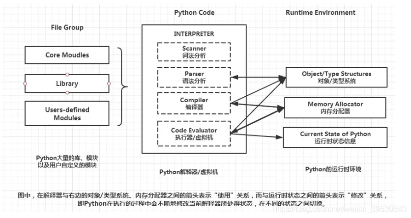

解释型语言，运行时通过特定解释器来解释并运行。一般官方使用的解释器是 CPython，也就是底层使用 C 实现，另外大部分第三方库（像 Numpy）也都是以 CPython 调用为目的来实现的。

在 `import` 库时会生成带解释器信息后缀的字节码（常为 `__pycache__/*.cpython-36.pyc`）以避免太多重复编译，可以通过 `export PYTHONDONTWRITEBYTECODE=1` 来避免生成字节码，`find . -type f -name "*.py[co]" -delete -or -type d -name "__pycache__" -delete` 来删除这些文件。



注意，Cython 和 CPython 不同，Cython 是一种 C/C++ 和 Python 互取所长混合使用的语言，最终输出 C 代码。

## 安装
推荐使用 `pyenv` 等工具安装管理，使用 ppa 源安装可能会出现问题


## 最佳实践
https://pythonguidecn.readthedocs.io/zh/latest/

### 库安装和打包
项目中存在 `setup.py` 是 Python 包构建分发工具所使用的文件，如果需要从源码安装 Python 包一般会使用采用这样的方式

```sh
python setup.py build
python setup.py install
```

但由于 `setuptools` 在依赖上存在一些问题，现在已逐步弃用。建议采用 `pyproject.toml` 来替代 `setup.py` 来构建工程，具体可参照 https://godatadriven.com/blog/a-practical-guide-to-setuptools-and-pyproject-toml/

更常见的安装库方法是直接使用 pip 安装

```sh
pip install xxx
pip install -e .    # 不安装 wheel，而是引用源代码目录，用于开发时即时使用修改的代码
pip install -e .[full]   # 安装 extras_require 版本

pip install xxx==x.x.x  # 制定版本
pip install xxx~=x.x.x  # 安装兼容的最新版本，一般是小版本能取新版，和 ^ 类似
```

一般安装的路径是 `/usr/local/lib/pythonx.x/dist-packages`，但一些自己编译的 python 库可能会安装到 `/usr/lib/pythonx.x/site-packages` 下，只是为了区分库的来源而已，在普遍使用虚拟环境的现在似乎没什么意义，可以手动移动库统一放到 `dist-packages` 里

总的来说，根目录的工程文件有如下这些：
- `setup.py`：使用 `setuptools` 分发打包库的脚本，传统方法，较为固定，现逐步弃用
- `setup.cfg`：为了避免 `setup.py` 的重复样本代码而使用的 ini 文件 https://setuptools.pypa.io/en/latest/userguide/declarative_config.html#declarative-config
- `pyproject.toml`：PEP 517 提出的新的打包分发 Python 模块的 ini 文件，可以指定使用什么工具来进行生成分发

关于 pip 安装缓存可以见 [[Ubuntu系统问题#pip 缓存问题|pip 缓存问题]]

关于导出使用的 pip 库，在容器中可以直接用 `pip freeze > requirements.txt` 导出当前环境所有 python 库

关于更多参见：
1. https://ianhopkinson.org.uk/2022/02/understanding-setup-py-setup-cfg-and-pyproject-toml-in-python/
2. https://setuptools.pypa.io/en/latest/build_meta.html


### Linter
代码检查工具，可以使用 Ruff，集成了很多常见的功能，在 VSCode 上可以使用 auto-fix 以及 Organize import 来整理代码

```python
# 在行后面加上 # noqa 表示让 linter 忽略这一行的警告
xxxxxxx = xxxxx    # noqa
```

### Formatter
自动格式化工具，最广泛使用的是 Black，也可以用 Ruff 集成的，基本一样，Ruff 的配置多一些
```shell
ruff format                   # Format all files in the current directory.
ruff format path/to/code/     # Format all files in `path/to/code` (and any subdirectories).
ruff format path/to/file.py   # Format a single file.
```

问题：
1. `unindent does not match any outer indentation level`：空格缩进和 tab 混用了

### 单元测试
测试的单元要尽可能小而且独立，函数命名采用尽可能长的功能描述性名字

可以使用 [pytest](https://learning-pytest.readthedocs.io/zh/latest/doc/intro/getting-started.html)，基本流程就是 Arrange-Act-Assert，需要将文件命名为 `test_xxx` 格式
```python
from xxx import func

def test_xxxxxx():
    x = 10
    y = func(x)
    assert(y == 10)
```
然后在 tests 文件夹目录终端输入 pytest 就会进行自动测试


## 特性
### REPL
REPL（Read-Eval-Print Loop）是一种顶层交互的 shell，可以输入语言相关的命令打印结果，CLI（Command-line interface）也是这样的东西（见 [[Shell]]）。Python 也带有 REPL 工具，在命令行终端下输入 `python` 就会打开相应版本的 REPL shell，然后就能执行 Python 命令

### 脚本
python 文件 `.py` 可视作脚本直接用命令行解析器 `python xxx.py` 解析执行，其执行顺序是由上而下逐行执行，也可以先 `python` 进入命令行交互模式再逐条输入命令执行或作为模块调用，区别在于不同的 __内置变量__（内置变量和内置方法格式为 `__xxx__`，可以通过 `vars()` 查看内置变量），如果执行脚本则会赋予内置变量 `__name__ = '__main__'`，所以可以通过如下方法来实现 main 函数（只在作为脚本解析时执行的函数）：
```python
# 无论是脚本解析还是模块调用都顺序执行
import xxxxxx

# 一般提倡在此处定义函数和类而不是执行代码，特别是多进程时需要注意这点
xxxx

# 若为脚本解析而非模块调用，则执行
if __name__ == '__main__':
	xxxxx
```

如果要以模块方式运行可以使用 `python -m xxx.py` 以 import 的方式执行（允许某种类型的相对导入，`__package__` 设为当前文件夹）

此外，Python 还支持以 zipapp 的方式将 Python 目录打包成 zip 压缩文件以通过 `python xxx.zip` 的方式执行 `xxx/__main__.py`，方便进行程序分发

对于有依赖库的工程，可以 pip 安装 `pipreqs` 库，然后使用 `pipreqs ./ --encoding=utf-8` 来生成 `requirements.txt`

### 模块
Python 文件一般分为包和模块，编写脚本并且导入相应的包或模块的方法从而实现各种功能，相当于库文件（脚本本身也可视作模块，只是会进入 `__main__`，和其他语言差不多）。  

包就是文件夹本身，通过在文件夹内部新增 `__init__.py` 表示该文件夹为包，在该文件中添加代码来使得 `import xxxpackage` 时进行一些默认行为。在这个层面上，导入包和导入模块可以使用一样的方法达到同样的目的。  

模块就是定义对象方法的库文件，导入模块时一般有两种方式
- 绝对导入：`import xxx` 或者 `from xxx import xxx`
- 相对导入：`from .xxx import xxx`，可以有多个前导点，但不提倡。通过模块属性 `__name__` 或者 `__package__` （若有）来定位位置
	- Python 的相对导入做得相对恶心，你无法在使用了相对导入的模块里加入 `if __name__ == '__main__':` 来保存模块测试代码，因为这样会被视作顶层文件（`__name__` 被设置为 `__main__`，而 `__package__` 被设置为 `None`），从而缺失路径无法完成相对导入
	- 使用 `python -m` 运行可以让 `__package__` 被设置为当前文件夹，运行一定程度的相对导入。`-m` 参数是让 python 搜索 `sys.path` 寻找模块（不需要后缀 `.py`）然后运行

对包的内部，推荐使用相对导入，以便对包进行维护。对于运行的脚本，则必须使用绝对导入

还有在脚本内通过字符串方式来进行导入：
```python
import importlib
mod = importlib.import_module('xxx_module')
func = getattr(mod, 'xxx_func')  # 使用字符串导入函数
```

### 对象
Python 一切皆对象，变量名和对象类似于指针和内存的关系，动态创建各种类型的对象并用变量名指向它，从而达到 __动态类型__ 的目的。这意味着 Python 里大部分赋值运算其实都是新建了对象再返回指向对象的别名

Python 提供可变类型和不可变类型
```python
my_list = [1, 2, 3]
my_list[0] = 4   # my_list 本身 id 没有改变，但其的元素改变了，是可变类型

x = 6
x = x + 1        # x 变量是一个新的变量，id 发生了改变，是不可变类型

x = 'asdx'
x[2] = '2'       # 报错，字符串也是不可变类型
```

- 常数：
  - 参与浮点相关操作要在数字后尾加 `.` 表明是浮点常数，否则可能会出错
- 全局变量：
  ```python
  a = 10
  
  def asd():
    a = 3
    
  def asd_global():
    global a
    a = 3
    
  # 函数内 a 为局部变量
  asd()          # a = 10
  
  # 函数内 a 为全局变量
  asd_global()   # a = 3
  ```
- 类：
    ```python
    # python3 自动继承 Object 类
    class Name:
        # 重写初始化函数
        def __init__(self, arg1, arg2):
            # 父类初始化
            super().__init__()
        
        # self 代表类对象自身，无所谓命名，用于调用类的方法
        def func1(self, arg1):
            pass

        # 下划线注意：用双下划线开头命名方法时，默认为受保护的方法，
        #           Python 会添加个类前缀以保护函数不被子类覆盖，
        #           如：这里需要用 a._Name__func2() 才能访问该方法
        def __func2(self, arg1):
            pass

        # 双下划线包裹时，命名不变，作为内置变量或方法
        def __func3__(self, arg1):
            pass

        # 单下划线开头，表示是内部使用的方法或函数，属于约定俗成
        def _func4(self, arg1):
            pass
    ```

https://pythonguidecn.readthedocs.io/zh/latest/writing/structure.html#id14

### 函数输入
Python 的函数/方法允许两种传入参数：位置参数、键值参数。位置参数就是通常的入参方式，假设实参和形参是按顺序一一对应的；键值参数就是指明形参对应的是哪个实参
```python
# a 是位置参数
# b 是键值参数
def test(a, b=1):
    print(a, b)

# 和函数定义不同，实际可以按自己喜欢使用那种输入方式（调用 C 底层库的除外）
test(1, b=2)
test(a=1, b=2)
test(1, 2)

# 顺序必须要先位置参数再键值参数，这种情况就不行
test(a=1, 2)
```

`*args` 保存函数输入多出来的参数，`**kwargs` 保存使用键-值方式输入的多余参数，同时使用时 `**kwargs` 要在 `*args` 后面。

`*` 为解包符号，单个使用时为将容器元素解开来一一送进函数（作为位置参数），两个使用时为字典键对应的值送进函数（作为键值参数，字典单个解包符则是送 keys 进去）。

```python
def test(*args,**kwargs):
    print(args)
    print(kwargs)
    
test(1,'2',None,c=8,d=12)

# (1, '2', None)
# {'c': 8, 'd': 12}

# 输入也可以通过字典或元组输入
test(*(1, '2', None), **{'c': 8, 'd': 12})
```

另外，通过加一个单独的 `*` 作为入参可以限定位置编码的范围，表示之后的入参只能靠关键词来输入
```python
def test1(a=1, b=2)
    print(a, b)

def test2(a=1, *, b=2):
    print(a, b)

# Works
test1(1,2)

# Not works
test2(1,2)
```


### Duck Typing
> If it walks like a duck, swims like a duck, and quacks like a duck, then it probably is a duck.

一种注重方便的编程方法，不去关注对象的类型，而是关注对象的行为。换句话说，在编程中使用对象提供的方法和特性，而不需要管对象是不是期望的类型


1. https://devopedia.org/duck-typing

### 内置变量和属性方法
Python 中对象和实例的属性以字典形式保存，有两种方法查看：
1. `vars(module)`：返回当前对象单个类的属性字典，其实就是返回它的 `__dict__` 对象。不输入参数则返回当前环境的符号表
2. `dir(module)`：返回当前对象单个类及其基类的属性字典，会返回所有有效属性。不输入参数则返回当前环境的所有对象名字
3. `eval(str)`：把 str 内容当成代码执行

常见内置变量：
1. `__all__`：用于控制模块公开的接口的变量，`__all__=["func1", "func2"]` 可以让模块导入时只导入列出来的成员
2. `__base__`：class 的基类，只有类有，实例没有，如果要看基类方法的实现，可以 `print(inspect.getsource(type(model).__base__.__call__))`
3. `__code__`：与函数代码层面相关的对象？可以显示当前函数的文件位置，以及形参 `__code__.co_varnames`

以双下划线包起来的内置方法也叫魔法方法：
1. `__init__` / `__new__`：Object 自带的初始化方法，`__new__` 会被首先自动调用用于构造返回类的实例（也就是可以返回别的类的实例），`__init__` 则是改变实例的状态返回 None。`__new__` 可以决定是否后续调用 `__init__`，Object 的话默认调用
2. `__del__`：在类被自动删除之前执行的方法，类似于析构函数


### 继承
多类继承涉及重复调用（钻石/菱形继承）问题，也就是共同基类会被多次调用，python 通过查找顺序（MRO）来解决这个问题。具体来说，在类中通过 `super()` 来调用 MRO 的下一个类的方法，确保每一个类只初始化一次，如：
```python
# 多类继承，这些类初始化首行均有 super().__init__()，共同基类为 base_parser
class merge_parser(landmarks_parser, face_parser):
	def __init__(self):
		super().__init__()

# 初始化调用顺序为：
# start merge_parser
# start landmarks_parser
# start face_parser
# start base_parser
# end base_parser
# end face_parser
# end landmarks_parser
# end merge_parser
parser = merge_parser()


import inspect
inspect.getmro(merge_parser)    # 获取 MRO 初始化顺序
# > (merge_parser, landmarks_parser, face_parser, base_parser)
```
不过多类继承还是存在无法很好传入参数的问题，而且也不好维护，所以实际推荐避开这种方法


### lambda 表达式
创建匿名函数。用表达式构建函数，只能访问自有参数，比 def 快速便捷  
```python
sum = lambda x1, x2: x1 + x2
sum(2,3)
```


### 迭代器与生成器
- iterator：
  - 创建：`a = iter(list)` 
  - 遍历：`next(a)`，无法 index?
  - 自定义：在类中实现 `__iter__(self)` 初始化和 `__next__(self)` 取值方法则可以构建迭代器
- generator：
  - `yield`


### 对象变动（Object Mutation）  
可变对象（如列表）赋值只是增加别名，都会更改同一个空间。函数内部修改外部传进来的可变对象元素也一样是直接改内存。但当在函数内重新赋值时（如 `in_dict = dict(xxx)`），传进函数内部的对象就不再是别名，而是新的对象
```python
>>> a = []
>>> b = [1,2]
>>> a.append(b)
>>> a.append(b)
>>> a.append(b)
>>> a
[[1, 2], [1, 2], [1, 2]]
>>> b[1] = 3
>>> b
[1, 3]
>>> a
[[1, 3], [1, 3], [1, 3]]

# 想要 a b 独立，应当
a.append(list(b))

# 或者拿出元素来建立 a
a.append(b[:])
```

可变对象作为入参时，函数默认参数只会运算一次，不会每次调用都重新运算：  
```python
def add_to(num, target=[]):
    target.append(num)
    return target
 
add_to(1)
# Output: [1]
 
add_to(2)
# Output: [1, 2]
 
add_to(3)
# Output: [1, 2, 3]
```
如果想要每次运行时重置，则需要将 `target = None`，然后在函数内创建列表

有时候在函数内部需要缓存当前状态时利用这个特性可以很方便（相当于在函数内部维护了一个静态数组）

### 不可变对象（Immutable Object）
也叫可哈希（hashable）对象，其在生命周期内不会改变（有 `__hash__()` 方法），能够通过 `__eq__()` 或 `__cmp__()` 进行比较。

可哈希对象可以作为字典的键或集合的元素（在内部使用哈希值表示）。

内置对象是可哈希的，自定义类的实例对象默认也是可哈希的（哈希值是 `id()`）


### 列表维护
如果创建新列表，可以采用列表解析的方式。比普通循环方法要快，可嵌套，字典也能这样用
```python
a = [ i**2 for i in range(10) if i > 3 ]

# 展开嵌套列表
a = [b for i in a for b in i]
```

如果只是要遍历列表，应该采用迭代器，可以避免过多的内容加载。可以用生成器表达式来完成（也就是换成小括号）
```python
# python 3.x
filtered_values = (i**2 for i in range(10) if i > 3)
filtered_values = filter(lambda i: i > 3, range(10))   # 没有输出乘法处理
```

通用的讲，这三种内置函数结合 lambda 函数可以达到一定程度的函数式编程：
- `map(func, iterable)`：对 iterable 逐个应用 func，输出等大小 list
- `filter(func, iterable)`：对 iterable 逐个应用 func，根据 func 结果是 true 或 false 选择是否保留该元素，返回小于等于原 list 大小的新 list
- `functools.reduce(func, sequence[, initial])`：func 输入上次结果和这次元素，计算累计结果传递给下个输入，遍历数组，可以实现累乘累加，返回单个值

### 协程
类似中断，它允许在函数执行中跳转执行其他函数，子程序是协程的一种特例  
- `yield`：生成器就是协程的一种实现
- `async/await`：python3.5 加入的关键字，通过 `async def func():` 来表示定义一个异步函数，内部可以设置挂起条件。在异步函数中通过 `res = await func()` 来表示挂起当前异步函数，等待 `func()` 返回结果

参考：  
1. https://www.cnblogs.com/dhcn/p/9032461.html
2. https://www.cnblogs.com/xinghun85/p/9937741.html


### 闭包
Python 函数内部允许嵌套函数，如果内部的函数使用了外部函数提供的临时变量（内部函数的非局部变量），然后返回外部函数返回值为内部函数，则形成了闭包，该外部变量被绑定成了值或在存储空间中，也就相当于内部函数被实例化创建了

```python
def f(x):
    def g(y):
        return x + y
    return g  # Return a closure.

def h(x):
    return lambda y: x + y  # Return a closure.

# Assigning specific closures to variables.
a = f(1)
b = h(1)

# Using the closures stored in variables.
assert a(5) == 6
assert b(5) == 6

# Using closures without binding them to variables first.
assert f(1)(5) == 6  # f(1) is the closure.
assert h(1)(5) == 6  # h(1) is the closure.
```

需要注意，Python 的闭包是 _late binding_ 的，也就是内部函数在被调用时才会去寻找内部变量的值，这意味着不能够一串 for 循环创建函数列表

```python 
cc = [lambda x : i * x for i in range(5)]
cc[0](2)
# return: 8
cc[1](2)
# return: 8


def create_multipliers():
    multipliers = []
    for i in range(5):
        def multiplier(x):
            return i * x
        multipliers.append(multiplier)
    return multipliers
cc = create_multipliers()
cc[0](2)
# return: 8
cc[1](2)
# return: 8
```

参考：  
https://docs.python-guide.org/writing/gotchas/#late-binding-closures


### 装饰器
如果有一些函数功能逻辑之外的事情要做，或者说需要控制函数的行为，比如日志、授权之类的，可以使用装饰器来实现以保持代码的简洁清晰

大致意思就是使用一个新函数去包装该函数

```python
from functools import wraps

def cal_time(func):
    @wraps(func)   # 让 wrap_func 使用 func 的函数信息的装饰器
    def wrap_func(*args, **kwargs):
        start = time()
        res = func(*args, **kwargs)
        end = time()
        print('time:', end-start)
        return res
    return wrap_func

@cal_time
def process(a, b):
    return a + b

process(1,2)
# Output: time: 7.152557373046875e-07
# Output: 3

# @ 后面跟以 func 为参数的可调用对象，所以可以再加一层使装饰器带参数
def benchmark(cuda=False):
    def cal_time(func):
        @wraps(func)   # 让 wrap_func 使用 func 的函数信息的装饰器
        def wrap_func(*args, **kwargs):
            if cuda:
                torch.cuda.synchronize()
            start = time()
            res = func(*args, **kwargs)
            if cuda:
                torch.cuda.synchronize()
            end = time()
            print('time:', end-start)
            return res
        return wrap_func
    return cal_time

@benchmark(True)
def process(a, b):
    return a + b


# 一些内建的装饰器
class X():
    # 类方法，可以 X.func1() 直接调用，允许通过 cls 来获取调用类的一些属性或方法，避免硬编码
    @classmethod
    def func1(cls, arg1, arg2):
        pass
    
    # 静态方法，可以 X.func1() 直接调用，无法访问类的属性状态
    @staticmethod
    def func2(arg1, arg2):
        pass
```

类和对象也可以用作装饰器，会更加灵活
```python
class luminance_inference():
    def __init__(self, f):
        self.f = f

    def __call__(self, x, *args):
        x, recov_uv = rgb_to_luminance(x)
        y = self.f(x, *args)
        y = luminance_to_rgb(y, recov_uv)
        return y

@luminance_inference
def forward(x):
    return x
```

一些有用的装饰器：
- `@functools.lru_cache(maxsize=128)`：函数缓存装饰器，会缓存 `maxsize` 个结果，函数的固定参数和关键字会用字典缓存下来，如果相同就会返回上次的结果。不过这个装饰器不能用在 numpy array 上，如需用于复杂返回值上可以考虑 [[Python#Python#Joblib|Joblib]]

问题：
1. 在类方法里使用装饰器有很多要注意事项，暂且没搞懂，总之很难用


参考：  
1. https://www.runoob.com/w3cnote/python-func-decorators.html


### 注册
https://applenob.github.io/python/register/


### 垃圾回收
Python 主要采用引用计数，辅以 标记-清理 和分代回收策略。  

对象引用计数 +1 的情况：  
1. 对象被创建
2. 对象被引用 `b = a`
3. 对象被传入函数中
4. 对象被存进容器中  

对象引用计数 -1 的情况：  
1. 别名被显式销毁 `del a`
2. 引用其他对象 `b = a` => `b = c`，a 引用 -1
3. 离开作用域
4. 容器被销毁，或元素被删除

问题：  
耗资源（引用一次改一次）、无法释放循环引用（`a, b = b, a`）  

解决：  
使用 标记-清理 将容器内元素分为 reachable 和 unreachable（对象间构建有向图，从 root object （全局变量、调用栈、寄存器）出发，能抵达的就是 reachable，否则 unreachable），清理 unreachable。清理的时机使用分代回收，即根据存活时间给对象分代，按特定策略触发垃圾回收


详细参考：
1. https://blog.csdn.net/xiongchengluo1129/article/details/80462651  
2. https://segmentfault.com/a/1190000016078708

### 内省（Introspection）和反射（Reflection）
大致意思都是程序在 __运行时__ 去查看或修改一个 __不确定是否存在__ 的对象，前者只能检查，后者允许修改。Python 中通过 `getattr(obj, str)`、`setattr(obj, str, val)` 等来实现
> The ability to inspect the code in the system and see object types is not reflection, but rather Type Introspection. Reflection is then the ability to make modifications at runtime by making use of introspection. The distinction is necessary here as some languages support introspection, but do not support reflection. One such example is C++.

`setattr(object, name, value)`：功能上类似于 `object.name=value`，给对象设置属性值，该属性可以不存在（新建），不过这里 `name` 为字符串  
`getattr(object, name[, default])`：同上，属于按属性名索引

### 多线程与多进程
GIL（Global Interpreter Lock）：由于 Python 使用引用计数来进行内存管理，如果多线程不互斥则可能出现大问题，于是引入了 GIL 作为互斥锁

多线程 `threading`，多进程 `multiprocessing`。由于 Python 一般使用 CPython 作为解释器，而 CPython 有 GIL 的存在（一时间只能一核在跑），所以无法在 Python 层面实施真正的多线程。如果同步和通信问题不是很严重，使用多进程会不错，每个进程会有一个 GIL，但不会互相影响

```python
# 多进程下 numpy 种子可能相同，随机函数或种子设置应采用 python 的 random
import random
# 使用 pickle 来序列化入参，改用 multiprocess 可以有更强的序列化能力
import multiprocessing

def func(x):
  pass
  
def func_wrapper(z):
  func(z[0], z[1], ...)

if __name__ == '__main__':
    # 单进程处理
    for x in list_v:
      func(x)

    # 简易使用，8 进程处理
    pool = multiprocessing.Pool(8)
    
    # 将 list_v 换为 [(arg1, arg2), (arg1, arg2), ...] 的二维数组，
    # 再套一层 wrapper 解析入参，再传入到 func 中即可处理多个参数
    # （类似 Tensorflow 的数据预处理）
    pool.map(func, list_v)
    pool.close()
    pool.join()
```

需要注意的是，不能多个进程对同一全局变量做修改（在各个进程中似乎会拷贝一份全局变量进去，然后每个进程都有一个仅对自己进程可见的全局变量，最终修改的结果也只影响拷贝的变量，不会改变主进程的全局变量）  
如需共享资源使用  `Multiprocessing.Queue`、`Multiprocessing.Array`、`Multiprocessing.Manager` 

子进程的构建方式包含 fork 和 spawn，还有一种 forkserver 似乎是两者的混合管理：
- fork：子进程使用父进程共享的内存，只会对修改部分写时复制，速度快，不过如果长时间运行修改的小资源多会导致内存涨得厉害。Unix 类以及 MacOS（python3.8 以下）默认用这种方式，Windows 不支持。另外，该方式会复制 numpy 随机种子，会出现多进程使用同一个种子的情况
- spawn：子进程从头构建，复制父进程数据，相当于再跑一个程序，速度慢。Windows 以及 MacOS（python3.8 及以上）默认这种方式
- 补充资料： https://bnikolic.co.uk/blog/python/parallelism/2019/11/13/python-forkserver-preload.html

在一些情况下（比如 VSCode 上调试）似乎只能用 spawn

jupyter 上多进程可见 [[Python#jupyter]]

`multiprocessing.Pool` 的使用说明：
- `apply(f, *args)`：使用进程池的一个进程跑一个函数，阻塞。非阻塞版本 `apply_async`
- `map(f, *args)`：使用进程池并行跑一个函数，阻塞。非阻塞版本 `map_async`
- `imap(f, *args)`：类似 `apply`

1. https://discuss.python.org/t/differences-between-pool-map-pool-apply-and-pool-apply-async/6575


### is 和 is not
类似 `==`、`!=`，不过 `is` 和 `is not` 比较地址  
```python
a="hello"
b="hello"
print(a is b, a == b)   # 输出为 True, True

a=["hello"]
b=["hello"]
print(a is b, a == b)   # 输出为 False, True
```
需要注意的是，`==` 可能会被重载（如 numpy 里会返回 keep_dims 的 bool 数组），这样就不能用 `a == None` 对 `a` 判别（重载后对元素进行逐个判别），而 `a is None` 可以，所以判别对象是否存在一般都用 `is None`

### None 和 False
if 语句里可以判断 空数据、`0`、`False` 和 `None` 都为假，使用 `is` 判断的话它们都是不同的
```python
a = []
b = 0
c = False
d = None

if a or b or c or d:
	# not enter
	pass

0 == False  # True
1 == True   # True
2 == True   # False
```

### with...as...
可以用于打开文件（上下文管理器），自动分配和释放资源，保证操作结束后无论是否异常都能自动关闭打开的文件。可以通过类里实现 `__enter__`  和 `__exit__` 方法来自制上下文管理器，也可以使用 `contextlib` 来装饰生成器做成简易的上下文管理器
```python
with open('xxx.txt', 'w+') as f:
	f.write(str)
```

https://pythonguidecn.readthedocs.io/zh/latest/writing/structure.html#id12


### 类型注解
类型注解是 Python 3.5 后引入的功能，主要用于标注对象的类型，使用方法类似 `a: int = 3`，常用于标注函数方法的输入输出变量类型，以方便编辑器检查。具体类型标准可以在 `typing` 库中找到
```python
from typing import List

# 复合类型注解
a: List[int] = [0, 3]

# Python 3.9+ 可以不需要 typing 库
a: list[int] = [0, 3]

# 也可以在内置构建函数时添加注解
a = dict[int, list[int]]()

# 更高级的还可以使用泛型来处理复杂的多类型支持和多参数同步类型问题
```

通过 `.pyi` stub file 可以给函数指定类型，从而让 Pycharm 等环境进行类型检查而非运行时动态检查。名字要相同，且在 `PATH` 中 https://www.cnblogs.com/chester-cs/p/14000921.html

https://zhuanlan.zhihu.com/p/419955374


### 异常处理
遵循 Fail-Fast 原则，不要静默处理，不要用默认处理纠正，除非明确知道怎么处理。对于意想外情况的输入，不要捕获，Let it Crash，让上层解决
```python
# 直接抛出异常
if xxx:
	raise RuntimeError('asdasdsa')

# 异常捕获以及打印信息
import traceback
try:
	Image.open('xxx.jpg')
except IOError:
    xxx
except Exception as e:
    print(repr(e))                    # 打印错误（无转义）
    print(traceback.print_exc())      # 打印完整 traceback
else:								  # 无误的话
	xxx
finally:
    xxx								  # 无论正确错误一定会执行的部分


# 断言，用 python -O 执行可忽略
assert(xxx == 'asd')

# 想要重新尝试一定次数再报错则可以使用 retrying 的装饰器
import retrying
@retrying.retry(stop_max_attempt_number=5, wait_fixed=1000)
```

https://dzone.com/articles/fail-fast-principle-in-software-development

### 性能分析
使用 dis 模块可以分析字节码
```python
import dis
dis.dis(func)
```

### 正则表达式/字符串处理
使用 re 模块
```python
import re
# 因为 re 的输入 pattern 需要符合正则表达式规则，而正则表达式和 ASCII 的转义字符部分冲突
# 所以需要在 pattern string 前加上 r 表示 raw string 不处理转义字符得到原始字符，用于正则匹配 
res = re.match(r'model\.stage\d\.', key)

# 与上面同结果的另一种写法，稍高效些
prog = re.compile(pattern)
result = prog.match(key)

# 将 key 中符合 prog pattern 的字符串替换成 xx
prog.sub('xx', key)

# 去除非英文字母、数字、空格的字符
re.sub('[^a-zA-Z0-9 ]', '', s)

# 转义字符
re.escape(' vv/n ')  # '\ vv/n\ '

# 返回捕获组，0 表示匹配的字符，1 表示第一个捕获组，2 表示第二个捕获组，如此类推
res.group(0)
```

### 日志系统
Python 使用 `logging` 库作为标准日志记录工具，其格式化等处理通过 handler 实现，常用的 handler 有：
- `StreamHandler`：将输出流发送到标准输出或文件对象等支持 `write()` 和 `flush()` 的对象上
- `NullHandler`：不会处理或输出，可以用来静默相关日志而不用大量改代码

开发库时，应当将 logger 设置成 NullHandler `logging.getLogger(__name__).addHandler(NullHandler())`，似乎可以将库的日志输出交由用户设置决定


1. https://realpython.com/python-logging-source-code/#library-vs-application-logging-what-is-nullhandler


### \_\_future\_\_ 模块
可以将新版本 python 的特性导入到当前版本中使用


### 关于 Unicode、str 和 bytes
标准 ASCII 码 0 ~ 127 表示字符，最高位留作奇偶校验（使字节的位累加和为奇/偶数），后 128 为扩展码。为表示更多语言，用两个字节来编码，如 GB2312。

Unicode 则是统一多种语言的字符集，每个字符对应四字节内的 ID（或称 code point），其编码方式（出于传输使用和压缩常用字符等目的）有 UTF-8（以 8 位为单位的可变长编码）等。

在 python2.x 中，`a = 'asd'` 和 `a = u'asd'` 分别是 str 和 unicode 类型，而在 python3.x 中两者都是 str 对象类型（似乎都是 unicode 的 code point 形式，都视为 unicode string）。而 UTF-8 表示则是字节形式，比如 UTF-8 字节 `0x30` 代表 unicode 字符 `0` 。

若要保存则需要编码为 bytes 类型（相当于字节组成的数组），通过 `a.encode('utf-8')` 实现，此时它的长度将会是如实的字节数。

对于 `a.encode("ascii", "xmlcharrefreplace")` 还有第二个参数，可以提供无法被相应规则编码的情况下的对策。  
_注：字符串标志 `r'xxx'` 表明用原始字符不转义（比如换行用”反斜杠+n“表示），`f'xxx{a:.2f}'` 表明 f-string，字符串内可以用大括号来引入外部变量，`b'xxx'` 表明是 bytes 对象_

更多资料： https://pycoders-weekly-chinese.readthedocs.io/en/latest/issue5/unipain.html

转换方法汇总如下：
```python
str_a = 'asd'
int_a = -4
arr_a = np.array([4.2, 3.1])
byt_a = b'asd'

# 转 bytes
b = str_a.encode('utf-8')
b = int_a.to_bytes(4, sys.byteorder, signed=True)
b = arr_a.to_bytes()  # 同 bytes(arr_a)
b = bytearray(byt_a) # 可写的字节数组，用于字节运算

# bytes 转
str_a = b.decode('utf-8')
int_a = struct.unpack('1i', b)
arr_a = struct.unpack('2d', b)

# 十六进制字符转 bytes
bytes.fromhex('E1B3')
```

字符串对齐方法：
```python
print("%-70s \t %s" % (s1, s2))  # 将 s1 字符串左对齐填充到 70 字符
print(f"{s1:<15}")               # 左对齐占 15 字符，最好将不能对齐的变量打印放到最后面
```

字符转义：
```python
re.escape('x.out.')
# > 'x\\.out\\.'
```

字符数字互转：
```python
ord('0')  # 返回 Unicode 码点，48
chr(48)   # 返回 Unicode 字符，'0'
```

编码错误问题：
1. 首先观察结构：如果是类似 `\123\432\142` 的格式，说明是 Unicode 码，这里是 8 进制 Unicode，而且可能是一个汉字（占三个 unicode）；如果是乱码字符说明是被解码过了，需要先用 `.encode('utf-8')` 之类的编码回 bytes
2. 然后转换成 16 进制的编码 bytes，也就是手动编码。如果是 `\123\432\142` 的话可以 `[bytes.fromhex(hex(int(code, 8))[2:]) for code in octal_code.split('\\')[1:]]` 把逐个 Unicode 码转成十六进制 bytes
3. 最后把 bytes 合起来，并且用正确的编码格式解码回正确字符， `b''.join(hex_bytes).decode('utf-8')` 

### I/O
主要分两种：StringIO、BytesIO，前者操作 str，后者操作二进制

```python
import struct

# 结构化读二进制文件
label_file = open("Samples.bin", 'rb')  # 样本格式为215个浮点+1个整型，一共69个样本
label_raw = struct.unpack(69*'215fi', label_file.read(69*216*4))  # 格式化读取相应字节的 buffer
label_array = np.array(label_raw)
label_array = np.reshape(label_array, [69,-1])
label_file.close()
```

想要通过文件 I/O 写数据进硬盘需要经过几个步骤，其中存在几种缓冲区：
1. 内部缓冲区。程序调用 I/O 接口 `file.write()` 写入时会先写到运行时/库/语言所创建的内部缓冲区中以加快程序写的速度，当缓冲区满了才会经过系统调用写入到实际文件（操作系统缓冲区），也可以通过调用 `file.flush()` 来显式进行这个过程，使用 `with ... as` 打开的文件会自动做 `flush`
2. 操作系统缓冲区。当完成了内部缓冲区到操作系统缓冲区的复制后，其他进程打开文件就能访问到更新的内容，但是还没有真正写到硬盘中，可以通过调用 `os.fsync(fd)` 来强制写到硬盘中，不过现代硬盘内部通常也有多级缓存区，而且主动的 `fsync` 可能会被禁用之类的，所以实际会更复杂些
3. 不过好像在 ext4 下必须要经过 `fsync` 才能同步文件内容，更多参考 https://stackoverflow.com/questions/7127075/what-exactly-is-file-flush-doing


### 版本控制
```python
from packaging.version import Version, parse

v1 = parse("1.0a5")  # 支持更丰富的非标准格式
v2 = Version("1.0")
```

1. https://packaging.pypa.io/en/latest/version.html

### 环境变量
- __PYTHONHOME__：表示 python 标准库的前缀路径，默认系统库为 `/usr/`
  > Change the location of the standard Python libraries. By default, the libraries are searched in prefix/lib/pythonversion and exec_prefix/lib/pythonversion, where prefix and exec_prefix are installation-dependent directories, both defaulting to /usr/local. 
    > When PYTHONHOME is set to a single directory, its value replaces both prefix and exec_prefix. To specify different values for these, set PYTHONHOME to prefix:exec_prefix.
- __PYTHONPATH__：python 模块索引路径，可以在 `sys.path` 中查看和修改，添加索引时常用的环境变量

如果要在脚本中临时插入环境变量，可选择 `os.environ['PYTHONPATH']='path'`，如果不好使那就 `sys.path.insert(0, 'path')`

### JIT 和 AOT
Python 3.13 版本后更新了 JIT，也就是可以在运行时翻译字节码成机器码来执行，相比于传统的每次都解释字节码并执行的方式要快。

## 计算
对性能要求较高的计算情况下可以考虑别的库，比如 Taichi 之类的

### 内置函数
- `vars(object)`：函数返回对象 object 的属性和属性值字典
- `dir(object)`：返回对象 object 的所有属性列表

### 常用生成函数
- `np.linspace(start, end, num_points)`：生成 [start, end] 的 num_points 大小的数组

### 传递
- `a = b`：对于 numpy 数组，此操作只改变指针，a 和 b 共用一块内存
- `a = b[0]`：注意，当 b 的元素是列表对象元素时（如 pytorch Tensor），内存不会拷贝，修改 a 会同时修改 b[0]
- `a = b.copy()`：内存拷贝
- `a = b[:,0:4]`：切片会拷贝内存，不会修改原数组

### 矩阵计算
- `a - b`：这类运算最好同维度，不然可能会出现意外的结果
- `a @ b`，矩阵乘法，同 `np.dot(a,b)`，为 Python3.5 新添加的特性
- `np.einsum('ij,ik->jk',a,b)`：爱因斯坦求和，高级的矩阵乘法表示，_"输入标记中重复字母表示沿这些轴的值将相乘"，“输出标记中省略字母表示沿该轴的值将被求和”_。如例，输入相同的维度 `i`（a 和 b 的行维度各元素）做 element-wise 乘法，输出表示取不同的维度 `j` `k`（列维度）做遍历计算排列，而省略的维度表示对上述乘法结果求和，若 i 为 3，`[1,2,3]x[4,5,6] -> [4+10+18]`
  - `np.einsum('ij,ik->ijk',a,b)`：输出三维度，同上沿行相乘，若 i 为 3，`[1,2,3]x[4,5,6] -> [[4],[10],[18]]`
  - 在 Numpy 下会加速，但在其他一些场合（PyTorch、TensorFlow）之类的可能会减速，所以在非通用支持的矩阵计算场合要谨慎使用
- 数组累乘积：`np.prod(a)`
- 返回三角斜边：`np.hypot(x1, x2)`，`x1` `x2` 是两条斜角边，可以是多维的常数
- 矩阵求逆：`np.linalg.inv(x)`，注意，`x` 需要是 well-conditioned 的，也就是 `np.linalg.cond(x)` 需要是较小的数，不然的得来的值可能会有相当大的偏差，这时候需要用伪逆来替代
- 广播机制：不同维度的矩阵进行运算时的机制，也可以用显式方法完成，是 GPU 运算加速（向量化）的头等目标
    - `shape(2,3)-shape(2,1)`：会自动复制最后一维，变成 `shape(2,3)-shape(2,3)`
    - `shape(2,1)-shape(1,2)`：会做自动切分遍历，得出 `shape(2,2)`

### 批量索引
- `a[c,:]`：bool 值数组 `c = np.array([False, True, ...]), c.shape=(12,)` 可以作为 index 筛选其他数组，此处可筛选出 a 的第一维数据
- `np.where(c)`：返回 bool 值数组中 True 的索引，常用如 `np.where((a>4)&(a<5))`，当 c 是二维数组时返回 `(row_idxs, col_idxs)` 的元组
- `np.isin(e1, e2)`：检测 e1 中是否有含有 e2 中元素的值，若是则为 True，否则 False。输出 e1 大小的 array。
- `a>0.5`：返回等大小 bool 值矩阵，若 `a[a>0.5]`，则筛选出相应值并组成一维向量，若 `a*(a>0.5)`，则可置 a 小等于 0.5 的值为 0
- `a[a==255] = 0`：批量替换 255 值
- `img[vec1, vec2] = 255`：可以向量化，`vec1`、`vec2` 为一维数组
- `a[:,[2,0]]`：取 a 数组第二维度的 2 和 0 通道

### 切片
- 冒号`:`数组切片，不省略维度，如：
```python
a = np.arange(10)  
b = a[2:7:2]   # 从索引 2 开始到索引 7 停止，间隔为 2（numpy 间隔可为负数，torch 不可）
# [start:stop:step]
# step 可省略，遵循左闭右开 [start, stop)
# start 和 stop 也可省略，
# 表示之后或之前的全部索引 [start:] [:stop]

a = np.arange(12).reshape(4,3)
a = a[:,[2,1,0]]   # 实现 BGR 转 RGB，同 a[:,::-1]，但 torch 只支持该操作
```
- 省略号`...`：数组切片，可省略多个维度，或者保持维度，如：
```python
a = np.random.rand(2,8,5,5)
print (a[...,1])   # axis 3 的第 2 个 [2,8,5]
print (a[1,...])   # axis 0 的第 2 个 [8,5,5]
print (a[...,1:])  # axis 3 的第 2 个及以后 [2,8,5,4]
```

冒号切片其实是通过传 `slice(x1,x2,x3)` 进 `__getitem__` 来实现的，可以检查入参类型来在自定义类中实现切片

### 特殊索引
- `np.searchsorted(array, value, side='right')`：寻找值的插入区间

### 删除
- `list.remove(xxx)`
- `np.delete(a, [1], axis=1)`：删除 index=1 列

### 逻辑
- 判空千万不要用 `xxx is None`，空数组也会返回 False，最好都用 `len()`、`.size` 等方法
- 交集并集等操作采用 [[Python#集合]]
- 批量逻辑判断可以用 `all([True, False, True]) == False` 或 `any([True, False, True]) == True` 来进行，类似全部与操作（空列表也返回 True）

### 比较
- 可以采用 `DeepDiff`，能够列出嵌套结构化数据之间的差异，支持常用结构和 numpy 数组作为元素，还有忽略大小写、忽略类型变化、指定浮点精度、正则表达式等功能 https://miguendes.me/the-best-way-to-compare-two-dictionaries-in-python

### 扩增
- `[1, 2, 3]*2 = [1, 2, 3, 1, 2, 3]` 或 `[2,3,4] + [23] = [2,3,4,23]`。__注意，乘法扩增不会在内存上进行拷贝，扩增的部分是共享的__ 
- 元组扩增也一样，不过只有一个元素要写成 `(x, )` 形式
- 字典扩增则直接赋值就好 `a[new_key] = new_value`
- `np.insert(a, [2], 1, axis=-1)`：在最后一维的 index=2 前面插入全 1

### 堆叠/展开
- PyTorch 中有 `tile/unfold`，见此 [[PyTorch#^e3b3d9]]，numpy 不清楚

### 数组扩维度
- `np.insert(a, 0, np.ones(9), axis=1)`：在 a 数组的第 0 列__之前__插入一列 1，`a.shape=[9, 3]`，相当于 matlab 的 [ones(9,1) a]
- `np.append(a, 1)`：将 a 展成一维，并在末尾插入 1，多维情况不明
- `np.reshape(a, [a.shape[0], a.shape[1], -1])`：类似 `torch.unsqueeze(-1)`
- `a[np.newaxis, :]`：等同于 pytorch 的 `a.unsqueeze(0)`，tensorflow 中也是类似方法
- `np.repeat(a, 3, axis=-1)`：将 a 的最后一维扩展三倍，也就是 [4,4,1] 扩展成 [4,4,3]

### 重排
- `np.transpose(a, (1,2,0))`，另外有些库只交换两个维度，有些库会称作 `permute()`
- 矩阵内部设立子矩阵，同时不改变排列结构：
  ```python
  # 需要设置分组情况，假设内部子矩阵为 4x4 大小一组，即 block_shape = (4, 4)
  # 由 a:(1380, 778) -> b:(345, 194, 4, 4)
  
  # strides 为每个维度跨越到下一维度的字节大小，注意要加上舍弃的末尾余数
  # 如 b[0] -> b[1] 需要经历 194x4x4+(778-194*4)*4，也就是 778*4
  strides = 4 * np.array([a.shape[1] * block_shape[0], block_shape[1], a.shape[1], 1])
  
  # 输出 shape
  a_block_shape = (a.shape[0] // block_shape[0], a.shape[1] // block_shape[1],
                   block_shape[0], block_shape[1])

  # 这里转成 4 字节的浮点矩阵再切分
  b = np.lib.stride_tricks.as_strided(a.astype(np.float32),
                                    a_block_shape, strides)
  ```

### 合并
- numpy：`np.concatenate( (a,b), axis=1 )`，将 a 和 b 沿 1 维合并，有些库称作 `concat()` 或 `cat()`，如果要 concat 到新维度的话就是 `np.stack()`
- list：`clist = alist + blist`
- 不要求容器类型：`itertools.chain(a, b)`，创建迭代器

### 插值
- `np.interp(np.linspace(1, 10, 50), np.linspace(1, 10, 10), a)`：用于一维线性插值，a 是大小为 10 的一维数组
- `np.append()`：展成一维，然后在末尾添加值
- `scipy.interpolate.interpn(grid_cord, grid_val, inter_p)`：多维插值，其中：
    - `grid_cord`：网格在各个维度的坐标的元组，比如 `(np.array([1,2,3,4]), np.array([1,2]), np.array([1,2,3]))` 可以代表从 x 维度上看各个网格的坐标刻度为 1,2,3,4（可以不等间隔，网格最终满足长方形状就行），另外两个维度同理
    - `grid_val`：网格内的值，如果按上述坐标的话，其 shape 应为 [4, 2, 3]
    - `inter_p`：要插值的点，shape 为 [N, 3]
    - https://docs.scipy.org/doc/scipy/reference/generated/scipy.interpolate.interpn.html

### 取模
- `a % b`：a 或 b 可为负数，具体结果：
  ```python
  # 仅 python
  -17 % 10 = 3
  17 % -10 = -3
  -17 % -10 = -7
  ```

取余和取模有点不同，取余结果符号只和被除数有关，Python 的是取模

### 取整
- `a // b`：注意，如果 a 是浮点数，b 是整型数，取整结果会是浮点数，需要转换类型， __符号相反的取整会向下取整__ 也就是 `-44 // 10 == -5`

### 截取
- `np.clip(a, min, max)`：有些库会叫 `clamp`

### 随机
- `random.shuffle(a)`：对 a 进行随机打乱，inplace 操作
- `random.sample(range(0, len(x)), 10)`：随机采样，用于产生不重复随机数
    - `np.random.rand(d1,d2,d3)`：注意，numpy 的随机在多进程中是各个进程得到相同值的随机，多进程下应当采用 `r = np.random.RandomState(random.randint(0, (1 << 32) - 1))` 来获得随机类，`r.rand(d1,d2,d3)`

### 最大最小索引
- `np.argmax(a)` 和 `np.argmin(a)`
- `np.argsort()`：可以返回最小的多个元素索引

### 排序
Python 使用 Timsort 算法来实现稳定排序，空间复杂度 O(n)，时间复杂度最好、平均、最差分别为 O(n), O(nlogn), O(nlogn)
- `sort()`：应用于 list，是 inplace 操作
- `sorted()`：可用于所有可迭代对象上，返回新 list

```python
# 先将排列依据设为 key 建立字典
a = {int(filestr):filestr for filestr in files}
# 然后排序，依次取出值
b = [a[k] for k in sorted(a)]

# 也可以按值来排序
b = {k: v for k, v in sorted(a.items(), key=lambda item: item[1])}

# 可以通过 key 传入排序的依据提取函数
def sort_func(x):
    dot_stuff = x.split('.')
    slash_stuff = dot_stuff[-2].split('_')
    res = 6 - len(slash_stuff[-1])
    for i in range(res):
        slash_stuff[-1] = '0' + slash_stuff[-1]
    dot_stuff[-2] = '_'.join(slash_stuff)
    return '.'.join(dot_stuff)
sorted(a, key=sort_func)

# 将 xxx_1 xxx_10 xxx_2 排成 xxx_1 xxx_2 xxx_10
sorted(a, key=lambda x: int(get_base_name(x).split('_')[-1])

# 如果是字典排序，则可以通过 items() 分开键值
sorted(a.items(), key=lambda kv: kv[1])
```

### 字符串匹配
- 比较两个字符串的相似性：`Levenshtein.distance(str1, str2)`，用于和单词表匹配去除 OCR 识别噪声

### 误差
- `np.allclose(actual, desire, rtol, atol)`：比较 `actual` 和 `desire` 的各数值差异，系数用于缩放，比较的容忍度为：`atol + rtol * abs(desire)`

### 统计
- `np.var()`：计算方差

### 角度中心点画旋转方向框
```python
cv2.rectangle(img_square, (int(tlx), int(tly)), (int(brx), int(bry)), (0, 0, 255), 2)
rot_mat = cv2.getRotationMatrix2D((int(x_center), int(y_center)), angle, 1.0)
img_rsquare = cv2.warpAffine(img_square, rot_mat, (img_square.shape[1], img_square.shape[0]))
img[np.sum(img_rsquare, 2)>0, :] = [0,0,0]
img = img + img_rsquare
 ```

### 转换
- numpy 转 opencv
  - `b = np.uint8(a)`：要带 dtype 的 numpy 数组才能被 opencv 处理，此方法为向下取整（溢出不提示，按内存数据取值）
  - `b = cv2.copyTo(a, np.uint8(np.ones(a.shape)))`： python 的 opencv 数组内存拷贝
- numpy 转 list
  - `a = np.ones((12,12))`  
  - `b = a.tolist()`
  - `c = np.array(b)`
- 输入转字符串：`a = str('xxxxx')`：`a = 'xxxxx'`
- 输入转列表：`b = list('xxx')`：`['x', 'x', 'x']`
- 字符串转列表
  - `b = list(a)`
  - `b = a.split('\n')`：以换行符分割字符串 a，缺省时以空白符来分割（包括空格换行符等）
- 列表转字符串
  - `a = ''.join(b)`：在列表 b 中插入字符串`''`来构成字符串 a
- 类型转换
  - 批量：`list(map(int, a))`

### 类型检查
- `type(xxx)`：返回对象类型
- `isinstance(xxx, TYPE)`：检查对象类型，__其类和基类被视为同一类__，`TYPE` 可为 `tuple` 以检查是否符合多种类型之一


## 常用数据结构（类）
### 文件
- 判断是文件还是目录：`os.path.isfile()` `os.path.isdir()`，符号链接也一视同仁
- 判断是否存在：`os.path.exists(file_path)`
- 获取目录下文件：
  - `glob.glob("xxx/*.png")`，结果带路径前缀，如 `xxx/1.png`，不包括隐藏文件
  - `os.listdir("xxx/")`，结果不带路径前缀，如 `1.txt`，包括隐藏文件
- 获取路径：
  - 当前工作目录：`os.getcwd()`，相当于 Shell 里的 `pwd`，注意，即使是在其他路径下的模块内部使用这个返回的也是一样的，都是 `python xxx.py` 时的目录
  - 当前文件目录：`os.path.dirname(os.path.abspath(__file__))`，同样的，获取某个模块路径时就以 `module.__file__` 替代
  - 获取文件的绝对路径：`os.path.abspath(path)`

### 枚举变量
`for (index, char) in enumerate(list(['a','b','c'])):`   
枚举返回的是计数值和 list 内容的二元组  
对于可迭代对象，可用 `next(X)` 来得到下一个二元组

- `zip(a, b)`：数组/元组合并为数对，a、b 为数组或元组，len 相同，返回枚举变量，将 a、b 中的值以元组对形式逐个输出

### 列表
- 判断为空：`len(a)` 或者直接 `if a:`
- 检测是否有重合：
  ```python
  from collections import Counter
  count_list = dict(Counter(a+b))
  print ({key:value for key,value in count_list.items()if value > 1})
  ```
- 判断是否包含：`if 'xxx' in set(a):`
- 列表字符串连接似乎是自动的？：`['431' 'xzcvzv'] == ['431xzcvzv']`

### 元组
与列表不同，元组不能直接修改元素，属于不可变类型

自定义命名元组结构，类似轻量化的类：  
```python
from collections import namedtuple
gaussian = namedtuple('Gaussian', ['mean', 'var'])
# 打印显示格式
gaussian.__repr__ = lambda s: '𝒩(μ={:.3f}, 𝜎²={:.3f})'.format(s[0], s[1])
```
但是不能直接 `gaussian.mean=1` 修改属性，需要通过 `gaussian._replace(mean=1)` 来修改  

还可以将字典的下标索引转为这种指针索引：  
```python
TrialOptions = namedtuple('TrialOptions', dict_a.keys())
opt = TrialOptions(*dict_a.values())
```

### 集合
集合似乎是一种元素唯一的列表，不考虑顺序，可以用于各种取交集并集的场合
```python
set([1,2,3,3,4,4,4,4])
# output: {1,2,3,4}
```


### 字典
Python 的字典是哈希表的实现，字典的键需要是不可变类型（常量、元组或对象都行），而不能是可变类型（列表、数组等）。具体来说，其哈希函数的处理如下：
- 整数和布尔值采用原值
- 元组使用各元素哈希值的相加
- 对象使用内存地址

冲突处理采用开放寻址的伪随机法。

使用记录：
- 判断字典是否含有该键值：`dict.__contains__('name')`
- 当存在时返回默认值可用：`dict.get('name', None)`，第二项为 default 项，不能用键值方式输入 `default=xxx`，因为这种内置函数多数是 C 层 API 只能用位置来确定参数
- 排序：`sorted(a)` 得到 key 的排序后的 list，见 [[Python#Python#计算#排序|排序]]
- 比较：字典 key 理论上是不讲顺序的，`a == dict(sorted(a.items(), key=lambda x:x[0]))`
- 返回键值：`dict.values()`，返回的是 dict_values 类型数组，使用 `list(dict.values())` 转换为列表才可以索引使用
- 更新字典里对应的值：`x2.update(x1)`，有则替换，无则插入
- 删除：`del dict['name']`
- 字典反转：`{value : key for (key, value) in a.items()}`
- 特殊字典
	- 如果需要在遍历时按插入顺序遍历，则可以使用 `collections.OrderedDict` 代替（python 3.6 以上都是默认记录了插入顺序的）
	- 如果需要让字典自动初始化值为 list，不会 append 空键值出错，可以使用 `defaultdict(list)` 来代替

### 对象
- `vars(xxx)`：返回对象的属性和对应值的字典，若无入参则同 `locals()` 返回当前位置的属性和对应值。


### 时间
- 获取当前日期可以用 `time.strftime("%Y-%m-%d %H:%M:%S")`
- 一般情况下使用平台默认的计时，返回秒
  ```python
  from timeit import default_timer as timer
  start = timer()
  end = timer()
  print(end-start, ' s')
  ```
- 存在多个设备（GPU 也算）同时运作时测时间，需要一些同步的方法和平台无关的时间测量，如 `torch.cuda.synchronize()`
- 获取文件修改时间：
    ```python
    timestamp = os.path.getmtime(f)
    struct_time = time.localtime(timestamp)
    time.strftime('%Y-%m-%d %H:%M:%S', struct_time)
    ```

## 设计模式

### 创建型模式
用于生成特定行为的对象的模式。主要是工厂，其他还包括单例模式

### 结构型模式
用于特定使用场景的代码结构模式

最著名的是 ZCA（Zope Component Architecture），主要提供用于定义、注册、查找组件的工具，包括两类组件：Adapters、Utilities

适配器（Adapter）：封装一个类或对象 A，用于工作在一个类或对象 B 的上下文中

### 行为型模式
对过程进行结构化的模式


## 示例
### 并行 I/O
前面提到使用 `multiprocessing` 可以完成并行处理 [[Python#多线程与多进程]]，其中一个常见的应用场景就是并行 I/O。比如利用多核 CPU 进行快速文件移动：

```python
import os
import shutil
from multiprocessing import Pool
from typing import List

def copy_file(src_file: str, dst_directory: str):
    if not os.path.exists(dst_directory):
        os.makedirs(dst_directory, exist_ok=True)
    try:
        # copy2 会尝试保留元信息，follow_symlinks=False 会复制符号链接而不是复制原本
        shutil.copy2(src_file, dst_directory, follow_symlinks=False)
    except:
        # 如果文件已存在则跳过
        pass

def copy_files_in_folder(src_folder: str, dst_folder: str, exclude: List[str]):
    # followlinks=True 会遍历符号链接文件夹
    for root, dirs, files in os.walk(src_folder, followlinks=True):
        if any(ex in root for ex in exclude):
            continue
        relative_path = os.path.relpath(root, src_folder)
        dst_directory = os.path.join(dst_folder, relative_path)
        # 单独处理符号链接文件夹
        if os.path.islink(root):
            dst_directory = '/'.join(dst_directory.split('/')[:-1])
            copy_file(root, dst_directory)
        else:
            # 异步处理，不阻塞
            _ = [pool.apply_async(copy_file, args=(os.path.join(root, f), dst_directory)) for f in files if f not in exclude]

pool = Pool(N)
exclude = ['.ipynb_checkpoints', '__pycache__']
copy_files_in_folder(src_folder, dst_folder, exclude)
pool.close()
pool.join()
```

再比如，快速清理 ipy 缓存
```python
exclude = set(['.ipynb_checkpoints', '__pycache__'])

def worker(path):
    for root, dirs, files in os.walk(path, followlinks=True):
        if any(ex in root for ex in exclude):
            return root
    return None

src_folder = opt.src
dirs = [d for d in os.listdir(src_folder) if os.path.isdir(os.path.join(src_folder, d))]
with mp.Pool(15) as pool:
    results = pool.map(worker, dirs)

result = [r for r in results if r]
print(result)
[shutil.move(path, '/somwhere/ipy_check/'+str(i)+'_'+'_'.join(path.split('/')[1:-1])) for i, path in enumerate(result)]
```

关键在于使用进程池来异步处理每个操作，需要确保每个进程的操作是独立的

### 爬虫自动化
主要使用 Selenium 和 BeautifulSoup 等库来处理页面

```python
from selenium import webdriver
from bs4 import BeautifulSoup
from selenium.webdriver.common.action_chains import ActionChains

# 启动浏览器
options = webdriver.FirefoxOptions()
driver = webdriver.Firefox(options=options)

# 打开页面
driver.get(link)

# 获取页面信息
soup = BeautifulSoup(driver.page_source, "lxml")

# 查找元素
button = driver.find_element(By.ID, "review_language_all")
elem_1 = driver.find_element('xpath','//p[@class="app-title"]')

# 执行点击动作
driver.execute_script("arguments[0].click()", button)
```

#### 页面滚动/等待
```python
from selenium.webdriver.support.ui import WebDriverWait
from selenium.webdriver.support import expected_conditions

# 滚动到顶部
driver.execute_script("window.scrollTo(0, 0);")
# 滚动到页面底部
driver.execute_script("window.scrollTo(0, document.body.scrollHeight);")

# 显式等待，等待时间设置为10秒钟，每0.5秒检查，直到 'q' 元素可见
wait = WebDriverWait(driver, 10, 0.5).until(expected_conditions.visibility_of_element_located((By.NAME, "q")))  # 

# 显示等待2，等待 ID 元素出现
element_present = expected_conditions.presence_of_element_located((By.ID, "elementID"))
WebDriverWait(driver, 10).until(element_present)

#滚动到特定元素
#特定元素element，是定位的位置，可以是文字，也可以是具体某个下拉框，选择框等等；
driver.execute_script("arguments[0].scrollIntoView(true);", element)
```

#### 悬停
```python
# 最好先点击再悬停，不然可能会因为光标问题而失效
hover = ActionChains(driver).click_and_hold(elem).release().move_to_element(elem)
hover.perform()
```

#### 滑动条/滑块
```python
# 范围滑条需要定位两个handle
slider = driver.find_element(By.ID, "app_reviews_playtime_slider")
handles = slider.find_elements(By.CLASS_NAME, "ui-slider-handle")
left_handle = handles[0]
right_handle = handles[1]

# 计算滑动的像素，由于存在截断情况，精细操控时必须整体划分像素，还要加上检查
slider_width = slider.size["width"]
offsets = np.int32(np.trunc(np.linspace(0, slider_width, 101))).tolist()
current_percent, target_percent = 12, 50
offset = offsets[target_percent] - offsets[current_percent]

# 模拟点击、移动、释放鼠标操作
drag_action = lambda offset: ActionChains(driver).click_and_hold(left_handle).move_by_offset(offset, 0).release().perform()
drag_slider(offset)

# 检查是否移动到位，要根据具体情况实现 get_current_percent
current_percent = get_current_percent()
while current_percent != target_percent:
    if current_percent < target_percent:
        offset += 1
        drag_slider(offset)
        current_percent = get_current_percent()
    elif current_percent > target_percent:
        offset -= 1
        drag_slider(offset)
        current_percent = get_current_percent()
    time.sleep(random.random())
```


## 库
### collections
包含很多有用的数据结构
```python
## Counter: 频率统计相关类，字典的子类
a = 'eabcdabcdabcaba'
# 类似字典
c = collections.Counter(a)  # {'e': 1, 'a': 5, 'b': 4, 'c': 3, 'd': 2}
# 提供前 n 个高频出现的元素
c.most_common(3)  # [('a', 5), ('b', 4), ('c', 3)]
```

### itertools
迭代相关的工具库
```python
for i, j in product(range(10), range(10)):
# 相当于
# for i in range(10):
#   for j in range(10):
    pass

```

### bisect
二分查找的库，是查找插入点而不是搜索值，只用到 `__lt__()` 方法

```python
# a = [1,2,3,4]
bisect.bisect_right(a, 3)  # return 3, same as bisect.bisect(a, 3)
bisect.bisect_left(a, 3)  # return 2
```

### Numpy
- 全局精度设置：`np.set_printoptions(precision=8)`  
- 缩略打印输出限制：`np.set_printoptions(threshold=10000, linewidth=200)`
- 不以科学计数法显示输出：`np.set_printoptions(suppress=True)`，pytorch 也是类似 `torch.set_printoptions(sci_mode=False)`
- 保存成 `.mat` 在 matlab 分析：`scipy.io.savemat('PR_curve.mat', {'precision': precisionC, 'recall': recallC, 'threshold': thresholdC})`
- 不同类型数组间进行 "=" 赋值时，如 `a[:,:,0] = b`，会将 b 的值直接内存索引给 a，也就是说没有类型转换，可能会溢出。

### Matplotlib
在 notebook 中使用时务必加上 `%matplotlib notebook` 来启用内联交互，不然会出现很多问题  
- 单通道图片显示需要设置为 `plt.show(img, cmap='gray', vmin=0, vmax=255)`，否则会显示一片黑

```python
# 基本 xy
import matplotlib.pyplot as plt

# 设置中文字体
plt.rcParams['font.family'] = ['WenQuanYi Micro Hei']
plt.rcParams['font.size'] = 15


plt.plot(x, y, '-')
plt.show()

# 多曲线添加标记
plt.legend(['a', 'b'])
# 打开网格
plt.grid('on')
# 设置 y 轴间隔
px = plt.yticks(np.arange(0, np.max(a)+0.01, 0.01))

# 直方图
plt.hist(data, bins=40, facecolor="blue", edgecolor="black", alpha=0.7)

# 饼状图
for i in range(4):
    data_count.append(num)
    labels.append(lab)
colors = sns.color_palette('bright')
plt.pie(data_count, labels=labels, colors=colors, autopct='%0.0f%%')

# 图像
plt.imshow(array)

# 去掉空白间隔
plt.subplots_adjust(hspace=0, wspace=0)
# plt.gca().set_axis_off()
# plt.subplots_adjust(top = 1, bottom = 0, right = 1, left = 0, 
#                     hspace = 0, wspace = 0)
# plt.margins(0,0)
# plt.gca().xaxis.set_major_locator(plt.NullLocator())
# plt.gca().yaxis.set_major_locator(plt.NullLocator())

# 不显示 x 坐标轴刻度
plt.xticks([])

# 例
plt.figure(figsize=(8, 8))
plt.subplot(1, 2, 1)
plt.imshow(img)
plt.subplot(1, 2, 2)
# 自动缩放值域
plt.imshow(tf.keras.preprocessing.image.array_to_img(out[0]))
plt.axis('off')	
# 保存图像，不 pad 周围
plt.savefig("res.png", bbox_inches='tight', pad_inches=0.0)
plt.show()


# 交互显示
import matplotlib.style as mplstyle
mplstyle.use('fast')
fig = plt.figure(figsize=[9,9], tight_layout={'pad':0.0})
ax = fig.add_subplot(1,1,1)
im = ax.imshow(np.random.randn(10,10))
ax.axis('off')
def disp(img):
    im.set_data(img)
    fig.canvas.draw_idle()


# 三维曲面
img = np.zeros((256,256))
xx = np.arange(0,256,1)
yy = np.arange(0,256,1)
X, Y = np.meshgrid(xx, yy)
fig = plt.figure()  #定义新的三维坐标轴
ax3 = plt.axes(projection='3d')
ax3.plot_surface(X,Y,img,cmap='rainbow')
# ax3.contour(X,Y,img,offset=1, cmap='rainbow')   #等高线图，要设置offset，为Z的最小值
plt.show()

# 带类别颜色的散点图
plt.scatter(data[:,0], data[:,1], c=colors)  # color 为 0-1, RGB [n,3] 或 [1,3]
```

#### 打印所有支持的字体
```python
from matplotlib import font_manager

a= sorted([f.name for f in font_manager.fontManager.ttflist])
for i in a:
    print(i)
```

#### 问题
- `UserWarning: Glyph 25151 (\N{CJK UNIFIED IDEOGRAPH-623F}) missing from current font`：中文不能正确显示，通过找中文字体 `fc-list :lang=zh family`，然后设置 `plt.rcParams['font.family'] = ['中文字体', 'sans-serif']` 替换就行
- `Font family ['Noto Sans CJK'] not found`： 接上文，则 `sudo apt install msttcorefonts -qq` + `rm ~/.cache/matplotlib -rf`，然后使用如 `plt.rcParams['font.family'] = ['WenQuanYi Micro Hei']`
- 如果安装了字体也找不到就只能手动添加到 matplotlib 的缓存中 `font_manager.fontManager.addfont('xxx.ttf')`，或者直接修改 `~/.cache/matplotlib/fontlist-v330.json 添加目标字体`

### seaborn
matplotlib 上层库
```python
# 设置主题以及中文字体、大小
sns.set_theme(style="whitegrid", font_scale=1.4, rc={"font.family": "WenQuanYi Micro Hei"})


# 取两个属性进行画图，x 为离散属性，y 为连续属性
#                     hue 为离散属性（用于成对显示）
# 改为 boxenplot 可以画出增强版箱线图
ax = sns.boxplot(x="method", y="lpips", hue="param", data=scores_df)

# 半透明化
plt.figure(figsize=(10,8))
ax = sns.boxplot(x="tuned", y="lpips", data=scores_df, saturation=.9)
for patch in ax.artists:
    r, g, b, a = patch.get_facecolor()
    patch.set_facecolor((r, g, b, .5))
    
# 调整 y 轴
px = plt.yticks(np.arange(0, scores_df['lpips'].max()+0.01, 0.01))

# 画散点图
ax = sns.stripplot(x="epoch", y="lpips", data=scores_df, jitter=0.1)

# 画类型图，通过 height 和 aspect 来调整画布大小
# attr_data 为拥有 attr value bk 三个维度属性的 DataFrame 
g = sns.catplot(
    data=attr_data, kind="bar",
    x="attr", y="value", hue="bk", palette="dark", alpha=.6, height=10, aspect=20/10
)
# 去掉左边轴线
g.despine(left=True)
g.set_axis_labels("", "value")
g.legend.set_title("")
```

问题：
- `missing from current font`：问题同 matplotlib 需要 `sns.set_theme(rc={"font.family": "WenQuanYi Micro Hei"})`


### jupyter
notebook 中多进程示范（但似乎不太可靠）：
```python
from multiprocessing.pool import ThreadPool as Pool

sites = [
    'https://github.com/veit/jupyter-tutorial/',
    'https://jupyter-tutorial.readthedocs.io/en/latest/',
    'https://github.com/veit/pyviz-tutorial/',
    'https://pyviz-tutorial.readthedocs.io/de/latest/',
    'https://cusy.io/en',
]

def func(url):
    return url

pool = Pool(4)
for result in pool.imap_unordered(func, sites):
    print(result)
```

- 使用 virtualenv：  
  安装 `pip3 install ipykernel`  
  `python3 -m ipykernel install --user --name=xxx`
- 删除 kernel：  
  `jupyter kernelspec remove`
- 查看 kernel：  
  `jupyter kernelspec list`
- 使用 parser 默认配置：  
  `parser.parse_args(args=[])`
- Undo & Redo：  
  Esc 下 `z` & `Shift+z`
- 跨文件复制：command mode 下复制 cell，然后另一个文件连按两次 ctrl+v
- 修改字体：在 `~/.jupyter/custom/custom.css` 内添加 
  ```css
  .CodeMirror {
    font-family: Dejavu Sans Mono;
    font-size: 14px !important;
  }
  ```
- 增加 notebook 宽度：
  ```python
  from IPython.core.display import display, HTML
  display(HTML("<style>.container { width:100% !important; }</style>"))
  ```
- 自动重新加载模块（不重启就能调试模块，除改变类结构（如继承）外）：
  ```python
  %load_ext autoreload
  %autoreload 2
  ```
- 不输出 Output：
  `%%capture`
- 更多指令见： https://ipython.readthedocs.io/en/stable/interactive/magics.html
- 问题：
  - Tab 失效，而 Shift + Tab 有效：`pip install jedi==0.17.2`
  - 自动补全很慢：Jedi 的问题：`%config IPCompleter.use_jedi = False` 禁用 Jedi
      - https://github.com/ipython/ipython/issues/10493
  - `pip install -e .` 安装的库 jupyter 用不了：安装到了 `/usr/lib/python3.9/site-packages/` 中导致，移到 `/usr/local/lib/python3.9/dist-packages/` 下就行
  - `LD_LIBRARY_PATH` 和终端不同？ 见 [[Python#坑]] 13.
  - 进不去 jupyter-notebook，终端反馈 `403 GET`：关掉 caddy 再过一段时间就好了，可能和 caddy 代理有关
  

### logging
```python
import logging

# 输出到文件
# logging.basicConfig(filename='logger.log', level=logging.INFO)

# 输出到终端
logger = logging.getLogger('fasion_mnist_AutoML')
logger.setLevel(logging.INFO)
logger.info('\nTest set: Average loss: {:.4f}, Accuracy: {}/{} ({:.0f}%)\n'.format(
        test_loss, correct, len(test_loader.dataset), accuracy))
```

### argparse
```python
parser = argparse.ArgumentParser(description='GAN Research')
parser.add_argument(
    "--config",
    default="",
    metavar="FILE",
    help="path to config file",
    type=str,
)
parser.add_argument('--log_step', default=10, type=int, help='Print logs every log_step')
parser.add_argument('--use_tensorboard', default=True, type=str2bool)
parser.add_argument(
    "opts",    # positional argument
    help="Modify config options using the command-line",
    default=None,
    nargs=argparse.REMAINDER,
)
args = parser.parse_args()
```
1. 最后一个参数，接受未明确指明的任意类型值，用空格分隔  
2. 如果是在 notebook 中使用，则可以传入空参数使用默认值，`parser.parse_args(args=[])`，如果要解析命令行字符串则可以 `parser.parse_known_args(args_string.split(' '))`
3. 使用 `nargs` 参数可以调整选项所需的参数个数：
  - `parser.add_argument(, nargs="?",)`：`?` 表明指定选项时可以附带一个参数，也可以只指定选项不带参数（使用 `const` 值），或者都不指定（使用 `default` 值）
  - `parser.add_argument(, nargs="+",)`：`+` 和 `*` 类似，都类似于正则表达式的匹配规则，在指定选项需要多个参数时可以用，指定其他选项时终止参数匹配。__其解析后类型变为 list，元素是指定的 type，所以不需要 `type=list`__
4. 使用 `argparse.ArgumentParser(prog='PROG')` 允许只输入选项的前缀（需唯一）
5. 对于可能有额外未识别的选项和参数输入时，使用 `parser.parse_known_args()` 来代替 `parser.parse_args()` 可以将它们存到额外的一个 list 里 `args, unkown_list = parser.parse_known_args()`

对于想输入 bool 类型的情况，需要手写 string 转 bool：
```Python
# bool 类型输入需要做字符转换处理
def str2bool(v):
    if v.lower() in ('yes', 'true', 't', 'y', '1'):
        return True
    elif v.lower() in ('no', 'false', 'f', 'n', '0'):
        return False
    else:
        raise argparse.ArgumentTypeError('Unsupported value encountered.')

parser.add_argument('--use_dropout', type=str2bool, nargs='?', const=True, default=False, help='use dropout for the generator')
```
这样就能使用 `--use_dropout`、`--use_dropout True` 来表示 Ture，`--use_dropout False` 或者干脆不指明来表示 False


### ipywidgets
若无法显示则加 `%matplotlib inline`，还不行则 `pip install --upgrade --force-reinstall ipywidgets`、`pip install --upgrade --force-reinstall widgetsnbextension`、`jupyter nbextension enable --py widgetsnbextension --sys-prefix`

### tqdm
进度条插件
```python
from tqdm import tqdm
for idx, image in tqdm(enumerate(input_iter), total=num_files):
	pass

# 训练显示
for epoch in range(1, 2):
    with tqdm(range(100), unit="batch") as tepoch:
        for iters in tepoch:
            tepoch.set_description(f"Epoch {epoch}")
            optimizer_D.zero_grad()
            y = model(x)
            loss = loss_func(y, x)
            loss.backward()
            optimizer_D.step()
            tepoch.set_postfix(loss=loss.item())
```

### Requests
```python
# 请求图片
res = requests.get(url)
with open('./xx.png', 'wb') as f:
    f.write(res.content)
```

### JSON
以字典形式存储，如 `{"id": "str"}`，如果要保存数组（只支持一维）的话则如 `{"id": [num1, num2, num3]}`
- `json.dumps(a, indent=2)`：将字典转成 JSON 字符串，缩进两格
- `json.dump(a, f, indent=2)`：在 I/O 上下文中将字典输出
- 如果含有中文字体，则需要取消默认的 ASCII 编码，指定 `ensure_ascii=False`


### Joblib
针对大数据 numpy 数组进行优化的工具库，可以本地缓存函数的结果，从而避免重复计算

```python
# 在定义函数的文件里
from joblib import Memory
location = './cache'    #  如果要缓存于内存则 /dev/shm
memory = Memory(location, verbose=0)

# 直接包装
process_func = memory.cache(process_func)

# 装饰器
@memory.cache
def process_func
```

注意：
- `memory.cache` 最好只包装一个函数，级联包装多个会显著降低速度，可能是某些策略或内存问题导致


### OpenCV
更多见 [[OpenCV]]
```python
import cv2

# Read
cv2.imread('xxx.png', flags=cv2.IMREAD_UNCHANGED)  # 读单通道时要加上 flags

# Show
cv2.imshow('WINDOW_NAME', IMG)

# Video flow
key_value = (cv2.waitKey(1) & 0xFF)
if key_value == ord('q'):
	break
    
# Image flow
cv2.waitKey(0)

# Release
cv2.destroyAllWindows()

# Display Text
cv2.putText(disp_img, str, (30, 30), cv2.FONT_HERSHEY_COMPLEX_SMALL, 0.8, (255, 0, 0))
```

### PIL
读取 jpg 图像速度比 OpenCV 稍慢，但是如果只读图片高宽等属性会快非常多
```python
from PIL import Image

# 打开图像文件（返回 File 类耗时间短），读图失败需要处理异常
imgfile = Image.open(label_path)

# 转换为 Image 或 numpy 数组（耗时长）
a = imgfile.convert("RGB")  

# 若 imgfile 本身为 RGB，则 
# np.array(a, dtype=np.uint8) 和 np.array(imgfile, dtype=np.uint8) 一样，
# 但前一种多余操作会增加更多耗时

# PIL -> numpy，可通过调色板的模式得到原始图像数据
np.array(a, dtype=np.uint8)

# numpy -> PIL
Image.fromarray(a.astype('uint8'))

# 从文件流读取图片
lab = open("xxx.png", 'rb').read()
image = Image.open(io.BytesIO(lab))

# 保存
image.save("xx.png")

# 显示
image.show()
```

### mat73
用于读取 matlab 格式 `.mat` 数据的库
```python
import mat73
data_dict = mat73.loadmat('xxx.mat')
```

### Pandas
- Series：可用 python list, dict 或者 numpy array 等数据结构来初始化
- DataFrame：Series列表，一行为一条数据（包含多个属性）
    - `.dtypes`：看各列数据的类型
    - `.memory_usage(deep=True)`：看列数据内存总占用
    - `.info()`：包含上述两种的总览
    - `.infer_objects()`：对数据类型不统一的样本进行切片后可以采用该方法修正为合适数据类型
    - `.json_normalize()`：对嵌套字典进行展开填充成 DataFrame，较为复杂


如果需要节省内存可以改变一下列元素的类型，比如采用 `category` 替代字符串类型：
```python
# Category 替代字符串
cat_cols = dataset.select_dtypes(include=object).columns
dataset[cat_cols] = dataset[cat_cols].fillna('none').astype('category')

# 更小的精度类型替代
dataset["id"] = pd.to_numeric(dataset["id"], downcast="unsigned")
```

一些常用的处理：
```python
from pandas import Series
s1 = Series([1,'asd',231]) # 类似 numpy object array
s2 = Series({'a':3, 'b':'asfwq', 'c':48})  # 自动取索引
s3 = Series({'a':3, 'b':'asfwq', 'c':48}, index=['id','b','c'])   # 自定义索引，'id' 索引没有值，故为 NAN

s1.notnull()        # 判断非 nan 值
s1.isnull()         # 判断 nan 值


# 从 csv 中创建
df = pd.read_csv(file_path) 

# 从 python 或 numpy 数组创建，columns 描述属性信息
df = pd.DataFrame(array, columns=['name', 'score'])

# 从 Series 中创建
df = pd.DataFrame([s1,s2,s3])

df.iloc[0]        # 整数下标索引

df.describe()     # 得到基本描述，第一行 count 为非缺省值个数
                  # 25% (50%, 75%同): 
                  # 大于所有数据的25%的数，小于75%的数 的数值
                  
df.head()         # 取头几个数据
df.xxx==5         # 取出属性 xxx 值为 5 的所有数据
df['xxx']==5      # 同上
df[df['xxx'].isin(xxx_list)]   # 通过元素是否在列表中来筛选

df.sort_values(by=['xxx','yyy'])         # 根据 xxx 和 yyy 的值排序，有先后

## 增加一维 size 用于统计去除重复的行
df.groupby(df.columns.tolist(),as_index=False).size()

## concat MxJ 和 MxK，得到 Mx(J+K)
pd.concat([df1, df2], axis=1)

## 按给定的列表排序 https://www.cnblogs.com/lemonbit/p/7004505.html
df['xxx'] = all_ratings['xxx'].astype('category')
df['xxx'].cat.reorder_categories(sort_name, inplace=True)  # 似乎 deprecated 了
df.sort_values('xxx', inplace=True)

## 列排序
df = df.reindex(sorted(df.columns), axis=1)
```

处理 excel 表格，首先要安装 `openpyxl`，然后 `xxx = pd.read_excel('xxx.xlsx')`

#### 切片
```python
# 行切片
df[12:33]                           # row index 会从 12 开始
df[12:33].reset_index(drop=True)    # row index 会从 0 开始

df[['col1', 'col3']]                # 支持选定列切片

# 中括号内支持一些运算，产生的逻辑数组用于切片
df[(df['xxx']-df['yyy']).abs() < 2]   # 可以做一些基本运算

# 挑出某行，apply 遍历，生成 bool 数组
mask = df.loc['genres'].apply(lambda lst: genre in lst)
# 在列维度应用 bool 数组切片
filtered_df = df.loc[:, mask]
```

#### 增删
```python
# 可以直接 del 某列
del df['col']
```

#### 遍历
```python
def func(s1: pd.Series) -> pd.Series:
    return s1

# 能够对每个列数据进行遍历处理，未返回则设置为 None
df.apply(func(s1))
```


#### 保存读取
```python
# 默认会保存 index，一般没这个必要
df.to_csv(file_path, index=False)

# 和 json.dumps 相比有一些不同
# 1. / -> \/ 的转义
# 2. `:` 后缺少一个空格缩进
df.to_json(file_path, indent=4, force_ascii=False)
```

#### 问题
1. `ArrowInvalid: ("Could not convert '2.71' with type str: tried to convert to int64", 'Conversion failed for column params with type object')`： `to_feather()` 时出现的错误，原因是数据里有 list 元素类型不统一，也就是说混合数据的 object 是不允许的，每个元素都必须是同类型。迷惑设计，我都用 object 了，还会在意这个？ https://github.com/wesm/feather/issues/349 https://github.com/pandas-dev/pandas/issues/21228 ^3f4b47
    - 采用 `.astype({'b': str})` 将混合类型的 `b` 列改为 `str` 类型似乎可以解决？ 

### sklearn
常用的机器学习库
```python
from sklearn.pipeline import Pipeline
from sklearn.preprocessing import StandardScaler, PolynomialFeatures

# 特征每个维度缩放到 0 均值 1 方差，预处理基本用法 fit_transform
scaler = StandardScaler()
norm_x = scaler.fit_transform(x)
norm_x = (x - scaler.mean_) / scaler.scale_  # 使用参数归一化
x = norm_x * scaler.scale_ + scaler.mean_    # 使用参数复原

# 多项式特征生成，[1, a, b, c, a^2, ab, ac, b^2, bc, c^2]
PolynomialFeatures()

# 可以合在一起组成一个 pipeline
pipe = Pipeline([('poly', PolynomialFeatures()), ('scaler', StandardScaler())])
pipe.fit_transform(x)
```


### absl
Google 的库，从 C++ 移到 Python，包含标志系统、日志系统等

### Gradio
专供机器学习的 UI 库，含有一些基本的组件
```python
import gradio as gr

def classify_image(image):
    input_image, input_data = preprocess(image)
    input_name = session.get_inputs()[0].name
    output_name = session.get_outputs()[0].name
    score = session.run([output_name], {input_name: input_data})[0]
    return input_image, f"评分(1-5): {str(score[0].squeeze())}"

def run():
    imageBox = gr.inputs.Image().style(width=750, height=768)
    textBox = gr.outputs.Textbox()
    outputBox = gr.outputs.Image(type='numpy').style(width=224, height=224)

    gr.Interface(
        classify_image,
        imageBox,
        # set server name to local machine IP to share with another 
        [outputBox, textBox]).launch(server_name='x.x.x.x', server_port=7860)

```


## 坑
1. `cv2.error: /home/sad/opencv/modules/imgproc/src/imgwarp.cpp:3361: error: (-215) func != 0 in function resize`
   debug 了一下似乎是 OpenCV 不支持 32 位及以上的 int 或 uint 型矩阵的 resize, 然后翻了下源码, 果然线性插值的 ResizeFunc tabel 不支持. 而 python caffe 返回的值是 int64 的, 所以拿到了空的 func, 报错
2. Python 数据结构的 `=` 赋值全为指针赋值 ( 即浅拷贝 ), 共享内存, 对其修改会影响原数据结构数值
3. `TypeError: ellipse() takes at most 5 arguments (8 given)`：center 和 axes 要是整数
4. `Could not build wheels for bottleneck which use PEP 517 `：装这个 `https://github.com/pybind/pybind11`
5. `fatal error: Python.h: No such file or directory`：安装相应版本的开发包 `sudo apt-get install pythonxx-dev`
6. `ImportError: No module named pkg_resources`，可能是 setuptools 的问题，pip install 一下可能会好
7. `shutil.copy(src, dst)` 可能会出现 `dst` 不存在的奇怪错误，若 `src` 文件和 `dst` 目录都存在则可能是相对地址问题，把地址改成 `os.path.abspath()` 的就行
8. `OSError: [Errno 5] Input/output error`：广州腾讯云服务器读写 `cpfs` 云盘出现的问题，可能是文件 copy 到同目录偶尔会有问题，copy 到子目录或许会好点？https://research.google.com/colaboratory/faq.html#drive-timeout 
9. `TypeError: a bytes-like object is required, not 'str'`： 读取 pickle 时出错，需要读入 byte 格式 `open(xxx, 'rb')`
    - 如果进一步出现 `UnicodeDecodeError: 'ascii' codec can't decode byte 0xad in position 0: ordinal not in range(128)` 则需要修改 encode 格式 `pickle.load(f, encoding='latin1')`
10. `pip list` 发现安装的库不在：可能是安装的库路径有误，详见 [[#库安装]]
11. `pip install` 出现 `No space left`  说明默认的临时缓存空间不足，可以通过设置环境变量 `export TMPDIR='/work/tmp_other'` 来改变临时缓存目录
12. `pip install` 出现 `ERROR: Can not execute setup.py since setuptools is not available in the build environment.` 错误：需要更新 pip 和 setuptools
13. `ModuleNotFoundError: No module named "xxx"`：可能是因为当前目录下有个 xxx 库，所以 import 了错误的库导致
14. `jupyter-notebook` 环境变量不同步：通过 `jupyter kernelspec list` 找到 kernel 配置目录（`/usr/local/share/jupyter/kernels/python3/kernel.json`），修改 `kernel.json`，添加一行 `"env": {"LD_LIBRARY_PATH":""}` 来设置环境变量
15. `ModuleNotFoundError: No module named '_ctypes'`：经典错误，原因未明。如果装 `libffi-dev` 无法解决则需要重装 python
16. `super(type, obj): obj must be an instance or subtype of type`：Jupyter Notebook 重载模块的神奇错误，重启 kernel 就行，或者将修改了的类的初始化改为 `super().__init__()`
17. `Error: Failed to find a python interpreter in the .data section`：`py-spy` 问题，似乎 `py-spy record -o pro.svg -- python xxx.py` 就没问题，原因不明
18. pip 安装用了很长时间，可以通过加 --verbose 来看看在做什么 `pip install xxx --verbose`
19. `RET_CHECK failure (tensorflow/compiler/xla/service/gpu/gpu_compiler.cc:618) dnn != nullptr`：cuDNN 版本错误，删掉旧的 `dpkg -P` 以及可能的 `pip uninstall nvidia-cudnn-cu11`，要看 cudnn 用的什么方式安装
20. `wandb: ERROR api_key not configured (no-tty). call wandb.login(key=[your_api_key])`，wandb 库是联网的 dashboard，命令行输入 `wandb offline` 切换成本地版本免去 api_key
21. `ERROR: Could not find a version that satisfies the requirement tb-nightly`：pip 库安装问题，可能是镜像源没有该库，更换镜像源或使用官方源
22. `gradio` 502 bad gateway 错误：本地部署需要设置为 `0.0.0.0` 或设置域名来监听网络请求，而不是 `127.0.0.1` 本地还回
23. notebook 极度卡顿，py-spy 显示卡在 autoreload 的 `update_instances` 中
24. pip 安装出现 `WARNING: Retrying (Retry(total=4, connect=None, read=None, redirect=None, status=None)) after connection broken`：pip 源出了问题，换一个就行
25. `'gbk' codec can't encode character`：写入文件时出错，windows 默认用 gbk 保存，改成指定用 utf-8，`open('test.html', 'w+', encoding='utf-8')`
26. `UnicodeDecodeError: 'gbk' codec can't decode byte 0xae in position 2954: illegal multibyte sequence`：notebook autoreload 问题，同样是 Windows gbk 编码导致，python 3.7 以上版本可以设置环境变量 `PYTHONUTF8=1` 来解决
27. pip 安装其他 numpy 版本出现 `NameError: name 'CCompiler' is not defined. Did you mean: 'ccompiler'?`，似乎是版本太低导致的，可能和 setuptool 有关
