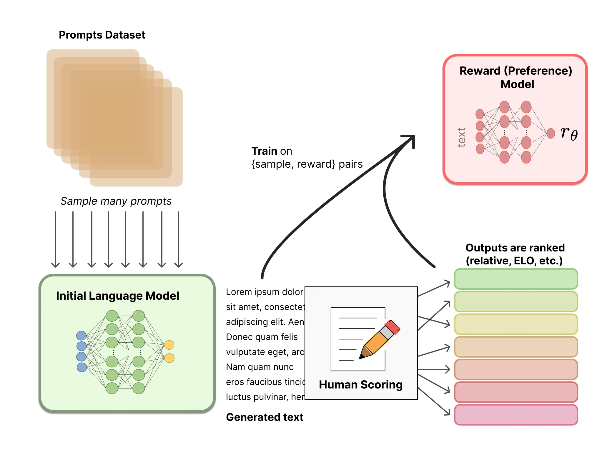

links: https://huggingface.co/blog/zh/rlhf

### 原由
参考前置论文 [InstructGPT](https://arxiv.org/abs/2203.02155)，只是加大 LLM 模型可能会导致模型输出不可信、有毒、没帮助的回答，而不是用户想要的回答。所以需要 __对齐(align)__ 模型和用户，也就是使用人类反馈进行微调，其中的一个卓有成效的方法就是 __RLHF(reinforcementlearning from human feedback)__

- LLM 创造性生成难以用指标衡量。除了评估指标，现有的模型通常以预测下一个单词的方式和简单的损失函数 (如交叉熵) 来建模，没有显式地引入人的偏好和主观意见
- 可以把生成的文本用人工反馈来进一步优化模型

### 步骤
1. 使用手工标记的领域数据迁移预训练模型 LLM，得到 baseline 模型
2. 收集大量 baseline 模型对人类提交的 prompts 的回答，人工比较标记作为数据
3. 用比较数据集训练奖励模型，奖励模型为 baseline 模型的轻量版本（因为用大模型似乎不稳定），去除最后一层，用于标量输出
4. 使用奖励模型 PPO 微调 baseline 模型

### 排名
可以对不同 LLM 在同个 prompt 下生成的文本进行比较，然后用 Elo 系统建立完整排名，排名最后归一化作为训练的奖励值

Elo：一种零和博弈的相对水平评分系统。大意是每次博弈结束后，赢的一方从输的一方获取分数，赢的一方分越高则获取的分数越少，反之亦然。长远来看会逐渐趋向于真实水平

### 疑问
1. 奖励模型具体要怎么训练？用于奖励模型训练的模型多个输出是怎么采样的？有讲究吗？
    - 原始情况采用一个输入两个输出，交叉熵损失。但 InstructGPT 的数据集一次展示数量 K 个，如果两两比较来训练会过拟合。所以它训练时一个 batch 拿 K 个输出，奖励模型输出 C(K)(2) 个结果，代表所有排列的两两比较结果，采用 Cross Entroy Loss
    - RAFT 中提到输出采样方式分为 global(top) 和 local 两套。InstructGPT 采用的是 global，也就是拿 K 个 prompt 生成 K 个结果；另一种是 local，是一个 prompt 生成 K 个结果，用于奖励很大程度上取决于 prompt 的情况
2. 比较数据集具体怎么搭建？
    - 一次可以展示 K(取 4-9) 个输出来比较，用于加快采集
    - 只需要对这 K 个样本排名即可，训练时也是使用这个局部排名
3. 标注筛选有什么要求？
    - 在标注人群上需要筛选出对敏感内容响应较好的
        1. 建立敏感言论标记数据集，部分带敏感的输入输出，测试和标注者的一致性
        2. 建立排名比较数据集，测试和标注者的一致性
        3. 建立敏感演示输出数据集，需要标注者根据敏感输入回答，根据 1-7 Likert scale 来评价标注者的得分
        4. 设立关于自我评估敏感言论识别能力的问题

### 实现
见 [[LLM尝试-202307111548]]

