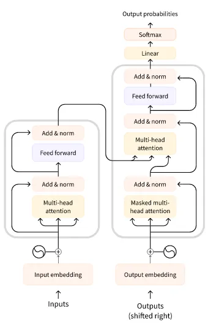

links: https://huggingface.co/learn/nlp-course/chapter1/1


三类 Transformer 模型
- GPT-like (also called _auto-regressive_ Transformer models)
- BERT-like (also called _auto-encoding_ Transformer models)
- BART/T5-like (also called _sequence-to-sequence_ Transformer models)

Transformer 的原始结构如下，用于翻译任务，左边 encoder 输入整个原句子，右边 decoder 输入已被翻译的部分句子



BERT-like 模型只使用了 encoder 部分。由于所有 attention 都涵盖了全部输入，适合需要抽取整个句子的任务，比如分类、NER、QA 之类的

GPT-like 模型只用了 decoder 部分。由于所有 attention 只涵盖了先前的输入（从 context prompt 开始），适合文本生成的任务
  - GPT 特点是生成，可以在文本末尾加入提示词然后作为输入预测接下来的句子，从而也能完成各种各样的任务

BART/T5-like 模型属于 encoder-decoder 模型。在 Transformer 原架构的基础上综合了上面两者的训练方法改进，适合翻译、摘要等任务
  - T5 预训练是多任务的，使用前缀来指明任务，比如 `summarize: ` 开头就会执行总结任务。其多语言版本为 mT5

三类模型其实大差不差，encoder 是为了强调从原始输入整体提取特征的重要性，decoder 是为了加强模型输出内容的复杂度

## Tokenizer 结构
返回 BatchEncoding 结构，类似字典，可以按字典方式索引，方法和属性如下
- `input_ids`：token ids。默认为列表，加了 `return_tensors='pt'` 则返回 pytorch 张量
- `attention_mask`：用于忽略 padding token 的掩码
- `token_type_ids`：如果涉及对多个句子进行对比的任务话，会使用这个来区分 token 属于哪个句子
- `tokens()`：返回 ids 对应的 token

特殊 token
- `[CLS]`：BERT 模型中用于句子分类而添加的 token。因为是整句分类，只需要池化为一个输出，而采用所有的 hidden state 可能会有问题？所以在句首添加这个 token，最终只使用这个 token 对应位置的 hidden state 来进行分类

`Transformers` 有两种 tokenizer：一种是 python 实现的；另一种是 Rust 实现的（含 fast 后缀），由 `Tokenizers` 库提供

翻译任务
- 对于输入输出不同语言的情况，需要特殊的 tokenizer，比如 `MarianTokenizer`，可以设定输入和输出语言，其词汇表是有多个语言的，使用时需要进行正确设置
- 也有些多语言模型是用单个大 vocab 来编码输入输出

tokenizer 的整体结构比较复杂，是一个涵盖了前后处理流程的类，以 `Tokenizer` 库为例，主要包含几个任务：
1. normalizers，用于清理输入文本的部分，比如去除控制字符，替换空白符，降大小写，unicode 规范化
2. Pre-tokenization，将输入初步分成 words
3. model，使用的 tokenizer 算法，进一步切分和聚合以及转 tokens 成 ids
4. Post-processing，加特殊 tokens，以及 `attention_mask` 等附带信息

从头构建一个 tokenizer 可以参考如下 (https://huggingface.co/learn/nlp-course/chapter6/8?fw=pt)：
```python
from tokenizers import (
    decoders,
    models,
    normalizers,
    pre_tokenizers,
    processors,
    trainers,
    Tokenizer,
)

# Select a model
tokenizer = Tokenizer(models.WordPiece(unk_token="[UNK]"))

# Build Normalizer
# tokenizer.normalizer = normalizers.BertNormalizer(lowercase=True)
tokenizer.normalizer = normalizers.Sequence(
    [normalizers.NFD(), normalizers.Lowercase(), normalizers.StripAccents()]
)

print(tokenizer.normalizer.normalize_str("Héllò hôw    \t\tare ü?"))

# Build Pre-tokenizer
# tokenizer.pre_tokenizer = pre_tokenizers.BertPreTokenizer()
# tokenizer.pre_tokenizer = pre_tokenizers.Whitespace()
tokenizer.pre_tokenizer = pre_tokenizers.WhitespaceSplit()

print(tokenizer.pre_tokenizer.pre_tokenize_str("Let's test my pre-tokenizer."))

# Train Tokenizer
special_tokens = ["[UNK]", "[PAD]", "[CLS]", "[SEP]", "[MASK]"]
trainer = trainers.WordPieceTrainer(vocab_size=25000, special_tokens=special_tokens)

# Add Processing
cls_token_id = tokenizer.token_to_id("[CLS]")
sep_token_id = tokenizer.token_to_id("[SEP]")
tokenizer.post_processor = processors.TemplateProcessing(
    single=f"[CLS]:0 $A:0 [SEP]:0",
    pair=f"[CLS]:0 $A:0 [SEP]:0 $B:1 [SEP]:1",
    special_tokens=[("[CLS]", cls_token_id), ("[SEP]", sep_token_id)],
)

# Add Decoder
tokenizer.decoder = decoders.WordPiece(prefix="##")

# Warp with PreTrainedTokenizerFast
from transformers import PreTrainedTokenizerFast
wrapped_tokenizer = PreTrainedTokenizerFast(
    tokenizer_object=tokenizer,
    unk_token="[UNK]",
    pad_token="[PAD]",
    cls_token="[CLS]",
    sep_token="[SEP]",
    mask_token="[MASK]",
)
```


## 模型使用
模型搭配 tokenizer 使用，使用统一接口初始化 `from_pretrained`，根据不同的类来决定初始化模型附带的 head，如果 checkpoints 有对应 head 的话就能直接用

```python
# https://huggingface.co/xxx/yyy
checkpoints = 'xxx/yyy'

# 使用 AutoModel 只初始化到 pooler 层
# 不同的 AutoModel，比如分类 AutoModelForSequenceClassification，模型会初始化带分类 head
# 要修改 head 则直接传入参数就行
model = AutoModelForSequenceClassification.from_pretrained(checkpoints, num_labels=10, proxies=proxies, cache_dir=cache_dir)
tokenizer = AutoTokenizer.from_pretrained(checkpoints, proxies=proxies, cache_dir=cache_dir)

# 对应任务可以直接用，比如 AutoModelForMaskedLM 的 model
model_pipeline = pipeline('fill-mask', model, tokenizer=tokenizer)
model_pipeline('I used to be an adventurer like you, [MASK] I took an arrow in the knee.')
```

checkpoints 可以是 huggingface 上的 model 名字，也可以是含模型的本地目录


## 数据集
主要围绕 datasets 库的 load_dataset 来制作数据集，似乎很灵活
```python
# 使用 pandas pkl 制作数据集，带训练验证分割
data_files = {"train": "datasets/a-train.pkl", "test": "datasets/a-eval.pkl"}
dataset = load_dataset("pandas", data_files=data_files)

# 如果没有区分训练验证，可以在 load 后再分割
split_dataset = dataset["train"].train_test_split(train_size=0.9, seed=20)

# 支持 pop 的方法删除子数据集，字典复制增加子数据集
split_dataset['validation'] = split_dataset.pop('test')
```

## 预处理
可以将 Tokenizer 包装到函数中，以方便数据集使用 map 处理
```python
# 在转换到 tensor 进行 batch 时再 padding
def tokenize_function(example):
    return tokenizer(example["sentence1"], example["sentence2"], truncation=True)

# 如果 tokenize_function 支持 batch 操作则设置 batched 为 True，否则 False
tokenized_datasets = raw_datasets.map(tokenize_function, batched=True)

# DataLoader 所需的 collate_fn，用于实现 padding+batch
data_collator = DataCollatorWithPadding(tokenizer=tokenizer)
```

如果使用 Trainer API，则已经准备得差不多了，加上测试指标就能进行训练。如果是自定义训练流程，则还需要额外处理

```python
# 去除数据集多余的 features，转换成模型 forward 所需的格式，并且转成 pytorch 格式
tokenized_datasets = tokenized_datasets.remove_columns(["sentence1", "sentence2", "idx"])
tokenized_datasets = tokenized_datasets.rename_column("label", "labels")
tokenized_datasets.set_format("torch")

# 用 pytorch DataLoader 包装
train_dataloader = DataLoader(
    tokenized_datasets["train"], shuffle=True, batch_size=8, collate_fn=data_collator
)
eval_dataloader = DataLoader(
    tokenized_datasets["validation"], batch_size=8, collate_fn=data_collator
)
```

## 统计信息
```python
# 计算量
input_dict = {'input_ids': torch.ones((1, 768)).long()}
flops = model.floating_point_ops(input_dict)  / 1000 / 1000 / 1000

# 参数量
model.num_parameters() / 1000 / 1000
```

## Tokenizer 训练
不同语料有不同的语法和符号规则，当目标语料的规则与预训练语料的规则差异大的情况下需要训练新的 tokenizer

可以在现有的 tokenizer 基础上通过 `train_new_from_iterator` 来训练新的 tokenizer


## 任务训练
loss 在模型类型里自带，检查模型的 forward，传了 labels 进去就会计算 loss。labels 视任务可以在不同地方提供，比如 fill-mask 的 labels 可以由 `DataCollatorForLanguageModeling` 提供，该 collator 可以设置在 batch 数据时自动 mask 一部分 token，同时也会将原有 token 替换一部分为随机 token

训练方式分为两种，一种是 Trainer API，使用较为简单
```python
def compute_metrics(eval_preds):
    logits, labels = eval_preds
    predictions = np.argmax(logits, axis=-1)
    return metric.compute(predictions=predictions, references=labels)

batch_size=16
training_args = TrainingArguments(
    output_dir='experiments/xxx',
    overwrite_output_dir=True,
    num_train_epochs=3,             # 常规训练参数
    learning_rate=5e-05,
    per_device_train_batch_size=batch_size,
    save_strategy='epoch',          # checkpoint 相关
    save_total_limit=3,
    logging_steps=50,               # 训练 log 相关
    report_to="tensorboard",
    evaluation_strategy="epoch",    # 指标相关
    per_device_eval_batch_size=batch_size,
)
data_collator = DataCollatorForLanguageModeling(
    tokenizer=tokenizer, mlm=True, mlm_probability=0.15
)

def tokenize_function(example):
    return tokenizer(example["text"], truncation=True)

tokenized_datasets = raw_datasets.map(tokenize_function, batched=True)

trainer = Trainer(
    model,
    training_args,
    train_dataset=tokenized_datasets["train"],
    eval_dataset=tokenized_datasets["validation"],
    data_collator=data_collator,
    tokenizer=tokenizer,
    compute_metrics=compute_metrics,
)
trainer.train()
# trainer.train(resume_from_checkpoint='xxx')   # 继续训练
```

另一种是自定义，也就是常规框架训练流程，不多赘述

多 GPU 等加速可以使用 `Accelerator` 库，Trainer API 已经内置，可以直接使用

```sh
accelerate launch --config_file accelerate_config.yml train.py
```

配置文件见： https://huggingface.co/docs/accelerate/basic_tutorials/launch


fill-mask 的 loss 为 `AutoModelForMaskedLM` 的 forward 中自带的 Cross Entropy Loss，计算 loss 时需要提供 labels。labels 只给出 mask 部分，其余设置为 -100，原因不明（可能是为了 NLL 计算时忽略不用关注的部分）：
```python
labels = torch.where(inputs.input_ids == tokenizer.mask_token_id, labels_tokens, -100)
```

## 问题
1. `An error occurred while generating the dataset`：读数据时出问题，似乎是下载问题，删掉 `.lock` 缓存文件再试试
2. 类 T5 模型训练出现 loss=0.0，eval_loss=nan：似乎是 fp16 的问题，微调时需要尝试 fp16 为 True 或 False，不对就会出问题（改用 bf16 似乎没问题） https://discuss.huggingface.co/t/t5-variants-return-training-loss-0-and-validation-loss-nan-while-fine-tuning/30839
3. `OverflowError: out of range integral type conversion attempted`：在训练的第二次 eval 的时候出现，神奇现象