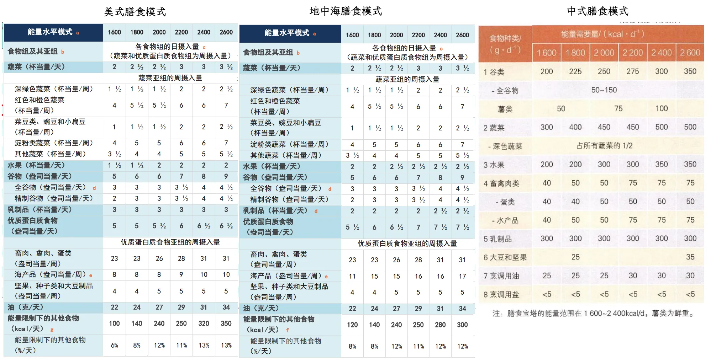
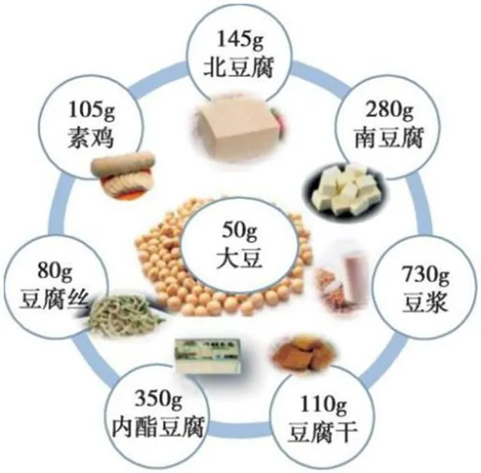
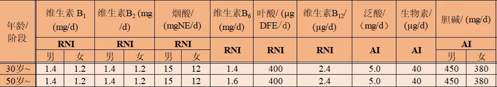
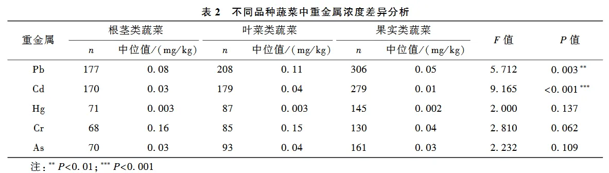
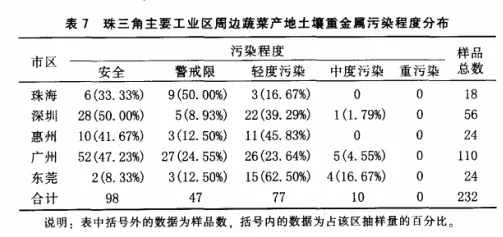
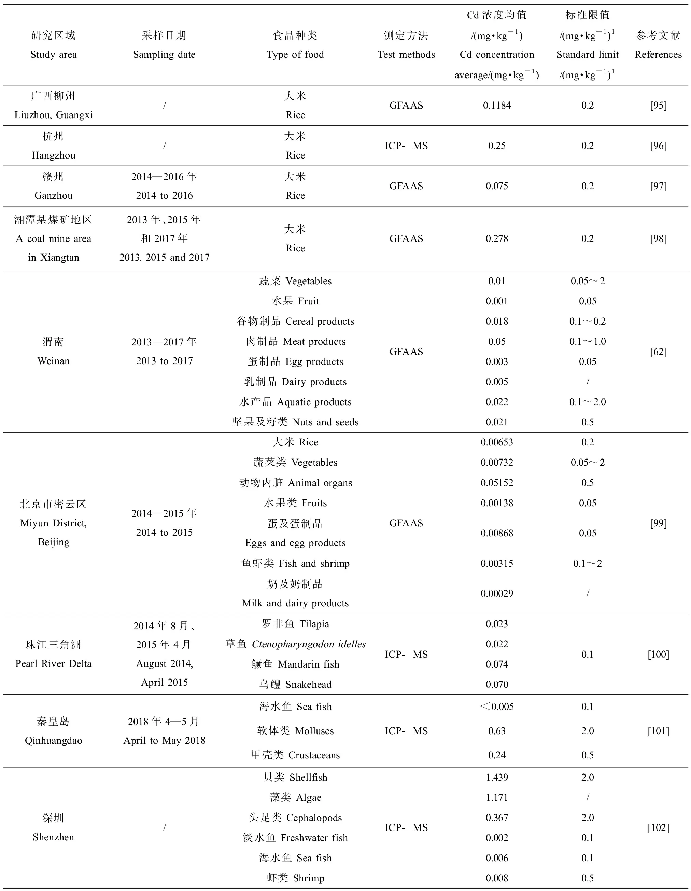

本指南为营养学相关知识汇总，以健康膳食为目标对食品相关问题进行粗略剖析，默认只考虑 30 岁以上成年男性的情况。

资料来源主要为：
1. `中国居民膳食指南（2022）[M]. 北京: 人民卫生出版社, 2022.`，[网页简略版](http://dg.cnsoc.org/newslist_0402_1.htm)
2. `中国居民膳食营养素参考摄入量（2023版）[M]. 北京: 人民卫生出版社, 2023.`，[网页简略版](http://www.ffifood.com/news/detail/2979)，下面简称《参考摄入量》
3. `Dietary Guidelines for Americans 2020-2025 [M]. Washington, DC: U.S. Government Publishing Office, 2020.`
4. `中国食物成分表（标准版·第6版）[M]. 北京: 北京大学医学出版社, 2018.`

## 规范
用语规格：
- 1kcal ≈ 4.186kJ
- 一杯（cup）：≈240ml
    - 用于固体食物对应切碎后装满一个约 240ml 的圆柱形杯子，也就是大约一个拳头大小
    - 美国膳食指南中采用杯当量（cup eq）的单位，意思是对于多种成分复合的食物，需要达到相当于一杯典型目标食物的体积。比如蔬菜组的 1 杯当量相当于 1 杯煮熟蔬菜叶 、1/2 杯脱水蔬菜、2 杯蔬菜叶沙拉，盎司当量也是同样道理，所以具体得查指南或者国外的网站，比如 https://www.fatsecret.com/calories-nutrition
- 一份（serving）：类似一杯，用来形容一次吃下的大概份量，比如一份谷物就是一盎司谷物，一份水果就是一个苹果，一份牛奶就是一杯牛奶
- 盎司（oz）：≈28g
- 液体盎司（fl oz）：≈30ml
- 热量供能：碳水≈400kcal/100g，脂肪≈880kcal/100g，蛋白质≈400kcal/100g
- 国际单位（IU）：旧式单位，基于物质的生物活性（比如维生素对机体的效果）而确立，因为不同物质会产生同一效果，只是生物利用度不同（比如视黄醇和 β-胡萝卜素），所以现在一些维生素还在使用这种单位。具体换算成重量或摩尔的算法会因物质不同而不同。因为存在缺陷，正逐渐被替代。

## 食谱
根据《中国居民膳食指南（2022）》和 《美国居民膳食指南（2020-2025）》 来确定自制食谱范围，原理是 **平衡膳食** 以及 **高营养密度饮食**。

平衡膳食：每天摄入 12 种以上的食物，一周摄入 25 种以上的食物，具体数额依照平衡膳食宝塔规定。

高营养密度：提供矿物质、维生素、必须营养的 **蔬菜、水果、全谷物、海产品、蛋类、杂豆、坚果和种子、乳制品、畜禽瘦肉**，当没有添加糖、低饱和脂肪、低钠时都是高营养密度食品。每天 85% 能量应以高营养密度食物摄入，剩下 15% 留作他用（包括添加糖和饱和脂肪等）。

中式、美式、地中海三种健康膳食模式总结如下：

以下以能量水平 2000kcal 为例。

### 谷物（中式 250g/天；美式/地中海 6 盎司/天，约 168g/天）
- 精制谷物+全谷物（中国推荐 3:1-2:1；美国推荐 1:1）
    - 大米和杂粮米（东北大米和各色糙米 1:1 混合）
    - 燕麦片（早餐 40g，七大勺）
    - 玉米
    - 低盐挂面或荞麦面
    - 全麦面包

全谷物主要支撑碳水化合物、维生素 B1、镁、锌、膳食纤维的供给。

### 蔬菜（中式 450g/天，深色占一半；美式/地中海 2.5 杯/天）
- 深绿色（菜叶重金属残留多，少吃点）
    - 西兰花（**K↑、C、A、叶酸、B6、锰**）
    - 菠菜（营养恐怖，草酸高、镉吸附强，**K↑↑↑↑↑↑、A↑↑、锰、叶酸、镁、铁、C**）
    - 娃娃菜
    - 奶白菜（钠较高，偶尔吃可以）
    - 豌豆尖
- 红/橙色
    - 番茄（每天一份番茄 100~200g，**C、A、K**）
    - 胡萝卜（**A↑↑↑、K**）
    - 南瓜
    - 红辣椒（高抗氧化剂，**C↑↑、B6、A、K**）
    - 彩椒（似乎国内种植技术不成熟，**C↑↑、A、B6、叶酸**）
    - 红薯（作为一半的主食，**A↑↑↑、C、锰**）
- 杂豆
    - 豌豆（常吃豆类，**K、锰、C、B1、A、叶酸、磷**）
    - 红豆、绿豆、芸豆、花豆等
- 淀粉类蔬菜
    - 土豆（250g 作为晚餐主食，一杯 160g，**C、B6、钾**）
    - 芋头
    - 山药
    - 莲藕
- 其他类蔬菜
    - 洋葱（独特有机硫化物，但是会挥发，生吃超呛）
    - 黄瓜（注意农残）
    - 芦笋（**K、叶酸、A、C、B1**）
    - 茭白
    - 紫菜或海带（**碘**）
    - 白蘑菇/双孢菇（**锌、硒、钾**）

蔬菜和杂豆主要支撑维生素（主要是 A、C、K 和叶酸）和植物化学物质的供给，同时也是钾、钙、铁的重要来源，以及补充一部分镁和不溶性膳食纤维。

深绿色蔬菜富含维生素 K、叶酸和钙。其中叶酸在高温或酸性条件下会大幅损失，所以可以考虑生吃或简单焯水（减少草酸）。

红/橙色蔬菜富含 β-胡萝卜素（可以合成维生素 A）和维生素 C。其中 β-胡萝卜素需要充分烹饪才能有较好的生物利用率，而维生素 C 在烹饪时会有较多损失，所以最好生熟都有。

杂豆（淀粉豆）富含叶酸，还能补充一些膳食纤维、各类矿物质以及 B 族维生素。

淀粉类蔬菜富含碳水化合物和钾，可以作为一部分主食。

### 水果（中式 300g/天；美式 2 杯/天；地中海 2.5 杯/天）
- 菠萝（最爱，150g 一杯）
- 橙子、橘子
- 蓝莓（140g 一杯）
    - 10g/100g 糖
- 葡萄（160g 一杯）
    - 15g/100g 糖
    - 大部分是果糖，脂肪肝、尿酸小心
- 猕猴桃（1.5 个 110g 大果为一杯）
    - 14g/100g 糖
    - 草酸较高（[具体看品类](https://max.book118.com/html/2017/1231/146670971.shtm)），肾结石小心
- 哈密瓜
- 香蕉（糖较高，不建议多吃）
- 果汁（水果摄入不足时可以替代一半的水果摄入，但是要注意杯当量的换算）
    - 由于高温灭菌、存储的原因，市售果汁的维生素 C 可能会有所损失
    - 皮、核、渣的舍去，会导致植物化学物质和膳食纤维的损失
    - 没有膳食纤维的包裹，糖的吸收会更快，容易过量

水果主要弥补蔬菜烹饪过程中损失的水溶性维生素（主要是维生素 C）和其余种类的植物化学物质，以及提供一些钾和可溶性膳食纤维。

从具体营养贡献量来看，水果相比其他组类能提供的东西较少，价格却较高。但从演化适应角度上看，人类长期以来将水果当作主要食物来源之一，保持摄入很可能会对身体有潜在益处，有很多观察数据都支持这点。

### 乳制品（中式 300~500g/天；美式 3 杯/天；地中海 2 杯/天）
- 鲜牛奶（一天 400ml，2-3 天一瓶 900ml 牛奶）
    - 理论上脱脂牛奶可以更好控制饱和脂肪摄入，但实际跟踪宏量营养素后发现全脂也可以接受
- 低糖酸奶
- 奶酪
- 强化植物奶（加钙达到牛奶的水平）

乳制品是填补日常膳食中钙缺口的重要食物来源，同时也提供可观的维生素 A 和 B2。400g 牛奶能够提供一半的钙需求和 1/3 的维生素 A 和 B2 需求，还能增加蛋白质、脂肪、碳水化合物的摄入种类。

### 优质蛋白（中式 150g/天；美式 5.5 盎司/天；地中海 6.5 盎司/天。都是 150~180g）
- 畜禽蛋（普遍要求每天 100g，鸡蛋占当量的 1/4，也就是剩 75g 肉）
    - 瘦肉
        - 鸡肉：便宜安全的白肉，**B3、硒、B6、磷**
        - 牛肉：好红肉，不适合高温，**锌、B12、B3、硒、磷**
        - 猪肉：经济好吃，**硒、B1、磷、B3、锌**
    - 鸡蛋（每天 1 个，营养最全面，**硒、B2、B12、磷、B5、A、铁**）
    - 猪肝（每次 10g，营养太丰富，**A↑↑↑↑↑↑↑↑、铁↑、B2↑、硒、B1、烟酸、磷、锌**）
- 水产品（每周 2 次或 300~500g，地中海推荐到 420g，也就是 140g × 3 天）
    - 金鲳鱼（便宜，脂肪 2.3g/100g，4.3% DHA，1.1% EPA，也就是大约 100mg/100g DHA，25mg/100g EPA。由于广西、湛江等地有大型养殖基地，金鲳鱼是其中的头牌，实际含量会更高）
    - 鲐鱼（价格也便宜，脂肪 7.4g/100g，28.5% DHA，5% EPA，也就是大约 2109mg/100g DHA，370mg/100g EPA。组胺高，可能会有点过敏）
    - （以海鱼或食肉淡水鱼为主，需要注意甲基汞含量，优先选食物链低的）
    - （海鱼较难存储，容易组胺超标导致过敏甚至中毒，而且冷藏会降低油脂品质，最好即买即食，高组胺鱼类：鲐鱼、鲹鱼、竹荚鱼、鲭鱼、鲣鱼、马鲛鱼、青古鱼、沙丁鱼等青皮红肉海水鱼。容易过敏。）
- 大豆及制品（105~175g/周）
    - 大豆/黑豆/青豆（一天 10~20g，可以随饭煮）
    - 豆浆（一周可以喝一瓶，但有糖的话不太好，无糖的又有猫腻，水挺深）
    - 北豆腐/南豆腐（允许每周三份。一份 50g 大豆，可替代一份红肉）
    - 腐竹（一盒 150g 腐竹约 80g 大豆）
    - 豆制品摄入份量示意 
- 坚果类（50g/周，约 7 粒/天）
    - 两个月吃完一罐 400g 的原味坚果仁

提高蛋白质的摄入种类可以发挥互补作用，从而提升生物利用率。

畜禽蛋是蛋白质、B 族维生素（特别是 B12）和锌的主要来源。蛋黄、肝脏都是营养不错的食物。

水产品是最佳的蛋白质来源，其脂肪可以直接提供 DHA 和 EPA（来源于海藻饲料）。

大豆及制品也是不错的蛋白质来源，并且大豆含有相当高的营养密度，可以补充钙、钾、镁、锌、膳食纤维和各类维生素等，但其抗营养素（如植酸、皂角素、草酸）较多，不适宜多吃。

坚果可以丰富蛋白质和脂肪的种类，并且富含各类常量和微量元素、植物化学物质、不溶性膳食纤维和维生素 E。不过和大豆同理，而且热量较高，不适宜多吃。

### 食用油（中式 25g/天，美式/地中海 27g/天）
- 亚麻籽油（至少每天一勺 3g，满足 ALA 需要以及避免失衡）
- 菜籽油（主要用油，每天 6-7 勺）
- 山茶油（备选油，油酸含量丰富）
- 橄榄油（奢侈备选，换口味用）
- 猪油（煮面或炒菜用）
- 最好严格定量，毕竟误差影响较大，可能需要电子量勺。但炒菜出锅会漏掉一些油，所以很难精准

食用油是各类必需脂肪酸和维生素 E 的主要来源，食用时应注意平衡各类脂肪酸比例。

### 调料（以天然香料为主）
- 刺激辛辣的香料
    - 大蒜（大蒜素）
    - 红辣椒（辣椒素）
    - 洋葱
    - 现磨黑白胡椒（胡椒碱）
    - 姜黄（姜黄素）
- 添加糖、钠、油脂调味料
    - 淀粉：绿豆/豌豆淀粉，不粘，用于做凉粉等；红薯/木薯淀粉，很黏，挂糊或做甜品用；玉米/土豆淀粉，有点粘，最常用
    - 糖（<25g/天，最多 50g，普通的白砂糖就行，用于提鲜）
    - 盐（<5g/天，选碘盐就行，少量使用，用于增味）
    - 酱油（分为生抽和老抽，调味以生抽为主，老抽主要是上色，优先选购低钠版）
    - 味精/鸡精/耗油（以谷氨酸钠为主的调料，用于提鲜，优先选购低钠版）

天然香料含有丰富独特的多酚类化合物、有机硫化物等物质，很多研究认为这些物质有身体有多种益处。

## 料理技巧
烹饪的技法有很多种，对营养成分影响也各有不同。对于蔬菜来说，热处理通常有助于破坏细胞壁以释放更多维生素和多酚类物质。

中式的热处理方法有：蒸、煮、煎、炒、炸、焖、炖等。

西式的热处理方法以干制和炖煮为主：
- Broiling：用面火炉（一种开放式可升降的烤炉）从上方快速高温加热
- Grilling：放在网格架子从下方烤制
- Griddling：放在平板上从下方烤制
- Frying：煎炸，pan-frying（平底锅煎）、stir-frying（炒）、deep-frying（炸）
- Boiling：煮到冒泡沸腾
- Simmering：煮到接近沸腾
- Poaching：文火煮

除此之外，还有现代的热处理方法：
- 低温慢煮：将食物放置到真空袋中，通过数小时的恒温水浴来做熟，减少水分和风味流失。一般用来处理肉类比较多，之后可能还会经过煎制。
- 微波炉：使用微波电磁场让食物内部水分子等极性分子震荡来达到加热，方便快捷，营养保留较好。缺点是只适合含水量较高的食物，低含水量食物加热容易温度过高导致有害物质形成。
- 真空冷冻干燥（FD）：一种较好的脱水处理技术，制作果蔬干用，可惜价格较高，更常用真空低温油炸来脱水。

为了避免长时间热处理导致氧化损失，同时考虑便捷性，蒸、焯水、5 分钟短时快炒都是不错的选择。具体根据食材来定。

## 营养分析
DRIs（膳食营养参考摄入量）：由 RDA（推荐膳食供给量）发展而来。当前主要涵盖的指标为：
- EAR（平均需要量）：群体中各个体需要量的平均值，可以满足群体中 50% 个体的需求 
- RNI（推荐营养摄入量）：相当于 RDA，由群体推算出来，满足 97%-98% 的个体，作为个体参考营养标准。因为是最低的推荐摄入量，一般要求高于这个量
- AI（适宜摄入量）：尚未研究清楚，只是由健康个体推算出来，没有依据，不一定准
- UL（可耐受最高摄入水平）：几乎所有健康个体在这个剂量下长期摄入都不会有不良影响，是无任何风险的摄入上限
- AMDR（可接受宏量营养素分布范围）：指碳水化合物、蛋白质、脂肪这些宏量摄入的营养素摄入范围，低于此范围缺乏，高于此范围可能增加慢性病风险
- PI（建议摄入量）：即 PI-NCD，针对慢性病易感人群用于预防的推荐量
- SPL（特定建议水平）：预防非传染性疾病风险的推荐值，用于非必须营养素
- CDRR（慢性病风险降低）：营养素摄入量的上限，预防长期过量摄入

也就是说参考 AMDR 来制定食物方向，然后其余元素参照摄入到 RNI 和 UL 之间就行。推荐的营养元素见《参考摄入量》。

在进行具体营养分析之前，需要先消除个体因素，一些营养素是根据代谢体重法（代谢率与体重的 0.75 次方成正比）来推算，标准成年人男性体重采取 65kg，可以根据情况进行缩放。

<mark>需要注意的是，如果不是具体某营养素缺乏的情况，很多时候营养补充剂并不具备天然食物的优势（饮食模式带来的益处在）。</mark>

我设定每日能量需要为 1940kcal（约 8120kJ），使用 fatsecret 等 app 来辅助跟踪。

### 水
国内研究非常少，只有推算出来的适宜摄入量（AI），成年男性每天饮水量 1.7L（约 7.5 杯），包含食物的总摄入量 3L。这个数据非常模糊，难以应用到个体上。

比较合理的一个说法是让身体维持在最佳水合状态（人体水的摄入和排出处于动态平衡,其平衡状态称为水合状态）。简单来说，需要考察几个方面：
- 尿的颜色：透明的淡黄色
- 排尿次数：每天 5~7 次
- 不能出现口渴
- 运动每消耗 1kcal，需要补充 1~1.5ml

所以原则上来说，先考虑水周转量，比如我的典型值大约是 3500ml/d，然后推算出一天总摄入量大概是 3000ml，其中约一半通过饮水满足，也就是 <mark>1.5L（约 6.7 杯）</mark>，分摊到 14 小时中（睡前两小时不喝或少喝），也就是<mark>两小时喝差不多一杯，6 分钟抿一口</mark>。之后根据水合状态再调整饮水量就好。

#### 纯净水
一直以来都存在“长期饮用纯净水存在健康风险”的争议，该争议的最大支持方是 WHO 的一篇文章《[饮用水中的营养素](https://iris.who.int/bitstream/handle/10665/43403/9787117242295-chi.pdf;sequence=7)》中的第十二章 饮用去矿物质水产生的健康风险。其核心论点是：
1. 低矿物质水（TDS ≤ 100mg/L）会影响渗透压，导致矿物质离子排出量增加，尿量增加。
2. 多国研究报告显示，饮用水中的钙和镁离子即使营养贡献很低，实际对健康的影响并不低。
3. 许多现代人的食物不能提供充足的矿物质和微量元素。当某种元素处于临界缺乏状态时，即使从饮用水中摄入相对少量的该元素，也能发挥相应的保护作用。
4. 低矿物质水烹饪食物会导致食物流失更多的镁和钙。
5. 低矿物质水不稳定，对接触的材料有较高腐蚀性，可能会溶解管道重金属导致暴露风险。

反对方则主要针对这些证据的可靠性，因为部分报告涉及的地区（淡水匮乏区域）、人群（钙镁缺乏的边缘人群）或场景（动物实验）与常规生活场景差异较大，以及一些科学结论可能有所夸大。

近年来因为农夫山泉等矿泉水资本企业的介入，形成了不少造谣、辟谣的无谓讨论。就我个人认为，目前因为饮用水会经过消化道抵达小肠再进行吸收，期间会经过胃酸和食糜，其中会带有微量元素使得纯净水不再纯净，最终可能和矿泉水的差异并不大，那对身体的影响也就不值得讨论了。目前也没有见到关于健康膳食模式下低矿物质水是否有健康风险的研究，若是不考虑膳食而单看纯净水与矿物质水的影响，仅凭其中微量的矿物质含量区别似乎并没有达到会对身体会产生影响的阈值。除非有进一步的研究（比如持续供给微量矿物质有利身体健康），不然以目前的研究还不足得出结论。

硬要说的话，安全处理过的天然水从演化适应角度上看会更加合理，这道理就和粗加工食物优于精加工食物一样。不过纯净水对于天然水资源污染严重的区域（工业区或矿区附近）和泌尿系统结石患者是更合适的。当然，最重要的还是要确保牛奶和全谷物的摄入以保证钙和镁达到要求。

### 碳水化合物（糖）
作为人体最主要的能量来源，碳水化合物的<mark>供能需要占 50%-60%</mark>，过高和过低都会提升死亡风险。当肝糖原储备耗完时，机体启动糖异生，将各处的蛋白质转化为葡萄糖以维持稳态。为了维持碳水、脂肪、蛋白质的供能占比，不应该在额外摄入糖分。

#### 添加糖
一般来说，添加糖是指游离糖，也就是添加到食物中的糖，但由于难以区分食物中天然存在的糖和添加到食物中的糖，添加糖的定义在世界范围内还没有达成普遍共识（出自《参考摄入量》第171页）。

摄入添加糖的主要风险有三个：
1. 增加总摄入能量，容易引发肥胖。暂无可信的证据表明在控制总摄入能量的前提下摄入添加糖会引发肥胖。
2. 龋齿发病率增加。当添加糖摄入量 <10% 能量（约 50g）时，龋齿发生率下降；当添加糖摄入量 <mark><5% 能量（约 25g）</mark> 时，龋齿发病率显著下降。 
3. 增加二型糖尿病发生风险。

美国膳食指南给出了更详细的限制：
- 满足食物组摄入建议的高营养密度选择后，大多数人剩下的能量冗余不超过 15%。
- 饱和脂肪和添加糖各占冗余能量的一半。
- 饱和脂肪的总摄入量应低于总能量的 10%。
- 没有发生酒精饮料的消费。
- 总能量摄入量未超过健康体重所需的摄入量。

另外的一些民间观点则是针对添加糖容易引发较高的高血糖反应，也就是 GI 高，以及摄入量难以控制（容易上瘾）。需要注意的是，相比葡萄糖，果糖虽然甜度高、GI 低，但其代谢会额外产生尿酸和脂肪，并且过多的代谢脂肪会在肝上堆积，不利于健康。

白砂糖、赤砂糖、绵白糖、冰糖、红糖等本质都是蔗糖，而蔗糖是葡萄糖和果糖组成的双糖，所以也具有果糖的缺点，不建议太多摄入。

食物上常用的果葡糖浆，以及天然的蜂蜜、菠萝蜜、葡萄、梨、苹果等都含有较多的果糖，需要关注摄入量，不宜过多。

另外，由于我国超过一半的人口乳糖酶缺乏，在饮用牛奶时应关注是否存在乳糖不耐受或乳糖吸收不良的情况。可以饮用小份量（240ml 以下）牛奶并逐步增加份量，同时配合其他食品一同摄入，也可以食用酸奶或硬质奶酪来替代，详见 [乳糖不耐受与科学饮奶专家共识](https://xyxrmyylib.yuntsg.com/ueditor/jsp/upload/file/20241012/1728723931356015575.pdf) 。

#### 代糖
老一辈的代糖如阿斯巴甜、安赛蜜、三氯蔗糖等都存在健康争议，可能会影响血糖调控能力，近些年大量使用的糖醇也偶有爆出存在健康风险。比如[有研究](https://www.nature.com/articles/s41591-023-02223-9)称赤藓糖醇会促进血栓形成，每日摄入 30g 赤藓糖醇就会带来较高的心血管疾病风险。

但相比普通的蔗糖、果糖来说，代糖还是要更好些的。如果要选代糖产品，可以选用甜度高一些的，比如非糖醇类的代糖，这样摄入量会少一些，对身体的潜在影响也更小。

#### 膳食纤维
成人适宜摄入量为 <mark>25~30g/d</mark>，主要来源是燕麦、杂豆、水果等。过多摄入不利于肠胃。

β-葡聚糖是不错的膳食纤维来源，在燕麦中含量很丰富。有研究称每天摄入 3g β-葡聚糖可以显著降低血液中的低密度脂蛋白胆固醇。

### 脂肪
重要的能量来源，但国内目前缺乏整体研究，故没有推荐摄入量和最高耐受，只对供能范围推荐占比 <mark>20%~30%</mark>。其细分研究倒是比较多，饱和脂肪酸、单不饱和脂肪酸、多不饱和脂肪酸的摄入量都有要求。

目前食谱下，全脂牛奶固定会摄入 16g 脂肪，其中 9g 饱和脂肪酸，5.87g 单不饱和脂肪酸，1.01g 多不饱和脂肪酸。

6 勺菜籽油 + 1 勺亚麻籽油可以让 ω-6 : ω-3 接近 1 : 1，提供 1.8g 饱和脂肪酸，14.39g 单不饱和脂肪酸，8.26g 多不饱和脂肪酸。

总体加起来三种脂肪酸占比约为 1 : 2 : 1，一共约 40g，提供 354kcal 热量，占比约 17%。加上其余食物的脂肪摄入，最终会落在 25%-30% 的区间。

#### 饱和脂肪酸（SFA）
饱和脂肪酸通常在动物脂肪中含量较高，占比越高越容易凝固，热稳定性越好。现有多项研究表明用多不饱和脂肪酸部分替代饱和脂肪酸摄入可以降低心血管疾病风险。

在维持健康膳食模式下（10% 的饱和脂肪酸能量占比上限），能留给额外饱和脂肪酸摄入的冗余非常少，可能只有 5% 左右。换算成猪油或黄油（40%-50% 饱和脂肪酸含量）的话，每天上限为 22~27g。在采购面包时需要格外注意。

棕榈油、黄油、猪油的饱和脂肪酸含量都较高。人造的起酥油、氢化植物油也是饱和脂肪酸含量很高的油。椰子油虽然饱和脂肪酸非常高，但是多为中链脂肪酸，有点特殊。

就我个人来说，一天至少 400ml 全脂鲜牛奶，也就是会固定摄入约 9g 饱和脂肪酸，按照油脂热量 887kcal/100g 来算的话，剩 13.5g 左右，再算上肉食和烹饪油后<mark>需要限定在 10g 以内</mark>，相当于 50g 饼干，还是需要注意一下的。

#### 不饱和脂肪酸（UFA）
不饱和脂肪酸通常在植物中含量较高，占比越高越难凝固。分为单不饱和脂肪酸（比如 ω-9/n-9/18:1/油酸）和多不饱和脂肪酸（比如 ω-6/n-6/18:2/亚油酸/LA 和 ω-3/n-3/18:3/α-亚麻酸/ALA），也就是含有一些双键的脂肪酸。

其中 ω-6 和 ω-3 的比例得到了较多关注，两者都是必需脂肪酸，但因为常见的食用油含 ω-6 系列脂肪酸量较高，导致比例过高。而有研究表明（ doi.org/10.3181/0711-MR-311 ）比例过高时会加剧整体炎症反应和多项慢性疾病风险。该结论证据尚不充分，大部分国家都没有对其做出推荐。

由于坚果、植物油等食物中 ω-6 系列脂肪酸含量较多，获取来源较广泛，不太可能缺乏，一般推荐补充 ω-3 系列脂肪酸，来源除了亚麻籽油外主要是高脂肪的鱼（吃海藻饲料的）。

ω-3 系列脂肪酸又分为 α-亚麻酸（ALA）和 DHA、EPA 等。
- ALA 的适宜摄入量为 1.6g/day，相当于<mark>每天 3g 亚麻籽油</mark>，暂无最高可承受规定。
- <mark>DHA、EPA 的 AMDR 为 250~2000mg/day</mark>，对孕妇和幼儿由于有特殊作用故有推荐适宜摄入量（250mg/day）。α-亚麻酸在体内需要经过脱氢去饱和才能得到 DHA、EPA，转化率较低（取决于很多因素，在 0-10% 之间，非线性，可能有转化上限），膳食指南认为普遍不足以达到日常所需，所以需要额外从鱼中摄入。100g 的三文鱼或青花鱼就可以达到 1~2g 的 DHA、EPA 摄入，也就是说每周都需要吃两次鱼。

目前三个膳食指南都推荐畜禽蛋和海产品的食用比例为约 1.5-3 : 1。

#### 反式脂肪酸（TFA）
植物油常温液体不好保存运输，而动物油又较贵，所以常见做法是将植物油氢化，得到固态的氢化植物油，用于食品工业中。但随之而来的问题是部分脂肪酸可能转化为反式脂肪酸，反式脂肪酸对人体有害，不能长期食用。

现有的氢化工艺已经没太多反式脂肪酸了，只是氢化植物油本身就是高饱和脂肪酸油，不适合过多食用，黄油也同理。

除去氢化工艺外，长时间高温烹饪、反复油炸也会产生反式脂肪酸，所以不能使用热稳定较差的油来进行烹饪（比如 ω-6 油）。

### 蛋白质
高蛋白质摄入会对肾脏造成伤害，一般推荐 AMDR 为 <mark>10%~20%</mark> 供能占比。

#### 红肉
有研究称常吃红肉会增加直肠癌风险，但红肉是锌、维生素 B12 的主要来源，几乎没有能纳入常规食谱的替代品。

### 常量元素
常量元素的补充是膳食中重要的一环，在健康膳食模式下一般不会有缺乏的情况，不过还是可以留意一下各食物对常量元素的贡献。

#### 钙
- EAR 650mg/d，RNI 800mg/d，UL 2000mg/d
- RNI 通过美国人群达到钙平衡所需的摄入量来进行推算，采用 65kg 标准体重，经过缩放后个人推荐量应该是约 <mark>568mg/d</mark>

在健康膳食模式下，400g 牛奶可以提供 440mg 以上的钙，豆类及制品可以提供 100mg 左右的钙，蔬菜提供接近 100mg 的钙，总体达到了 EAR，超出个人推荐量，应该没有缺乏的风险。

我国居民平均钙摄入量是 345~412mg/d，对于一般人来说是有必要进行适当补充的。

#### 磷
- EAR 590mg/d，RNI 710mg/d，UL 3500mg/d
- 基本不缺，可能过量

膳食来源很丰富，光全谷物几乎就能满足一天所需。由于常用于食品添加剂，可能要考虑过量的情况。摄入太多会影响钙吸收，导致各种骨骼、钙化疾病。

在未考虑食品添加剂的情况下我国居民膳食磷摄入大约为 1000mg/d，根据《参考摄入量》中的引用的调查显示磷摄入的评估通常会低估 20%~25%，应该小心含磷添加剂，并且增加钙摄入以加大钙磷比例。

#### 钾
- AI 2000mg/d，PI-NCD <mark>3600mg/d</mark>
- 有多种益处

膳食来源丰富。在健康膳食模式下，110g 全谷物饭提供 180mg 钾，250g 马铃薯提供 860mg 钾，400g 牛奶提供 480mg 钾，大豆和豆制品提供 100~500mg 钾，蔬菜水果提供 >700mg 钾，肉类提供 >600mg 钾。预计能轻松达到 3000mg 以上的摄入量，可以达到 PI-NCD 的值。

通常不会因食物摄入而过量，多项研究表明高钾摄入对降低高血压、脑卒中等慢性病风险有显著关系。

#### 钠
- AI 1500mg/d，PI-NCD ≤2000mg/d
- 根据代谢体重法进行缩放得到个人推荐量约为 1150mg，最好 <mark>≤1500mg</mark>
- 常常过量，存在风险

成年人钠摄入的 CDRR 为 2300mg，也就是 5g 盐左右。国人普遍钠摄入超标（平均超 2 倍以上），除了盐外，酱油、耗油等常用调味剂也含有大量的钠。适量摄入有利于预防高血压，过量摄入会增加高血压等疾病风险。

一般来说，10ml 的减盐酱油有 500mg 的钠，15ml 的减盐耗油也是差不多 500mg 的钠，1g 低钠盐则有 350mg 左右的钠。考虑到健康膳食会包含牛奶 200mg 的钠、肉蛋 150mg 的钠、蔬菜 100~300mg 不等，目前的调味情况还是不够理想。有必要进一步控制钠的摄入。

#### 镁
- EAR 270mg/d，RNI 320mg/d
- RNI 根据美国/日本人达到镁平衡的数据推算得来，缩放得到个人推荐值约 230mg/d
- 会自主调节吸收率，一般不缺，研究不充分

膳食来源很广泛，特别是在全谷物、大豆和坚果中含量很高，健康膳食模式下不会缺。

### 微量元素

#### 碘
- EAR 85μg/d，RNI 120μg/d，UL 600μg/d
- RNI 根据美国/加拿大数据推算得来，替换体重进行计算得出个人推荐值约为 <mark>90μg/d</mark>

甲状腺激素合成需要碘，而碘仅由食物提供，一般只能储备 2-3 个月。成年人需要每天平均 120ug 的碘，最高 600ug。过高或过低都会有问题。

广东属于低水碘地区，需要食物补充。1g 加碘盐大约含有 22ug 的碘，酱油等调味品几乎不含碘。那么问题来了，如果要达到每日平均推荐碘摄入量，就需要 4g 加碘盐，而这个份量已经达到了钠摄入的安全上限（只用盐调味最高允许 2.6g）。这样看来似乎有必要额外补偿。

在健康膳食模式下，鸡蛋只含有不到 10ug 的碘，牛奶和蔬菜等含有 10~30ug 的碘，海鱼 5~20μg。而 1g 紫菜大约含有 43ug 碘。可以看到不吃盐的话可能<mark>一周要补充 1~2 次的紫菜或海带</mark>才能满足碘需求，不过这些富碘食物几乎一定存在重金属超标问题，需要谨慎限制用量。

#### 锌
- EAR 10.1mg/d，RNI <mark>12mg/d</mark>，UL 40mg/d
- 吸收较少，铁、植酸会影响锌的吸收，控制植酸和锌的比例很重要

健康膳食模式下，全谷物提供 3mg 左右的锌，牛奶提供接近 1mg 的锌，大豆和坚果能提供约 1mg 的锌，蔬菜瓜果能提供约 2mg 的锌，白蘑菇可以提供 6mg 左右的锌，牛肉提供 6~10mg 的锌（猪肉 4~6mg，鸡肉 <1mg，鱼肉也不多），生蚝、扇贝也能提供很多（10~70mg/100g），但由于重金属污染原因排除了。可以发现锌是比较难补够的一类，如果不常吃牛肉、蘑菇可能无法满足一天所需。

这里还涉及吸收利用率上的问题，精加工减少植酸可以将锌的吸收率从 18% 提升至 30% 甚至 50%，但植酸本身也有很多好处。植酸主要存在于植物种子中，如坚果、豆类、全谷物。据说维生素 C 可以抵消掉一部分植酸，暂不明确。

就目前的健康膳食模式来看，如果不吃红肉，锌的日摄入量应该在 7~8mg 左右，存在一个缺口，至少要增加 2mg/d 以上的额外摄入，有必要通过<mark>锌强化食品（如芝麻或白蘑菇）</mark>来补充。

#### 硒
- EAR 50μg/d，RNI 60μg/d，UL 400μg/d
- 与土壤有关，身体会自主调节

食物来源的硒和土壤、饲料有关，由于人体会自主调节硒的储备，一般不会缺，过量可能会掉光头发。

### 维生素
维生素是维持人体生命所必须的微量元素，几乎只能通过食物摄取。主要分为水溶性（B 族、C）和脂溶性（A、D、E、K）。其中，水溶性维生素较为安全，摄入多了也容易排出，可以适当补充。

要想高效摄入食物营养素，需要注意烹饪方法。有些营养素对热敏感，加热会加速其氧化过程或破坏结构（比如维生素 C）；有些需要充分热处理以帮助人体吸收（比如番茄红素）；有些需要协同摄入（比如维生素 D 和钙、B 族维生素）。

#### 维生素 C（L-抗坏血酸）
- 水溶性，在水溶液中不稳定，容易被氧化，中性、碱性、光、热、重金属离子均会加速其氧化
- RDA <mark>90mg</mark>
- 食物含量
    - 橙子 30mg/100g
    - 番茄 20mg/100g，烹饪会损失一部分

#### B 族维生素
- 水溶性，似乎是木桶效应，需要综合补充，常见于瘦肉中
- RNI 见下表
- 食物含量 见下表

| 维生素\mg/100g |         |         |        |        |         |          |
| ----------- | ------- | ------- | ------ | ------ | ------- | -------- |
| B1（硫胺素）     | 糙米 0.38 | 燕麦 0.46 | 土豆 0.1 | 猪肉 0.3 | 牛奶 0.02 | 鸡胸肉 0.07 |
| B2（核黄素）     |         |         |        | 猪牛 0.1 | 牛奶 0.12 | 鸡胸肉 0.06 |
| B3（烟酸）      |         |         |        | 猪牛 5.0 |         | 鸡胸肉 12.0 |
| B6          |         |         |        |        |         |          |
| B7（生物素）     |         |         |        |        |         |          |
| B12         |         |         |        |        |         |          |

水溶性维生素在体内仅有少量储存，饱和后多余的会随尿液排出，缺乏时会较快出现症状，所以可以适当补充。

很多食物在受热、炖煮时会有 50% 左右的维生素 B1 损失，需要尽量避免长时间高温烹饪和炖煮。

#### 叶酸
- 水溶性，对热和光敏感，酸性溶液中超过 100 度分解，烹饪损失 50%~90%，常见于豆类、坚果、深绿色蔬菜中
- EAR 320μgDFE/d，RNI 400μgDFE/d，UL 1000μg/d（仅合成）
- 食物含量
    - 大米：~20μg/100g
    - 藜麦：~200μg/100g
    - 大豆：~200μg/100g
    - 绿豆：286μg/100g
    - 菠菜：~100μg/100g
    - 鸡蛋：113μg/100g

虽然来源很广，但含量差异较大，很多食物都在 20μg/100g 左右，再加上热敏感的特性，普通膳食的补充有些困难。美国通过在面粉中强制加入叶酸来降低新生儿缺陷率，我国可能考虑到膳食结构和过量摄入叶酸带来的风险，没有类似政策，只对孕妇有要求。需要通过规划膳食来达到推荐量。

仔细翻查，发现关键点在于菜豆（绿豆、赤小豆、豇豆、芸豆），只要能提供 100μg 左右的叶酸，那剩下的加起来还是有可能达到 EAR 的。

#### 维生素 A
- 脂溶性，具有视黄醇生物活性的一大类化合物，包括类胡萝卜素等，广泛存在于深色食物中
- RNI 770μgRAE/d，UL 3000μg/d（不包括维生素 A 原）
- 食物含量
    - 鸡蛋 255μgRAE/100g
    - 牛奶 70μgRAE/100g
    - 菠菜 243μgRAE/100g
    - 胡萝卜 344μgRAE/100g
    - 番茄 31μgRAE/100g

健康膳食模式下，鸡蛋和牛奶能提供一半，剩下的需要 300g 左右的深色蔬菜和水果来补充。

#### 维生素 D
- 脂溶性，与钙磷代谢有关，分为 D2 和 D3，D2 在植物中存在，D3 为动物皮肤经紫外线照射合成，一般用 IU 描述，1μg = 40IU
- RNI 10μg/d（400IU/d），UL 50μg/d（<mark>2000IU/d</mark>）
- 食源摄入较少，光照的蘑菇、鱼、肝脏、肉、蛋黄含有一些。主要还是靠光照和营养剂

维生素 D 缺乏是一个世界性问题，日照不足或者地处高纬度的人很有可能会缺乏维生素 D。体检血清中 25(OH)D 接近 50nmol/L（20ng/ml） 是比较理性的健康状态，低于 30nmol/L 则需要补充。

临床上使用大剂量的维生素 D 补充剂来治疗维生素 D 缺乏，考虑到不清楚当前的血液 25(OH)D 水平，可以采取 4000IU/d 的剂量（无高血钙风险）持续 2 个月来治疗，之后体检指标若正常则可以维持 1000IU/d 左右的剂量（一周一次 5000IU 也行）。

有一些观点认为高剂量（>5000IU/d）的 D3 补充维持两个月才能快速解决 25(OH)D 较低的问题，否则要很长时间才能恢复正常水平。

有一些观点认为补充高剂量（10000IU/d）维生素 D3 可以降低一堆疾病风险，但《参考摄入量》认为这些观点尚无充分证据。

需要注意，如果长时间不运动又缺乏光照，会发生溶骨导致高钙血症，这时候可能会出现 25(OH)D 水平低但血钙高的情况，如果补充大剂量维生素 D 可能会加剧高钙血症。需要同时恢复<mark>负重运动和补充维生素 D、K2，以及多喝水</mark>（高钙血症可能引发肾结石）。

另外就是白天伴随脂肪餐服用比较好，可以购买羊毛脂提取的 D3 软胶囊，以达到更好的效果。需要注意国内的保健品有[超大规模造假](https://www.bilibili.com/video/BV19eLqzUEsH)，如果要购买海外产品最好是在 costo 或沃尔玛等超市购买。

#### 维生素 K
- 脂溶性，K1 与凝血有关，K2 与骨骼健康效应、心血管疾病风险（血管钙化预防）有关，目前研究资料不算充足
- AI 80μg/d
- K1 大量存在于绿色蔬菜中，K2 主要存在于发酵食品，鸡蛋和禽肉中也有少量

K2 是比较值得注意的点，因为只有很少的食物可以提供，目前很多研究均表明仅靠补充 K1 不足以改善预防骨质流失、骨折、血管钙化等疾病。

K2 的形式有很多，最多研究的是 MK-4 和 MK-7。MK-4 在禽肉、肝脏的脂肪中常见，体内肠道细菌也可以合成少量；MK-7 主要在发酵豆类比如纳豆中较多；MK-9 则基本只在乳酪上含量较高。可以看到，禽肉脂肪、肝脏都不是能大量摄入的食物，纳豆、发酵乳酪又不在常吃的食谱上，仅靠食源补充可能存在难度。

有研究称 MK-7 效率相比其他的要高很多，似乎代谢情况不明，少量摄入就能满足需求。尚未有过量摄入产生不良反应的报道。

### 植物化学物质
由于动物的新陈代谢产生氧化性物质，这些物质导致的氧化损伤被认为是各种疾病和衰老的原因（见 [抗氧化剂](https://www.zgbk.com/ecph/words?SiteID=1&ID=185000&Type=bkzyb&SubID=105544) ），而植物的新陈代谢产生还原性物质（次生代谢产物）。于是这类物质就被认为可用于帮助人体对抗氧化、消除自由基。但目前研究不多，很多只是证明了体外有效，体内利用率层次不齐，实际效果存疑，所以没有被纳入为推荐摄入的营养素。

植物化学物质主要分为几类：多酚（类黄酮）、萜类（类胡萝卜素）、有机硫化物、生物碱。很多有益物质可以通过色觉、嗅觉、 味觉来感知到。比如植物的色素：花青素、番茄红素等，基本都具有强效的清除自由基和抗氧化的能力，而颜色越深的蔬菜含有越多的植物色素，这是倡导吃深色蔬菜水果的主要原因。除了颜色外，气味也是一样的道理，很多有机硫化物具有挥发性，是浓烈味道的来源，对身体也有很多好处。味道也是，水果的芳香味和酸味也有萜类物质、有机酸等成分的功劳。

#### 黄酮醇
- 包括槲皮素、杨梅素和山奈酚，分布广，在水果蔬菜中很常见
- 食物中洋葱的槲皮素含量较高

#### 芪类（白藜芦醇）
- 植物抗毒素，有数据显示能够增加脑血流量，降低大脑疲劳。广泛分布于植物界
- 食物中葡萄含量较高

#### 原花青素（黄烷醇）
- 多酚类混合物，有低聚体和高聚体之分，酸性介质下加热产生花青素，生物利用率较低
- SPL 200mg
- 食物含量
    - 未碱化的生可可粉：200mg/5g，黑巧克力也行，可惜重金属污染问题严重，不适合长期食用
    - 葡萄籽：基本无法食用，一般提取物用于保健品
    - 浆果

#### 花青素
- 水溶性色素，一般以花色苷形式存在。常见于深红、深蓝、深紫、深黑色植物中，[有研究认为其体内利用率很低](https://news.sciencenet.cn/htmlpaper/2021/6/202161818492953964314.shtm)
- SPL 50mg
- 食物含量
    - 蓝莓/桑葚：300-400mg/100g
    - 胡萝卜/紫薯/茄子/紫洋葱：>50mg/100g
    - 黑豆：200mg/100g

#### 番茄红素
- 脂溶性色素，被发现在前列腺中存储较多，故推测有抗前列腺炎的作用，但需要剂量大
- SPL 15mg，UL 70mg
- 食物含量
    - 番茄（生）：2.57mg/100g，充分加热煮熟可以提高到 4.4mg/100g，并且热处理使其转化成顺式结构更有利于吸收
    - 番茄罐头/番茄酱：20-30mg/100g，经过充分热处理打破细胞壁的番茄产品可以获得更多番茄红素
    - 西瓜：4.53mg/100g，越红越高

### 草酸
植物涩味的其中一种来源，蔬菜水果中都有。最常见的肾结石成分是草酸钙，由饮食引起。因为有肾结石家族史，所以要格外注意。

常见的比较高果酸的果蔬有
- 苋科（菠菜、苋菜等）：1000mg+/100g
- 伞形科（芹菜等）：100mg+/100g
- 竹笋、茭白：~100mg/100g
- 红薯
- 野菜（荠菜等）
- 小白菜：~100mg/100g
- 猕猴桃（和品种有关）
- 浆果：20mg+/100g

如需食用，先焯水处理，可以减少一部分草酸。还可以和牛奶、豆腐等高钙食品一同食用，以帮助形成草酸钙沉淀。虽然这样会影响钙吸收，但草酸钙不被吸收也就不用经过肾脏尿液排出了，减少了肾结石风险。

总之，如果涩味太重就不要吃了。

### 重金属污染
作为一个世界性问题，如今大部分土地和海洋都存在一定含量的重金属。单看某一个食品可能没到需要关注的程度，但如果全部累计起来则有可能超过健康允许范围。下面根据 AI 搜集总结的资料进行粗略分析。

首先 WHO 的每周耐受摄入量（PTWI）标准，砷（As）、镉（Cd）、铅（Pb）、汞（Hg）分别是 14μg/kg、7μg/kg、25μg/kg、5μg/kg。换算过来大约是 <mark>644μg、322μg、1150μg、230μg</mark>。其中镉后来被 [JECFA](https://apps.who.int/food-additives-contaminants-jecfa-database/Home/Chemical/1376) 调整为每月耐受摄入量（PTMI），设定为 25μg/kg，换算过来就是 1150μg，比 PTWI 的 332μg × 4 = 1328μg 还要低一些。

由于重金属有累积效应，像镉的生物半衰期长达 10-30 年，无法排出。当累积到一定程度（比如镉 2-3g）后会出现慢性中毒的发病症状，比如痛痛病、水俣病。JECFA 就是依据暴露 45-60 年后达到稳态来进行评估的，其中在 2021 年的评估中提到了中国孩童的每月镉暴露量是 48.2μg/kg，超标 1.9 倍。

#### 总体研究
根据 2020 年南京大学环境学院的[一项荟萃研究](https://www.hjwsxzz.com/article/doi/10.13421/j.cnki.hjwsxzz.2022.07.002)，湖南、云南、贵州、广西等南方省份的大米和蔬菜重金属超标率较高，甘肃、陕西、广东也有较多蔬菜重金属超标。超标很严重的点主要是在工业污染和矿区采样的。

重金属含量基本都遵循：<mark>叶菜类＞肉质根类＞茎类菜＞茄果类</mark>。土壤污染问题最严重的是镉，全国普遍有较大污染。

[珠三角地区](https://www.doc88.com/p-2019595749971.html)分析：

[全国镉风险暴露](http://eekw.rcees.ac.cn/eekw-data/stdlxb/2022/6/HTML/20210623001.html)分析（食物部分）：

主要是谷物、叶菜、根（土豆等）、贝类、藻类（紫菜、海带）、头足类（乌贼）污染较高。贝类特别需要注意，100g 就能达到一个月承受上限的 12.5%。

#### 植物
通过简单计算，土豆每日消费 250g 时，每月镉暴露量约为 4.9μg/kg。根据健康膳食模式需要消费该值 3 倍以上的蔬菜量，也就是理论上由蔬菜导致的每月镉暴露量约为 14.7μg/kg。同样计算大米导致的每月镉暴露量约为 3.9μg/kg。这是包含了污染区的中位数估计，可以发现，如果运气不是太差，理论上的每月镉暴露量大概会小于 PTMI 的 75%，如果鱼肉类产品不超标的话，有一定可能规避镉过度暴露的风险。

对于某个食物，单看重金属是否超标没太大意义。比如根据国标 GB2762-2022 假设吃的大米、土豆、叶菜、水果的镉含量全部合格（这不太可能），并且小于 0.1mg/kg，每天吃 120g+250g+100g+180g=650g，那每月镉的摄入量为 1950μg，已经超出 1.7 倍，这还是在不考虑海产品的基础上的。

可以看到，按目前国内土壤现状，需要尽可能避免长期食用单一品牌食物来减小整体风险，并且尽可能的选购风险低的区域以及风险低的植物种类。

此外，摄入抗氧化物维生素（比如维生素 C、E 等）或有机酸也可以降低镉的影响。

#### 海产品
特别需要关注的是中国近海的镉污染问题严重，有大量报告（[1](http://xdspkj.alljournals.cn/xdspkj/article/pdf/20130438)、[2](https://d.wanfangdata.com.cn/periodical/zgwsjyzz201516047)、[3](https://www.doc88.com/p-5520154982.html)、[4](https://www.doc88.com/p-90699063523084.html)）显示国内海产品镉超标率很高。应谨慎考虑海产品的产地。

比如紫菜，以浙江省的[一份调查](http://www.zjnyxb.cn/CN/10.3969/j.issn.1004-1524.2018.06.20)来看砷、镉、铅、汞平均为 30.66mg/kg、3.15mg/kg、2.36mg/kg、0.02mg/kg，其中毒性最强的无机砷为 0.3mg/kg。100% 的紫菜镉超标。另外的羊栖菜、海带的风险也高于紫菜。

可以看到砷已经达到了安全界限，镉则占了 20%，铅和汞则相对好些。

选择海产品时可以考虑品种：
- 优先选择：淡水鱼类（如鲫鱼、鲢鱼）、滤食性较低的虾类（如对虾）。
- 减少摄入：贝类（牡蛎、扇贝）、海水蟹类（梭子蟹）、肉食性鱼类（金枪鱼）。

### 农药残留
我国 2024 年抽检的蔬菜、水果及其制品合格率分别为 96.84%、97.46%，较 2023 年有所下降，其中最多的问题是农药残留超标，鉴于我国农药滥用的情况很严重，有必要对果蔬进行规范清洗。

去除农药残留可以用果蔬清洗剂或有类似功能的洗洁精。取 1% 浓度溶液浸泡数分钟，再经过流水清洗可去除 50%-80% 的农药残留，再使用清水进行浸泡可以更好去除农药残留。处理时间在 30 分钟左右最合适。

特别需要留意农残可能性大的食物，比如：草莓、菠菜、羽衣甘蓝、葡萄、桃子、梨、油桃、苹果、辣椒/甜椒、樱桃、蓝莓、绿豆。

### 亚硝酸盐
亚硝酸盐代谢需要几小时或几天，肝肾代谢，其在体内合成的亚硝酸胺有毒且致癌，摄入 300mg 中毒，3g 死亡，要谨慎监测。

亚硝酸钠安全摄入量大概是 0.07mg/kg，也就是说 3~4mg 就是上限了。但非油炸腌制食品的正常饮食可能就已经差不多达到这个量级了，而且加工肉食一般都会添加 150mg/kg 以下的亚硝酸钠，也就说非常容易超标。

结论：
- 避免反复油炸、隔夜、腌制加工食品才可能维持在健康范围内
- 火山石烤肠：一根 50-80g，乐观来说亚硝酸钠添加量可能在 30mg/kg 左右，也就说含有 1.5-2.4mg 亚硝酸钠，会非常勉强，算上其余食物可能超标
- 配料中若含抗坏血酸之类的可以减少亚硝酸胺形成，补充维生素 C 也可以做到

### 美拉德反应
糖和肉类在高温时加剧的一种反应，在煎、炸、炒、烘烤中很活跃，能让食物香气、色泽、味道更丰富，但期间也会产生丙烯酰胺等副产物，有部分研究表明这些副产物可能会对生理、心理健康产生不良影响，目前该反应尚未被充分研究。

### 预制菜
这里谈论的预制菜是指采用原材料和调味剂进行工业化加工后的食品，也就是 ultra-processed foods。

关于预制菜的主要问题有：
- 原材料一般为冷冻品，厂家难以把控原材料端的添加剂和防腐剂。
- 为了让更多人觉得商品好吃，预制菜的调味策略一般会比较激进。
- 制作后和运输途中的存储条件难以保证。
- 安全方面只能做到专项检测，而且无法全链条覆盖，这几年的土坑酸菜、煤罐食用油都是活生生的案例。
- 工业化加工与家庭烹饪的方法和过程不同，可能会产生有健康风险的副产物（如丙烯酰胺、微塑料等），这些尚未有成熟的标准要求，更别提可能有不写进配料表的超标加工助剂（如二氧化硫枸杞）和产品线残留物（如丙二醇牛奶）等等。

也就是说，哪怕配料表干净的预制菜，也可能称不上是健康的。因为工业化的原料管理、加工、存储、运输每个环节都存在大量不确定性。一旦大范围推广，会有众多企业在这个极其狭窄的品类中激烈竞争，必然会有铤而走险的投机分子。如果作为长期食品一旦暴雷，其危害程度会远超以往的食品安全事件。所以至少在零售食品的安全问题得到解决之前（在可预见的未来都不会得到解决），选择预制菜都是不明智的。

