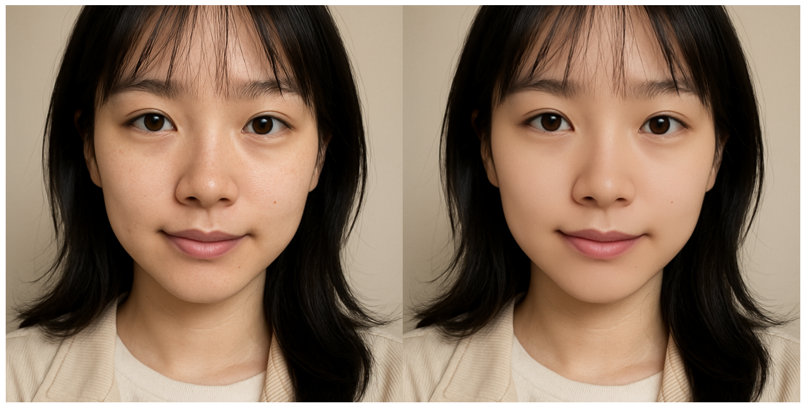
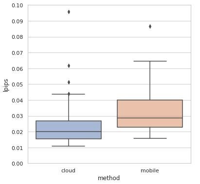

## 图生图？图像翻译！
图像输入-图像输出，这是一种很常见的模式，囊括了图像分割（Image Segmentation）、图像修复（Image Restoration）和风格转换（Style Transfer）等一系列任务。这其中 **很大一部分任务** 可以总结为学习从源域到目标域的转换，也就是图像翻译（Image-to-Image Translation）。所以如果想要一个通用的图生图框架，可以从通用图像翻译入手。


## 都有什么方法呢？
早期的图像翻译采取的是普通的 FCN 监督训练，在语义分割这种分类问题上表现还行。通过鼓捣特征层也可以获得一定程度的风格转换能力，但只能做到简单的滤镜风格，效率也较差。

在 GAN 相关方法受到瞩目后，诞生了一堆以 GAN 为基础的图像翻译方法，pix2pix 就是其中的一种。这类方法使用了 GAN loss 来进行监督训练，使用得当的话可以得到更复杂多样且有意义的结果，问题在于高分辨率下会变得很不稳定，而且开销很大。


解决方法很简单，就是直接下采样再输入，原分辨率的输入则是经过一个 stem 层做 skip connection，最后再加一些 loss 来增强稳定性。这就是 pix2pixHD，以前对此有过[简单解读](../pix2pixhd)。


此后虽然也诞生了基于 StyleGAN 的 pixel-Style-pixel，甚至 diffusion 的方法，但这些结构复杂的方法一来难部署，二来低算力下效果很差，三来当时还不实用，所以这里暂且不谈。

不过值得一提的是，在后续的工作中，我发现其实 GAN 也并非是必须的。它只在需要有意义的、多样的、创新的场合下才能发挥较大作用，比如从没有信息量的输入中生成多样化的结果，这样生成对抗才能成立。而在我实际遇到的场合中，AI 创新这种不稳定的产物往往是不需要的，何况 GAN 时代并没有出现能让人惊叹的王牌应用。

## 那么...有用吗？
在真正下注 pix2pixHD 之前，我也试过别的 cGAN 相关方法，比如 CycleGAN 之类的。这些方法基本都和实用相差甚远，并非是 tricks 能弥补的。


相较之下，pix2pixHD 是监督式，只要源域和目标域有清晰明确的对应关系，那就有可能得到实用的效果，问题在于它的潜力到底有多大。

官方给出的只有从标签图转换成现实图的用例，更侧重于生成的多样性和质量，而我更看重编码和根据编码内容进行解码的能力。所以需要完成两件事：
1. 将结构改为更适合编解码的结构，也就是 U-shape
2. 搜集成对数据集，测试模型的能耐

经过一番努力训练出了模仿几种效果的模型。大部分模型都很好地完成了理解原图、作出修改的通用图像翻译过程。（数据量的 elbow point 在 2000 左右）


其中有几点值得关注。

### 隐式学习
即使标签只有经过全部修改后的图像数据，标注过程中暗含的人脸、性别和局部仿射变换操作也可以被模型学习到。甚至在部分标签不太好的情况下能够超越标签本身去纠正错误，这代表了相关的正确概念被嵌入到了模型参数里。


### 自动平稳
哪怕训练数据有噪声波动，在训练之后模型的输出也会趋向于平稳，这是一种特征在时空层面的平稳，可以直接用于视频推理。我猜这可能和训练方法偏向单一类型映射有关。


### 支持多任务
从 mask-rcnn 到如今的多模态 transformer，多任务很多时候都是个辅助训练好选择。如果我们的目标是通用的图生图，那能多增加一些辅助任务也算是“物超所值”了。

既然人脸相关的任务较多，那很自然就能想到输出人脸 mask，比如对于如下的美化模型：



给模型添加一个输出通道用以保存 mask，然后以检测到的人脸点给数据集生成附带的人脸 mask 标签，再进行训练。


可以看到，模型可以同时学到用人脸点标注的 mask。并且在部署移动端小模型时，经过强化的抗噪声扰动训练，输出的 mask 会逐渐向 matting 的方向靠近。如此一来就可以知道，这个结构的模型是具备多种混合任务的学习能力的。

## 怎么部署呢？
只要有数据和算力，好的效果大家都能做，但让落地变得真正困难无比的点在于受限的部署环境。

### 云端模型
云端部署模型是限制最小的，但如果要视频实时推理的话还是要注意推理性能的。

#### 计算访存比
推理性能一个方面是看计算访存比，我们希望能够充分利用显卡的性能，就需要知道模型的计算和访存需求。这里提供一个简单的分析。

拿 pix2pixHD 的原版 local 模型来说，推理 1x3x1024x576 的输入图像，输出同等尺寸的图像，未进行 BN 融合等优化，其 FLOPs 为 1.615T，访存量为 6.98GB，计算访存比约为 215。

如果要进行云端部署的话，举个例子如果采用 Tesla T4，其 GDDR6 内存带宽为 300 GB/sec，单精度峰值算力 8.1 TFLOPS，也就是计算访存比大约为

$$\frac{8.1\times10^{12}}{300\times10^9}=27 < 215$$

推断模型为 compute-bound。

如果考虑 INT8 推理，Tesla T4 INT8 峰值算力 130 TOPS，也就是计算访存比约为 433，假设模型计算量不变、访存量少 4 倍，模型计算访存比约为 861，依然大于显卡的计算访存比，推断模型依然为 compute-bound。

在这样的情况下，模型的计算效率还算比较高。以同样的方法统计 global、local、U-shape 改进模型的计算访存比、推理时延和在某数据集上训练后的 lpips 测试指标得到：

|                  | pix2pixHD global | pix2pixHD local | U2Net U-shape |
| :--------------: | :--------------: | :-------------: | :-----------: |
|      FLOPs       |      1,240G      |     1,615G      |     257G      |
|  Memory Access   |      8,456M      |     7,503M      |    2,370M     |
|      Params      |       182M       |      730M       |      44M      |
|    intensity     |       147        |       215       |      108      |
|  INT8 intensity  |       587        |       861       |      434      |
| RTX4070 latency  |       55ms       |      87ms       |     21ms      |
|    T4 latency    |      365ms       |        /        |     103ms     |
| T4 INT8 latency  |        /         |        /        |     13ms      |
| A30 FP16 latency |        /         |        /        |      8ms      |
|   lpips（越低越好）    |   0.078±0.023    |   0.074±0.024   |  0.058±0.018  |

可以看到，在云端上三版都不会撞到内存墙，但 U-shape 结构模型用了小得多的计算量和参数量达到了更好的效果，时延也比其余两者要低不少。

#### 推理优化
由于模型推理速度本身已经比较快了（T4 下 103ms），只需要考虑量化、计算图优化和算子优化就能达到实时处理的要求。

---
**量化**

量化是对模型权重以及中间变量采取低精度的表示，而由于存储和运算的数据精度降低了，给存储空间、访存和运算带来了很多优化的可能性。

量化可以显著增加计算效率，采用 FP16 或 INT8 量化通常能带来 2~5 倍的性能提升。一般在训练后进行的量化，也就是 PTQ，主要分为动态量化和静态量化。动态量化是在推理的过程中动态确定中间层的量化范围，而静态量化是先跑一批数据然后统计出中间层的量化范围。由于动态量化会影响推理性能，一般多是采用静态量化。


这里的关键是在校验数据上跑一次，统计每一层的值域分布信息，以此为依据来压缩精度。这就意味着要求模型的参数或中间特征数值需要比较正常，不能有太大起伏，可以通过采用 残差设计、clip、ReLU6 等模块来帮助限制模型内流通的数值范围。不然的话效果可能会有较大的劣化。实际测试效果要取决于任务，有些任务指标和效果都不会有明显区别，有些任务则会出现明显的噪声扰动。

我还尝试过 nvidia 的 pytorch-quantization，这是一种基于 monkey patching 的 QAT 实现，结果虽然指标比 PTQ 要好些，但生成的图像还是差不多，而且实际支持的算子也很有限，最终只能作罢。

经过量化后在 Tesla T4 上使用 TensorRT 量化加速的 bs1 推理性能如下：

|               | latency  |
| :-----------: | :------: |
|    pytorch    | 103.53ms |
| TensorRT fp32 | 77.71ms  |
| TensorRT fp16 | 25.66ms  |
| TensorRT int8 | 18.20ms  |

---
**计算图优化**

这里说的计算图优化并不是 BN 融合之类的交由推理框架或编译器转换模型时完成的工作。我想说的是前后处理部分，有一些前后处理操作其实可以用 PyTorch 函数来实现，从而可以很方便的被后续 JIT 编译囊括进 GPU 推理中一同加速。

比如 yuv 和 rgb 的转换：
```python
def yuv420p_to_rgb_cuda(yuvData, height, width, yuv2rgb_mat):
    totalPixelNum = int(height * width * 3 / 2)
    img_data = torch.from_numpy(
        np.frombuffer(yuvData[:totalPixelNum], dtype=np.uint8)
    ).cuda()
    y_end = height * width
    u_end = y_end + y_end // 4
    y_ = img_data[:y_end].reshape(1, height, width)
    u_ = img_data[y_end:u_end].reshape(1, height // 2, width // 2)
    v_ = img_data[u_end:].reshape(1, height // 2, width // 2)
    u_ = torch.nn.functional.interpolate(
        u_.unsqueeze(0), scale_factor=2, mode="nearest"
    )[0]
    v_ = torch.nn.functional.interpolate(
        v_.unsqueeze(0), scale_factor=2, mode="nearest"
    )[0]
    yuv_444 = torch.cat([y_, u_, v_], dim=0).type(torch.cuda.FloatTensor)
    yuv_444[0, :, :] -= 16
    yuv_444[1:3, :, :] -= 128
    rgb = yuv2rgb_mat.mm(yuv_444.reshape(3, -1)).reshape(1, 3, height, width)
    return rgb


def rgb_to_yuv420p_cuda(rgb_img, height, width, rgb2yuv_mat):
    yuv_444 = rgb2yuv_mat.mm(rgb_img[0].view(3, -1))
    yuv_444[0, :] += 16
    yuv_444[1:3, :] += 128
    yuv_444 = yuv_444.clamp(0, 255).type(dtype=torch.cuda.ByteTensor)
    yuv_image = yuv_444.view(3, height, width)
    I420_image = torch.cat(
        [
            yuv_image[0, :, :].view(-1),
            yuv_image[1, ::2, ::2].reshape(-1),
            yuv_image[2, ::2, ::2].reshape(-1),
        ]
    )
    I420_image = I420_image.view(-1, width)
    return I420_image
```

类似的向量化方法在训练时其实也很常用，因为很多 OpenCV 的操作在 PyTorch 上都没有原生支持。经过一番向量化，代码就从不可微的 OpenCV 代码变成了可微的 PyTorch 代码。当然，如果懒的话，找找 [kornia](https://github.com/kornia/kornia) 之类的开源项目，说不定也有类似的实现。

---
**算子优化**

算子层面的优化主要是涉及 GPU 推理优化，其中有很多在模型设计时就已经考虑了的，比如卷积的通道数、特征图大小最好是 16 的整数倍之类的，这样有利于硬件加速。但有一些是需要工程师考虑的，比如整数倍的邻近插值要比双线性插值快得多（`align_corners=True` 的情况下放大两倍的双线性插值还不会自动转换成邻近插值）、transposed conv 效率非常低。诸如此类细枝末结的东西具体要不要管需要看整体的 profile 情况。

nvidia 部署可以使用 nvprof 记录，然后通过 nvvp 或 nsight 分析看看具体的 kernels 使用情况和耗时占比，如果 kernels 命名中存在字母加几个数字 `[i|s|h][some numbers]`（如 h884）则说明用了 Tensor Cores，当然有些不这么命名，不过大致就是这种思路。


---

最终抠抠嗖嗖，推理时延可以压缩到 13ms 以内。

### 云端链路
最考验部署生态的时候到了。如果用的 TensorFlow，那部署生态很丰富，可以用 TensorFlow Serving，移动端也有 TensorFlow Lite，自带各种方式的部署优化，省心。而如果是用的 PyTorch，则需要找一些方法转换成静态图以便优化推理。

比如 nvidia 服务器上部署，TensorRT 推理。一种方法是使用 [Torch-TensorRT](https://github.com/pytorch/TensorRT)，这是一种编译器，将 TorchScript 模型部分编译成 TensorRT 引擎。主要做法是用 TensorRT 来推理 backbone，用 PyTorch 来兼容推理 head layers，这样一来就确保了高性能和兼容性，相当于将 TensorRT 嵌入进 TorchScript 里。


现在 PyTorch 2.0 版本后引入了 `torch.compile`，日后 TorchScript 可能要渐渐淘汰了，改为用 FX graphs 来表示，Torch-TensorRT 则作为后端。

至于服务器端则需要根据实际情况来。有推理服务框架是最好的，比如 Triton，直接传资源，写业务逻辑时用 HTTP 或 gRPC 来调用模型推理。我那时候中台并没有这些便利的东西，大家都是自己写自己的推理流程，然后通过 Serverless 框架统一调度。

云端上线相对来说算是最顺利的了，除了网络问题外基本都能很轻易的解决掉，这也是归功于对接的大神身怀绝技、十项全能。

相较之下，移动端部署是另一番场面。

### 移动端模型
对于深度学习模型来说，一般模型的计算量和实际效果会存在一种手肘状的关系，模型越小效果劣化会越显著。而十分悲催的一点是，对于视频推理和较高分辨率的图生图推理来说，移动端的资源连手肘的拐点都无法达到。

比如，在 MNN 上测试一台骁龙 835 安卓机：

| Model name           | CPU avg (ms) | GPU avg (ms) |
| -------------------- | ------------ | ------------ |
| mobilenetV3.mnn      | 16.811       | 24.977       |
| nasnet.mnn           | 138.738      | 54.193       |
| inception-v3.mnn     | 682.708      | 123.473      |
| mobilenet-v1-1.0.mnn | 98.717       | 14.271       |
| resnet-v2-50.mnn     | 443.503      | 66.552       |
| MobileNetV2_224.mnn  | 62.504       | 13.282       |
| SqueezeNetV1.0.mnn   | 110.135      | 22.035       |
| squeezenetv1.1.mnn   | 55.744       | 12.267       |
| 云端图生图模型              | >4000        | /            |

可以看到对于上面展示的图生图模型，如果直接在移动端上直接使用，时延可以达到 4s 以上，需要优化 100 倍才有实用的可能，更别提一百多兆的模型大小。哪怕只处理 224 的低分辨率输入，光是 encoder 部分的时延就已经不容乐观了。要是再加上 decoder、输出足够清晰的高分辨率图、还要达到实时、效果还想和云端匹敌，那几乎就是痴人说梦。


实际的应对方法大致有四种：

#### 只做高端机
高端机在开发限制上会少非常多，最好的就是 iPhone 这种用户量大、规格统一的，甚至还可以针对性地用 NPU 来进一步压榨性能。

比如这是一个 5.3G 计算量、125MB 访存量的模型实际接口测试时间：

|      设备      | npu 接口总时间（ms） | cpu 接口总时间（ms） |
| :----------: | :-----------: | :-----------: |
|    14Pro     |      9.2      |     25.2      |
|      14      |     10.8      |     39.8      |
|      13      |     11.4      |     39.8      |
|   12Promax   |      10       |     42.4      |
| 12Pro（A2408） |      51       |      47       |
|      12      |     10.8      |     43.8      |
|      11      |      15       |     58.4      |
|      xs      |      67       |      67       |
|  xiaomi 10   |       /       |      >93      |
| xiaomi MIX2  |       /       |     >303      |

计算量较大，只处理面部的情况下效果不比云端差多少，用 CPU 也可以通过一些优化方法在高端机上达到实时（30 帧）的要求，而中低端机则依然毫无希望。

#### 缩放和优化
正如前面提到的，对于需要高质量、高分辨率、中低端机运行的图像翻译模型来说，再怎么缩放和优化都是无济于事的。这里的缩放和优化更多是一种锦上添花，而非挑大梁。

具体的方法分为数据层面、模型架构层面和训练层面。


---
**数据层面**

增加数据是最实在的，无论是做什么，数据量的增加都会带来指标和稳定性的提升。


除此之外，规范化的自动数据采集管道也会有很大帮助，很多基础模型都可以辅助数据采集过程中的自动标记和清洗。

实际我就搭建了一系列针对人脸场景的自动化数据采集、清洗处理的工具，涵盖了诸如人脸框、关键点、姿态、图像质量、faceid、人像掩码、以及不太靠谱的性别和年龄等属性，可以嵌入任意函数进行遍历处理数据集，也能设定规则根据标签信息进行筛选和查看，带有简单的版本控制。因为没有什么开源好用的数据集管理工具，只好自己东拼西凑了，好在还挺好用的，其中一部分已经开源到 Github 上了：[CVGlue](https://github.com/Lamply/CVGlue) [IAPDataset](https://github.com/Lamply/IAPDataset)。


有了规模化的、标签丰富的数据集后，一来能提升移动端模型的训练指标和表现，二来也可以在训练过程中利用标签辅助训练，比如多任务训练和数据扩增。

---
**模型架构层面**

模型架构层面主要是用更轻量化以及号称更强大的架构，一般可能会有一些提升，但不会有太大用处，因为没有免费的午餐。我更倾向于选择易于模型缩放的架构，这样能够输出多种规格的模型，以便客户端根据机型进行模型分发。

实际测试如果模型低于 600M 计算量、120MB 访存量，则现有数据集训练的实际表现效果会大打折扣，只能作为最低程度的备选方案。最后选定的两种架构测试如下：

|         | MIX2 CPU | MIX2 GPU | P40 CPU | P40 GPU | iqoo8pro GPU | S10 GPU |
| :-----: | :------: | :------: | :-----: | :-----: | :----------: | :-----: |
| 600M 模型 |  87/97   |    18    |  32/38  |   22    |     9.5      | 11/14.5 |
| 400M 模型 |    55    |    17    |  20/22  |   17    |              |   8.5   |

600M 模型的资源消耗情况如下：

|     时间      | 机型  | FPS | app CPU |  GPU  |   内存    | 温度  |
| :---------: | :-: | :-: | :-----: | :---: | :-----: | :-: |
|   空闲 5min   | S10 | 30  | 32.85%  |  12%  | 122.4MB | 31  |
| 空闲+开启 15min | S10 | 30  | 35.39%  | 22.8% | 151.8MB | 38  |

---
**训练层面**

常见的训练优化包括剪枝、蒸馏、AutoML 自动调参等，会带来一点点指标提升，但在我的几种场景中表现并不明显。像剪枝类的方法一般只在一些训练得较差的模型（存在较多空卷积）上会有较好的效果。倒是有一种比较有趣的[模型嫁接](https://github.com/fxmeng/filter-grafting )方法会有微弱的指标提升。


实际尝试比较有用的一种方法是添加仿射 loss，比较对输入进行仿射变换和输出进行仿射变换的区别。

$$Loss(A(G(x)), G(A(x)))$$

没有这种方法的话训练的图生图模型在视频推理上会有很大的抖动，而添加这种方法后得出的模型稳定性非常强，哪怕没有时空稳定的算法也可以得到稳定的输出，当然这会引发别的一些问题。经过仔细排除因素发现这种抖动似乎是计算量太低或多级监督训练导致的。

---

经过一系列优化，在个别分辨率不敏感的场景还是可以达到接近云端模型的效果的。



总的来说，这方面能做的事情非常多，这里只涵盖了一小部分，实际还得根据部署的硬件和框架进行调整，是比较考验经验的。

#### 另求他路
尽可能地切碎任务，让模型只处理最核心的部分。需要充分结合领域经验来设计算法，让模型在先验知识下运作。这也是最复杂、难度最高的方法。

比如 Google 的 HDRNet 就是一个例子。对于移动端 4K 实时图像增强任务，采取了 Bilateral Guided Upsampling 的方法，让模型在低分辨率下学习双边空间的变换系数，最后缩放系数来使用。这本质上就是利用了图像增强领域大部分算子「在小范围内，输入像素强度和输出像素强度整体呈线性关系」的先验。


可以看到模型部分的计算量是可以做到很低的，输出结果也可以是高保真的。

当然这类方法会产生另外的一些问题，比如对后处理实现和优化有较强的依赖，加大了链路的复杂性，这点后面会谈。还有就是应用面有限，每一个场景都得想一套这样的方法那就不再是流程通用的图生图方法了。

#### 干脆云端
最合理的一种做法。因为目前的图生图模型并没有杀手级应用，没有一种应用是用户会日常大量使用的。用户最关注的是每一次偶然使用时的质量，而移动端本地部署在很多情况下就意味着在算力上妥协，算力妥协导致质量差，质量差会进一步减少用户的使用频率，这样还不如转到云端算了，实际上现在很多手机系统自带 AI 图像编辑功能就是只支持联网的。

### 移动端链路
准备好模型后就要迎接最繁琐的生产环境的落地工作，这部分的难度会和平台密切相关。如果是相对较小的平台，没有内部的 AI 部署框架，则需要可以使用开源的部署框架再制作 SDK；如果是较大的平台，有内部的 AI 部署框架，则可能要跨团队合作，SDK 也可能会交由其他团队制作。

不过哪怕都是较大的平台，移动端和云端的部署体验也可能完全相反。图生图的移动端的部署我遇到的就是神奇的多部门多团队合作，只需要提供模型和前后处理的示范代码，其余就交由其他团队完成。看起来很轻松，实际却一言难尽。

#### 编写测试
为了确保一致性，有必要对整个链路的输入输出做数值校验测试。通过编写测试跟踪生产环境的处理流程也可以知道生产环境存在什么隐患以及可以配合改进的地方，这点非常重要。

比如在图生图的链路上，跳跃连接和输出残差是很常见的处理，而这些情况下输出图像的质量会大幅取决于输入图像，但我检查过平台处理流程代码后发现用户图像在交由 SDK 处理前会强制进行一次缩放，将图像粗糙的缩放到 640 分辨率，从而导致一系列混淆和模糊问题。这可能是以往没有图生图链路，所以为了性能考虑而硬编码到客户端上导致的。

诸如此类问题还有很多，像是最常见的图像格式转换差异问题。如果有一个简易的测试工程则可以很好控制变量排查问题所在。只需要测试工程中在加入 dump 下 SDK 输入、SDK 输出、模型输入、模型输出和其他推理相关信息的代码，后续就可以在本地进行数值校验和分析。甚至因为流程是通用的，可以在移动端本地直接替换配置文件和模型来部署不同模型进行测试。


通过部署不同的模型还可以实现更深层次的测试。比如一个只做恒等计算的模型，既可以确认链路是否存在未知的、模型无关的问题，也可以确认链路的实际非计算耗时：

```python
class identity_model(nn.Module):
    def __init__(self):
        super().__init__()
        self.conv1 = nn.Conv2d(3, 3, kernel_size=1)
        weight0 = torch.zeros((3, 3, 1, 1))
        weight0[0, 0, 0, 0] = 1.0
        weight0[1, 1, 0, 0] = 1.0
        weight0[2, 2, 0, 0] = 1.0
        bias0 = torch.zeros((3))
        self.conv1.weight = nn.parameter.Parameter(weight0)
        self.conv1.bias = nn.parameter.Parameter(bias0)

    def forward(self, x):
        return self.conv1(x)
```

#### 预处理/后处理
首先需要考虑预处理和后处理的复杂程度，如果是像前面提到的 HDRNet 那样经过了较深度的融合（通常本地部署都会），那就需要较多的沟通合作。考虑到不在推理引擎中进行处理需要进行手动优化，这一部分往往是个天坑。因为端上的架构已经是固定了的，很难去修改，得遵循其运作规则，最终往往只能以一种非常低效率的方法来实现预处理和后处理。

所以最可控的一种方式还是将预处理和后处理尽可能集成到模型中。其中最常用的是调整输出的操作，比如数值缩放、通道调整、参数控制等。下面就是一段缩放输出数值的简单方法，只需要在模型 release 时调用既可以不引入计算量调整输出的数值范围。

```python
def reparams_convbn_int(self):
    """From [-1, 1] to [0, 255]"""
    # 1- get params
    last_conv = self.segmentation_head[0]
    last_bn = self.segmentation_head[1]
    conv_weight_ori = last_conv.weight.detach()
    bn_weight_ori = last_bn.weight.detach()
    bn_bias_ori = last_bn.bias.detach()
    bn_mean_ori = last_bn.running_mean.detach()
    bn_var_ori = last_bn.running_var.detach()
    standvar = torch.sqrt(bn_var_ori + last_bn.eps)

    # 2- merge bn running params
    bn_w_params_int = bn_weight_ori / standvar
    bn_b_params_int = bn_bias_ori - bn_weight_ori * bn_mean_ori / standvar
    bn_m_params_int = torch.zeros_like(last_bn.running_mean)
    bn_v_params_int = torch.ones_like(last_bn.running_var) - 1e-5

    # 3- merge conv params
    conv_weight_int = copy.deepcopy(conv_weight_ori)
    conv_weight_int[1::2] = (
        bn_w_params_int[::2].reshape(-1,1,1,1) * conv_weight_int[::2] * (-127.5)
        + bn_w_params_int[1::2].reshape(-1,1,1,1) * conv_weight_int[1::2] * 127.5
    )
    bn_w_params_int[1::2] = 1.0
    bn_b_params_int[1::2] = (
        bn_b_params_int[::2] * (-127.5) + bn_b_params_int[1::2] * 127.5 + 127.5
    )

    last_conv.weight = nn.parameter.Parameter(conv_weight_int)
    last_bn.weight = nn.parameter.Parameter(bn_w_params_int)
    last_bn.bias = nn.parameter.Parameter(bn_b_params_int)
    last_bn.running_mean = nn.parameter.Parameter(bn_m_params_int)
    last_bn.running_var = nn.parameter.Parameter(bn_v_params_int)
```

#### 推理框架
前几年有一段时间国内各大公司像是抢占市场般争先推出了一堆开源推理引擎，MNN、TNN、MegEngine、Mace、Paddle Lite 等等，如今似乎只剩 MNN 和 ncnn 这个老牌劲旅还活着。毕竟移动端要适配的硬件太多了，五花八门。想要达到一个较好的优化水平更是难上加难。

出于这些原因，移动端上很多开源框架都不够完善，难以支撑复杂的业务环境，特别很多预处理和算子可能都支持不太好，如果没有专人针对优化的话不太好用。所以最好的话还是使用 TFLite 和 CoreML 这种较成熟稳定的方案。

实际部署看线上是否有相关推理引擎的库，避免冲突。PyTorch 的模型得经过一些转换，常见的就是把 ONNX 作为中间模型：

```python
import onnx
import onnxruntime
from onnxsim import simplify

model = model.cpu().eval().requires_grad_(False)

# 导出
torch.onnx.export(
    model,
    input_dummy,
    opt.output_file,
    verbose=True,
    input_names=input_names,
    output_names=["output"],
    opset_version=11,
)

# 简化图，清掉不需要的 doc_string
if opt.remove_doc or opt.graph_simp:
    onnx_model = onnx.load(opt.output_file)
    if opt.remove_doc:
        for i in range(len(onnx_model.graph.node)):
            onnx_model.graph.node[i].doc_string = ""
    if opt.graph_simp:
        onnx_model, check = simplify(onnx_model)
        assert check, "Simplified ONNX model could not be validated"
    onnx.save(onnx_model, opt.output_file)

# 数值校验
onnx_model = onnxruntime.InferenceSession(
    opt.output_file, providers=["CPUExecutionProvider"]
)
check_allclose(model, onnx_model, input_dummy, input_names)
```

最后把导出的 ONNX 二次转换成推理引擎的模型就可以打包资源交由 SDK 发挥了。

需要注意的是有些算子可能推理引擎支持不好，特别是 NPU 限制会更多，需要查阅了解。以及有些算子的默认行为可能发生改变，和引擎行为不符。比如 coreml DepthToSpace 需要 DCR 模式（onnx 默认），但 pytorch 的 pixelshuffle 默认实现是 CDR 模式，需要手动对 ONNX 模型进行一些修改。

#### 性能测试
性能测试一般是交由测试团队进行，不过自己用 demo 跑个 perfdog 基本也能了解得七七八八。比较需要注意的是省电策略、温控热节流、大小核绑定之类的问题，实际能留给实时模型推理的资源非常少。

到了这一步能做的事基本都做了，剩下推理框架团队的优化和汇编优化只能说是锦上添花中的锦上添花。至少就我遇见的情况，都是渐渐没有下文了。

尽管最终有一部分图生图可以满足需求，但和最初的构想偏差甚远，每一个种类都必须高度的定制化才行。这或许就是移动端的无奈。比较神奇的一点是，大部分的图生图任务都是云端能勉强满足、移动端则拼尽全力还缺一口气的状况，处在一个非常尴尬的时期。

## 总结
虽然不是 GPT-4o image generation 那种接近通用的图生图，至少在云端适宜计算量水平下，是可以观测到单模型适应通用任务的可能的，效果也足够优秀。只可惜在移动端上还远达不到有余裕的境况。而且以目前的发展速度来看，这种范式在可预见的未来都难以达到较好的水准。或许转变为以 token 生 token 的 transformer 类范式会更具潜力一些。


